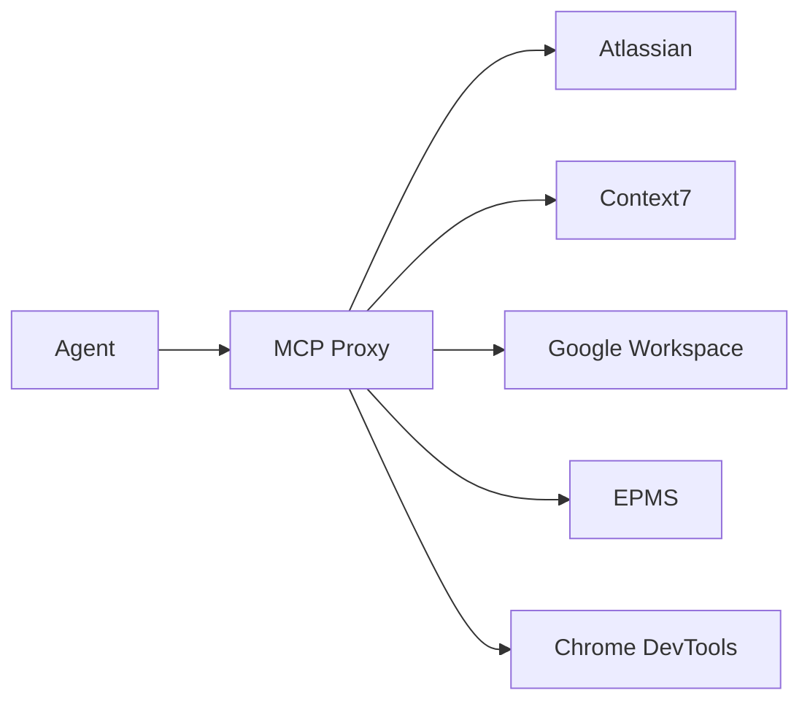

# Asset Creation Pipeline

**Purpose:** Reproducible procedure for capturing screenshots, code snippets, and diagrams from running LSA Digital products and embedding them into marketing post files.

**Last Verified:** 2026-02-15

---

## Pipeline Context

Asset creation is **Stage 3** of the content lifecycle. See `docs/post-pipeline.md` for the full pipeline.

**When to create assets**: After the post draft exists and before review/approval.

**Assets are filesystem-only**: Asset files are NOT stored in Squawk MCP. Squawk stores only the post markdown content and metadata. Assets live in `posts/2026/02/<post-folder>/assets/`.

**How assets appear in squawk-index.md**: The build script (`scripts/build-squawk-index.js`) automatically scans each post's `./assets/` directory when rebuilding the index. No manual registration needed — just put files in the `assets/` directory and run the build script.

**Asset rendering in squawk-index.md**:

| File Type | Rendered As |
|-----------|------------|
| PNG/JPG/GIF/SVG | `<a href="..."></a>` (hyperlinked thumbnail) |
| PDF | `[📄 filename](path)` (clickable link) |
| MP4/WEBM | `<video width="120" controls>...</video>` |
| None | `—` |

---

## Reusable Scripts & Examples

All Playwright capture scripts live in **`assetpipe/`** at the project root.

```
assetpipe/
├── README.md                  # Index of scripts and what they capture
├── lsars-captures.js          # LSARS HRA screenshot sequences
├── medicodax-captures.js       # MEDICODAX / HAI-EM screenshot sequences
├── epms-captures.js           # EPMS screenshot sequences (includes auth bypass)
└── examples/                  # Example output from previous runs (reference PNGs)
```

**Why this exists:**
- Future agents can read these scripts to understand the capture patterns without rediscovering the pipeline
- Scripts can be modified to capture new pages or UI states
- Example outputs show what "good" screenshots look like
- The scripts are written as `async (page) => { ... }` functions compatible with Playwright MCP's `browser_run_code`

**How to use an existing script:**

```javascript
// 1. Read the script from assetpipe/
// 2. Pass it to browser_run_code:
skill_mcp(mcp_name="playwright", tool_name="browser_run_code", arguments={
  "code": "<contents of assetpipe/lsars-captures.js>"
})
```

---

## Prerequisites

### Running Services (Docker)

All three product UIs must be running before capturing screenshots.

| Service | Container Name | URL | Health Check |
|---------|---------------|-----|--------------|
| **LSARS HRA** | `lsars-hra-ui-dev` | `http://localhost:3230` | `curl -s -o /dev/null -w "%{http_code}" http://localhost:3230` → 200 |
| **MEDICODAX (HAI-EM)** | `hai-em-frontend` | `http://localhost:3000` | `curl -s -o /dev/null -w "%{http_code}" http://localhost:3000` → 307 (redirect to /dashboard) |
| **EPMS** | `epms-ui-dev` + `epms-epms-1` | `http://localhost:5173` | `curl -s -o /dev/null -w "%{http_code}" http://localhost:5173` → 200 |

#### Starting Services

```bash
# LSARS HRA (usually already running)
cd ~/dev/lsars-hra && docker compose up -d ui-dev

# MEDICODAX
cd ~/dev/em-lab && docker compose up -d frontend

# EPMS — CRITICAL: both ui-dev AND the backend API must be running
cd ~/dev/epms && docker compose up -d epms ui-dev
```

#### EPMS Backend Gotcha

The EPMS UI (`epms-ui-dev`) is a Vite dev server that proxies `/api/*` to the `epms` backend container. If only `ui-dev` is running without `epms`, the UI shows **"Redirecting to login..."** and logs:

```
Error: getaddrinfo ENOTFOUND epms
```

**Fix:** `cd ~/dev/epms && docker compose up -d epms`

Verify the proxy works: `curl -s -o /dev/null -w "%{http_code}" http://localhost:5173/api/auth/proxy-user` → should return `401` (not a DNS error).

### Required Tools

| Tool | Purpose | Invocation |
|------|---------|------------|
| **Playwright MCP** | Browser automation, navigation, screenshots | `skill_mcp(mcp_name="playwright", tool_name="...", arguments={...})` |
| **Bash** | Create directories, verify files | `bash(command="mkdir -p ...")` |
| **Read/Edit** | Embed images into markdown post files | Standard file tools |

**NOT used:** Chrome DevTools MCP — its `savePath` parameter silently fails to save files to disk.

---

## Authentication

### LSARS HRA
No authentication required. The welcome modal appears on first load — dismiss it by clicking "Enter System" or navigate past it.

### MEDICODAX (HAI-EM)
Auto-login. Navigating to `http://localhost:3000` redirects to `/dashboard` and logs in as a demo user (e.g., Gladys Carrins, Certified Coder, or Beverly Eubanks depending on config).

### EPMS — Proxy Auth Bypass

EPMS uses Apache `mod_auth_openidc` proxy authentication in production. In dev, the backend reads the `REMOTE_USER` header directly. The Vite proxy does NOT set this header, so you must inject it via Playwright.

**Pattern:**

```javascript
// Set REMOTE_USER header on all requests from this page
await page.setExtraHTTPHeaders({ 'REMOTE_USER': 'admin@lsadigital.com' });
await page.goto('http://localhost:5173');
```

**Playwright MCP invocation:**

```
skill_mcp(
  mcp_name="playwright",
  tool_name="browser_run_code",
  arguments={
    "code": "async (page) => { await page.setExtraHTTPHeaders({ 'REMOTE_USER': 'admin@lsadigital.com' }); await page.goto('http://localhost:5173'); await page.waitForTimeout(3000); return page.url(); }"
  }
)
```

After this, the page redirects to `/kanban` and the user session is active for all subsequent navigations within the same Playwright page.

**Important:** `setExtraHTTPHeaders` persists for the lifetime of the page. If you close or create a new tab, you must set it again.

---

## Screenshot Capture Procedure

### Step 1: Create the assets directory

Each post has its own assets folder:

```bash
mkdir -p posts/2026/02/2026-02-15_2026-T-0XX_<slug>/assets
```

**The directory MUST exist before Playwright can save to it.** Playwright will error with `ENOENT` if the directory is missing.

### Step 2: Navigate to the target page

```
skill_mcp(mcp_name="playwright", tool_name="browser_navigate", arguments={"url": "http://localhost:3230"})
```

Use `browser_snapshot` to inspect the page structure and find interactive elements:

```
skill_mcp(mcp_name="playwright", tool_name="browser_snapshot", arguments={})
```

### Step 3: Interact with the page (if needed)

Click buttons, fill forms, select options, dismiss modals:

```
skill_mcp(mcp_name="playwright", tool_name="browser_click", arguments={"ref": "e92", "element": "Enter System button"})
skill_mcp(mcp_name="playwright", tool_name="browser_select_option", arguments={"ref": "e17", "values": ["Massachusetts"]})
```

### Step 4: Take the screenshot

```
skill_mcp(
  mcp_name="playwright",
  tool_name="browser_take_screenshot",
  arguments={
    "type": "png",
    "filename": "posts/2026/02/2026-02-15_2026-T-0XX_<slug>/assets/<descriptive-name>.png"
  }
)
```

**Options:**
- `fullPage: true` — captures the entire scrollable page, not just the viewport
- `element` + `ref` — captures a specific element only (e.g., a sidebar, a card)
- Default (no element) — captures the visible viewport

### Step 5: Verify the file was saved

```bash
ls -la posts/2026/02/2026-02-15_2026-T-0XX_<slug>/assets/
```

Expect a `.png` file, typically 50KB–300KB depending on page complexity.

### Step 6: Embed in the post markdown

Add the image reference in the post body where it's most relevant:

```markdown

```

**Conventions:**
- Alt text should be descriptive (what the image shows, not just a label)
- Use relative paths (`assets/filename.png`), not absolute paths
- Place the image inline near the text it supports, not in a separate section

---

## Advanced: Playwright Run Code

For complex multi-step interactions or custom screenshot regions, use `browser_run_code`:

```
skill_mcp(
  mcp_name="playwright",
  tool_name="browser_run_code",
  arguments={
    "code": "async (page) => { await page.goto('http://localhost:3230'); await page.click('button:has-text(\"Enter System\")'); await page.waitForTimeout(1000); await page.selectOption('select', 'Massachusetts'); await page.waitForTimeout(2000); await page.screenshot({ path: 'posts/.../assets/lsars-ma-counties.png' }); }"
  }
)
```

This is the same Playwright API used in `~/dev/lsars-hra/apps/ui/e2e/` test files. Reference pattern:

```typescript
// From lsars-hra/apps/ui/e2e/capture_ac_screenshots.spec.ts
const SCREENSHOT_DIR = '../../docs/plans/screenshots/LSARS-412';
await page.screenshot({ path: `${SCREENSHOT_DIR}/filename.png` });
```

---

## Asset Types & How to Create Them

### 1. UI Screenshots (Playwright)

**Source:** Running web applications (LSARS, MEDICODAX, EPMS)
**Tool:** Playwright MCP `browser_take_screenshot` or `browser_run_code`
**Best for:** Dashboards, forms, data tables, chat interfaces, map views

### 2. Code Snippets (Read from source)

**Source:** Project codebases (`~/dev/epms/`, `~/dev/em-lab/`, `~/dev/lsars-hra/`)
**Tool:** `Read` tool to extract relevant sections, then format as fenced code blocks in the post
**Best for:** Pydantic models, MCP tool definitions, config files, SQLAlchemy models

**Embedding pattern:**

````markdown
```python
# From epms/mcp/server.py — copy_product tool definition
@mcp_server.tool()
async def copy_product(product_id: str, new_name: str) -> dict:
    """Copy a product with all relationships preserved."""
    ...
```
````

### 3. Diagrams (Mermaid in markdown)

**Source:** Architecture knowledge, codebase structure
**Tool:** Write Mermaid diagram syntax directly in the post markdown
**Best for:** Architecture flows, data pipelines, auth flows, attack trees

**Embedding pattern:**

````markdown

````

### 4. Tables & Checklists (Markdown native)

**Source:** Research, codebase analysis
**Tool:** Write directly in markdown
**Best for:** Comparison tables, feature matrices, requirement checklists

---

## File Naming Conventions

```
<product>-<descriptive-name>.png
```

**Examples:**
- `lsars-welcome-modal.png`
- `lsars-ma-tract-map.png`
- `medicoda-dashboard-time-savings.png`
- `medicoda-audit-logs.png`
- `epms-kanban-board.png`
- `epms-mcp-tool-list.png`
- `epms-guest-portal-chat.png`

**Rules:**
- Lowercase, hyphen-separated
- Product prefix for screenshots (`lsars-`, `medicoda-`, `epms-`)
- No prefix needed for diagrams embedded as Mermaid or code snippets
- PNG format for screenshots (not JPEG — text legibility matters)

---

## Delegation Pattern (for AI agents)

When delegating asset creation to subagents, include these in the prompt:

```
MUST DO:
- Create assets/ directory with: mkdir -p posts/2026/02/<post-folder>/assets
- Use Playwright MCP (skill_mcp with mcp_name="playwright") for ALL screenshots
- For EPMS: set REMOTE_USER header first via browser_run_code:
    await page.setExtraHTTPHeaders({ 'REMOTE_USER': 'admin@lsadigital.com' });
- Save screenshots as PNG to: posts/2026/02/<post-folder>/assets/<name>.png
- Verify file exists after saving: ls -la posts/2026/02/<post-folder>/assets/
- Embed in post markdown with: 

MUST NOT DO:
- Do NOT use Chrome DevTools MCP for saving screenshots (savePath is broken)
- Do NOT use JPEG format (PNG for text legibility)
- Do NOT use absolute paths in markdown image references
- Do NOT skip mkdir — Playwright errors with ENOENT if directory missing
```

**After adding assets**: If the post body now references the images, re-ingest the post into Squawk:

```
execute_tool("squawk.upsert_document_draft", {
  "filePath": "posts/2026/02/<folder>/post-<slug>-<postid>.md",
  "referenceContext": {
    "postId": "<post-id>",
    "audience": "<business|technical>",
    "products": "<product-name>",
    "experts": "<expert-names>",
    "themes": "<THEME_TAG_1, THEME_TAG_2>"
  }
})
```

Then rebuild squawk-index.md to see the new asset thumbnails:

```bash
PATH="/Users/idengrenme/.local/share/fnm/node-versions/v20.19.5/installation/bin:$PATH" node scripts/build-squawk-index.js
```

---

## Troubleshooting

| Symptom | Cause | Fix |
|---------|-------|-----|
| `ENOENT` on screenshot save | Assets directory doesn't exist | `mkdir -p posts/.../assets` |
| EPMS "Redirecting to login..." | Backend not running | `cd ~/dev/epms && docker compose up -d epms` |
| EPMS "Redirecting to login..." with backend up | Missing REMOTE_USER header | Set via `page.setExtraHTTPHeaders(...)` |
| Screenshot is blank/white | Page still loading | Add `page.waitForTimeout(2000)` or `browser_wait_for` |
| Screenshot too small | Viewport size | Use `browser_resize` to set width/height before capture |
| Playwright not available | MCP not loaded | Load skill first: `skill(name="playwright")` |
| Chrome DevTools `savePath` ignored | Known bug — parameter is silently dropped | Use Playwright MCP instead |

---

## Quick Reference: Service URLs & Pages

### LSARS HRA (localhost:3230)

| Page | URL / Action | What's Visible |
|------|-------------|----------------|
| Welcome modal | Navigate to `/` | Logo, methodology selector (CA-OEHHA / EPA) |
| Map view | Click "Enter System" | US map, state/county/tract selectors, ZIP search |
| State drilldown | Select a state | County boundaries, county selector populates |
| Hotspot Analysis | Click "Hotspot Analysis" button | Analysis panel |
| Health Risk Advisor | Click chatbot button (bottom-right) | AI chat panel |

### MEDICODAX / HAI-EM (localhost:3000)

| Page | URL | What's Visible |
|------|-----|----------------|
| Dashboard | `/dashboard` | Time savings, record count, pending submissions |
| Mobile Queue | `/mobile-queue` | MobileEMNote submissions from iPhone app |
| Audit Logs | `/audit-logs` | Timestamped audit trail of all actions |
| New E&M Record | `/wizard-v2` | Step-by-step E&M coding wizard |
| Sidebar agents | Always visible | Claims Defender, Missing Docs Agent (PREVIEW) |

### EPMS (localhost:5173) — requires REMOTE_USER header

| Page | URL | What's Visible |
|------|-----|----------------|
| Kanban | `/kanban` (default after login) | Product lifecycle columns |
| Product detail | Click a product card | Artifacts, features, risks, KPIs |
| Guest Portal | `/guest/<share-link>` | Read-only product view with AI chat |
| MCP tools | Backend only: `curl -H "REMOTE_USER: admin@lsadigital.com" http://localhost:8000/mcp/tools` | JSON tool definitions |

---

## Source Codebases

| Product | Path | Key Directories for Assets |
|---------|------|---------------------------|
| **EPMS** | `~/dev/epms/` | `mcp/server.py` (MCP tools), `backend/app/api/` (routers), `backend/app/models/` (Pydantic), `frontend/src/` |
| **MEDICODAX** | `~/dev/em-lab/` | `backend/app/` (FHIR client, audit), `frontend/src/` |
| **LSARS HRA** | `~/dev/lsars-hra/` | `apps/ui/e2e/` (Playwright tests), `apps/backend/` (API), `AGENTS.md` |
| **Lazy-MCP** | `~/dev/common/lazy-mcp/` | `config.json` (5-server proxy config) |
