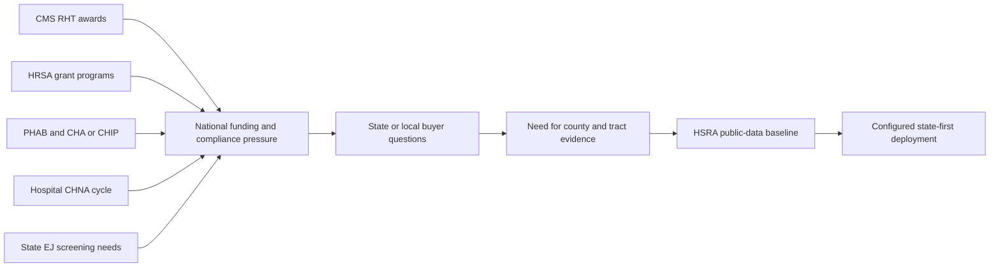
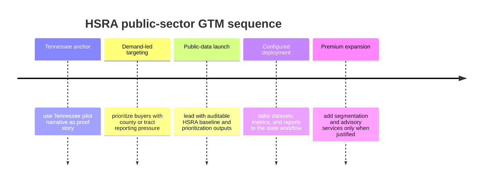

# HSRA Government Market Analysis

**Last Updated:** 2026-03-09

## Summary

The strongest HSRA public-sector path is a Tennessee-first story with a 50-state replication thesis. Tennessee provides a concrete pilot narrative around pollution, cancer, social vulnerability, and resource allocation. The broader national opportunity exists because multiple federal and state frameworks now require or reward tract/county-level evidence, but no single public data source integrates pollution burden, health outcomes, and SDOH in one tract-level decision object.

The strongest newly confirmed external demand signal is the CMS Rural Health Transformation Program: public materials describe a five-year, $50 billion program, all 50 states received awards in December 2025, and the NOFO requires quantifiable initiative metrics including county- or community-level measurement.

## Claim Classes Used In This Document

- `Implemented`: evidenced in the current HSRA stack
- `Configurable`: could be delivered with state-first deployment and services
- `Demand signal`: supported by external programs, mandates, or public frameworks
- `Replication thesis`: strategic extension inferred from demand signals, not yet the same thing as validated adoption

## Why Government Buyers Need HSRA

Government and adjacent public-health buyers repeatedly need answers to questions like:

- which counties or tracts have the worst combined pollution, cancer, and social-risk burden,
- where should scarce screening or mobile-service resources go first,
- how can an agency justify those choices with auditable data,
- how do public-health teams combine environmental burden with social vulnerability rather than treating them separately.

HSRA fits that gap because it can join:

- HRA and pollution burden,
- risk and burden context relevant to cancer and chronic-disease programs,
- SDOH and vulnerability overlays,
- report-ready prioritization outputs.

## Tennessee As The Anchor Business Case

Tennessee is the best current anchor because the internal pilot materials already frame HSRA as:

- a statewide tract-level baseline,
- a vulnerability hotspotting layer,
- a resource-allocation guide,
- an auditable public-health decision infrastructure.

That makes Tennessee more than a sales anecdote. It is the clearest example of how HSRA can move from technical analytics to operational prioritization.

## Why The Other 49 States Matter Now (`Demand signal` + `Replication thesis`)

This buyer-flow diagram captures the go-to-market logic: national demand signals create local prioritization questions, and HSRA answers them through a configurable state-first delivery model.

### 1. Rural Health Transformation And Related Funding (`Demand signal`)

The current market-demand work shows a nationwide funding and compliance environment that rewards county/community-level measurement, not just statewide averages. This creates a repeatable need across states even when the local politics and datasets differ.

The Deep Research result strengthens this point with a more specific read: CMS RHT is not just a generic rural-health signal; it is a concrete all-50-states program with county/community metric expectations, which makes it the cleanest public proof that place-based outcomes measurement is now a live funding requirement rather than a speculative future trend.

### 2. CHA / CHIP / CHNA / Accreditation Pressure (`Demand signal`)

States, local health departments, and nonprofit hospitals are all pushed toward more explicit disparity analysis and better documented prioritization. HSRA can help when they need a stronger combined environmental-health-and-SDOH story.

The external report adds a useful procurement analog: configured health-equity dashboards and CHNA/CHA analytics support are already being bought by public-sector organizations, which suggests buyers are comfortable paying for configured assessment and prioritization support even when the category is not labeled exactly like HSRA.

### 3. EJ And Environmental-Health Gaps (`Demand signal`)

Where agencies have mapping tools but lack health-risk and prioritization logic, HSRA can become the analytical layer that turns map awareness into action logic.

### 4. State-Specific Public Data Plus Configurable Delivery (`Configurable` + `Replication thesis`)

The Tennessee state-first strategy shows how HSRA can be configured around one state's public data stack without requiring the product to become a monolithic national portal before deployment.

## Priority Public-Sector Buyer Personas

| Buyer | Why They Care | Questions They Need Answered |
|---|---|---|
| State health department leaders | Need defensible prioritization of interventions and public-health resources | Which counties/tracts show the highest combined burden and where should interventions go first? |
| State Medicaid or rural-health program teams | Need county/community metrics tied to health-improvement or transformation funding | Which locations have the best chance of improving outcomes if targeted now? |
| Local health departments | Need sub-county disparity analysis and actionable community health assessment inputs | Which neighborhoods carry the heaviest environmental and social burden? |
| Nonprofit hospital community-benefit teams | Need sharper community-need and community-investment justification | Where do cancer, poverty, access, and pollution converge in our service area? |
| EJ / environmental-health agencies | Need tract-level analysis that is more health-linked than plain mapping | Which communities need remediation, scrutiny, or targeted investment? |
| Cancer-control and epidemiology teams | Need combined burden logic for prevention and screening prioritization | Where are screening gaps, cancer burden, and environmental exposures overlapping? |

## Recommended 49-State Expansion Logic

HSRA should not be marketed to all states in the same way. A better expansion strategy is to prioritize states that match one or more of these conditions:

- active rural-health transformation or equivalent statewide funding pressure,
- strong public-health equity mandates,
- active EJ or environmental-health screening needs,
- visible county/tract disparities that require targeted intervention,
- state agencies or partners already accustomed to CHA/CHIP or similar evidence-based planning workflows.

In practice, that means Tennessee can be the proof story, while the 49-state strategy should be treated as a pattern library rather than a copy-paste pitch. The existence of demand signals does not by itself prove identical product-market fit across every state.

The Deep Research result supports a narrower but stronger version of the 49-state thesis: the problem shape appears nationally because the data structure, funding pressure, and compliance cycles are national; the buying motion will still vary by state, agency type, and procurement context.

## What Government Buyers Are Really Buying (`Configurable`)

They are not just buying a dashboard. They are buying:

- a prioritization logic,
- an auditable explanation for resource allocation,
- a way to combine data silos into one decision narrative,
- a configurable state-first deployment rather than a generic national portal.

## Risks And Constraints

- Each state has different data, procurement, and political framing needs.
- The strongest public-sector value proposition may require configuration work, not just license access.
- Premium-data packaging may be a better fit for some buyer types than others.
- Government buyers may need cautious language around what is implemented today versus what is configurable or advisory.

## Recommended GTM Sequence (`Strategy`)

1. Use Tennessee as the anchor story.
2. Target agencies and organizations with active county/community-level reporting or prioritization pressure.
3. Lead with public-data HSRA and auditable prioritization.
4. Add premium data or consulting only where the buyer needs segmentation, outreach design, or deeper intervention logic.

## Safe External Claims For Downstream Use

- CMS RHT is currently the clearest 50-state demand signal for county/community-level outcomes measurement.
- CDC PLACES, SVI, EJI, and State Cancer Profiles together show that the public data ingredients for Tennessee-style place-based analysis already exist nationally, even though they remain fragmented across tools.
- Public-sector demand is strongest where funding, reporting, or prioritization requires county- or tract-level evidence, especially in rural transformation, CHNA/CHA work, and state EJ or health-equity programs.
- The external evidence supports repeatable problem shape across states, not validated product-market proof in every state.

## Source-to-Claim Map

| Claim | Sources |
|---|---|
| Tennessee is the clearest current public-health allocation story | `../lsars-hra/docs/investor/03_Traction_Pilots/Pilot_OnePager_TN_Health.md`, `../lsars-hra/docs/investor/research/Research_Health_Equity_Pilots.md` |
| Public-sector demand is driven by real programs and frameworks | `docs/research/market/hsra-demand-signals-rural-health-2026.md` |
| HSRA's advantage is integration of environmental burden, health, and SDOH | `../lsars-hra/README.md`, `docs/research/market/hsra-demand-signals-rural-health-2026.md` |
| State-first configuration is a plausible rollout pattern | `../lsars-hra/docs/state_first/TN_PILOT_DATA_STRATEGY.md`, `../lsars-hra/docs/plans/LSARS-509-TN-DATA-SOURCE-EXPANSION.md` |
| CMS RHT is the clearest current 50-state external demand signal | `docs/research/hsra/chatgpt-deep-research-result-2026.md` |
| External evidence supports repeatable problem shape more than finished nationwide software-category validation | `docs/research/hsra/chatgpt-deep-research-result-2026.md` |

## Sources

- `../lsars-hra/README.md`
- `../lsars-hra/docs/investor/03_Traction_Pilots/Pilot_OnePager_TN_Health.md`
- `../lsars-hra/docs/investor/research/Research_Health_Equity_Pilots.md`
- `../lsars-hra/docs/state_first/TN_PILOT_DATA_STRATEGY.md`
- `../lsars-hra/docs/plans/LSARS-509-TN-DATA-SOURCE-EXPANSION.md`
- `docs/research/market/hsra-demand-signals-rural-health-2026.md`
- `docs/research/hsra/chatgpt-deep-research-result-2026.md`
- https://www.cms.gov/priorities/rural-health-transformation-rht-program/overview
- https://www.cms.gov/newsroom/press-releases/cms-announces-50-billion-awards-strengthen-rural-health-all-50-states
- https://www.hrsa.gov/rural-health
- https://www.hrsa.gov/rural-health/grants
- https://data.hrsa.gov/get-started
- https://www.irs.gov/charities-non-profits/community-health-needs-assessment-for-charitable-hospital-organizations-section-501r3
- https://www.phaboard.org
- https://www.cdc.gov/places/index.html
- https://statecancerprofiles.cancer.gov/
- https://www.cdc.gov/atsdr/placeandhealth/svi/index.html
- https://www.cdc.gov/atsdr/placeandhealth/eji/index.html
