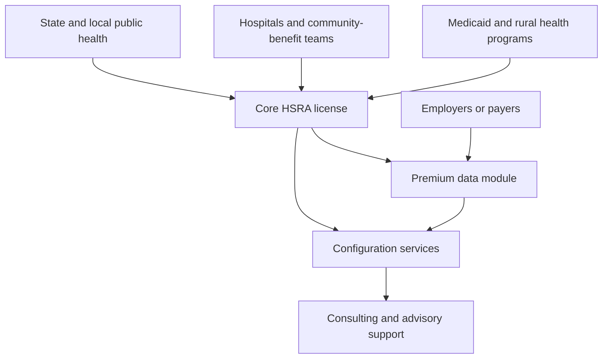

# HSRA License and Services Opportunity

**Last Updated:** 2026-03-09

## Summary

HSRA should be packaged as a software-plus-services offering, not as a pure off-the-shelf analytics tool. The highest-value commercial motion is a layered offer:

1. core HSRA software/license,
2. optional premium data enrichment,
3. configuration and implementation services,
4. buyer-specific strategy and intervention-design support.

This structure fits the current product evidence, the Tennessee pilot narrative, and the HPR premium-data opportunity.

## Claim Classes Used In This Document

- `Implemented`: supported by current technical/product evidence
- `Configurable`: achievable with configuration, onboarding, or project services
- `Premium extension`: depends on HPR data or similar enrichment
- `Positioning`: useful commercial framing that should not be treated as default capability proof

## Recommended Packaging Model (`Configurable` / commercial packaging)

The packaging ladder makes the commercial motion explicit: start with auditable HSRA, then add enrichment and services only where the buyer needs them.

| Package Layer | What The Buyer Gets | Best-Fit Buyers | Why It Matters |
|---|---|---|---|
| Core HSRA license | Baseline HRA + SDOH analytics, tract/county views, report outputs, prioritization-ready data products | State/local public health, hospitals, public-policy teams | Solves the integrated-risk visibility problem |
| Premium data module | HPR-style individual, household, and neighborhood enrichment for segmentation and outreach | Employers, payers, public-health programs, population-health initiatives | Turns risk insight into population-specific action design |
| Configuration services | State-first data integration, buyer-specific metrics, dashboard/report tailoring, workflow design | States, local agencies, health systems | Most buyers need local tailoring before the product becomes operationally useful |
| Consulting/advisory services | Question framing, intervention logic, resource-allocation design, stakeholder alignment | Tennessee-style pilots, public-sector programs, complex enterprise buyers | Buyers often need help converting analytics into defensible action |

## Why A Pure Software Sale Is Not Enough (`Configurable`)

The current HSRA evidence suggests the product is strongest when it is configured around a buyer's specific decision context. Examples:

- a state agency needs county/tract prioritization tied to grant, rural-health, or equity goals,
- a hospital needs CHNA or community-benefit justification,
- a permitting/public-interest workflow may need community-risk and investment framing,
- a premium-data buyer may need outreach, segmentation, or EAP design support.

In each case, the buyer value is not just the model. It is the model plus the configured questions, local data inputs, and interpretation workflow.

The Deep Research result adds external support for this packaging logic: adjacent vendors in health analytics, GIS, and social-risk markets routinely pair software with advisory/configuration services, and public buyers also procure configured analytics and dashboard support rather than only buying generic off-the-shelf tools.

## Public-Data Offer vs Premium-Data Offer

### Public-Data Offer (`Implemented` + `Configurable`)

This is the most defensible starting package for public-sector buyers:

- tract/county-level pollution and HRA baseline
- SDOH overlays
- report outputs and prioritization support
- state-first public data integration where applicable

This offer aligns well with Tennessee-style statewide prioritization and with agency buyers who need auditable public-data logic.

### Premium-Data Offer (`Premium extension`)

The HPR LCI materials suggest a second, higher-value layer. The premium offer can add:

- engagement segmentation,
- communication-channel and timing optimization,
- richer household and social-risk indicators,
- behavioral-health and EAP design support,
- deeper access-to-care, intervention, and benchmark logic.

That premium mode is especially useful when the buyer asks questions such as:

- who needs which intervention,
- what motivates them,
- how do we reach them,
- which communication strategy fits each segment,
- which subpopulations are structurally resistant to standard outreach.

External analogs reinforce that this should remain an optional paid enrichment layer. The strongest analogs are premium demographic, segmentation, location, or enrichment data sold on top of a core platform, not bundled by default into the base offer.

## Service Lines To Package Around HSRA (`Configurable`)

### 1. State-First Configuration

- public dataset selection and integration
- geography strategy (state, county, tract, ZIP where appropriate)
- buyer-specific scorecards and priority tiers
- evidence-card and report customization

### 2. Pilot Design and Deployment

- Tennessee-style pilot framing
- target-area selection
- decision-object design for screening, mobile services, or investments
- measurement and auditability setup

### 3. Premium Data Design

- HPR data-scope selection
- question mapping to premium fields
- population segmentation design
- privacy/governance packaging with the buyer

### 4. Strategy and Interpretation Support

- stakeholder workshops
- narrative framing for public-sector or executive audiences
- intervention prioritization logic
- documentation support for grants, boards, or program oversight

## Buyer-Specific Commercial Motions (`Configurable`)

| Buyer Type | Most Natural Offer |
|---|---|
| State health department | Core HSRA + state-first configuration + pilot design |
| Local health department | Core HSRA + CHA/CHIP support + targeted configuration |
| Nonprofit hospital | Core HSRA + CHNA/community-benefit packaging |
| Medicaid / public-health program | Core HSRA + prioritization workflow + premium segmentation if needed |
| Employer / payer / wellness-oriented buyer | Premium-data-enhanced HSRA + outreach/segmentation services |
| EJ / permitting-adjacent buyer | Core HSRA + public-facing narrative + community-investment framing |

## External Commercialization Analogs

- `Socially Determined` supports the software-plus-advisory pattern.
- `Esri` supports the software-plus-professional-services pattern and the premium-data upsell pattern.
- `SparkMap` supports subscription-tiered assessment/reporting packaging.
- `findhelp` supports configurable and branded platform delivery for programmatic buyers.
- `Claritas` and similar vendors support premium enrichment as a separate monetized layer.

## What Not To Claim Yet (`Claim hygiene`)

- fixed pricing without commercial validation
- premium HPR integration as already productized by default
- automated intervention recommendations as a turnkey capability in all deployments
- universal out-of-the-box fit across all buyer segments without configuration

## Source-to-Claim Map

| Claim | Sources |
|---|---|
| Core HSRA package should lead with auditable risk + SDOH analytics | `../lsars-hra/README.md`, `../lsars-hra/docs/LSARS_HRA_API_DOCUMENTATION.md`, `../lsars-hra/docs/investor/03_Traction_Pilots/Pilot_OnePager_TN_Health.md` |
| Tennessee-style delivery is configuration-heavy and action-oriented | `../lsars-hra/docs/investor/03_Traction_Pilots/Pilot_OnePager_TN_Health.md`, `../lsars-hra/docs/state_first/TN_PILOT_DATA_STRATEGY.md` |
| Premium HPR data expands into segmentation, outreach, and intervention design | `docs/inputs/HPR/LCI-GQM.html`, `docs/inputs/HPR/LCI-data-model-master.xlsx` |
| Services narrative exists in LSARS messaging | `videos/scripts/LSARS HSRA+PI explainer.SCRIPT.md`, `docs/inputs/HSRA/HSRA-pophealthmap.ai-deck-2026Mar9.pdf` |
| Adjacent markets normalize software plus configuration/services with optional premium data | `docs/research/hsra/chatgpt-deep-research-result-2026.md` |

## Sources

- `../lsars-hra/README.md`
- `../lsars-hra/docs/LSARS_HRA_API_DOCUMENTATION.md`
- `../lsars-hra/docs/investor/03_Traction_Pilots/Pilot_OnePager_TN_Health.md`
- `../lsars-hra/docs/state_first/TN_PILOT_DATA_STRATEGY.md`
- `docs/inputs/HPR/LCI-GQM.html`
- `docs/inputs/HPR/LCI-data-model-master.xlsx`
- `videos/scripts/LSARS HSRA+PI explainer.SCRIPT.md`
- `docs/inputs/HSRA/HSRA-pophealthmap.ai-deck-2026Mar9.pdf`
- `docs/research/hsra/chatgpt-deep-research-result-2026.md`
- https://www.sociallydetermined.com/our-approach
- https://company.findhelp.com/products/
- https://sparkmap.org
- https://www.esri.com/en-us/arcgis/products/arcgis-data/explore/demographics-data
- https://claritas.com/prizm-premier/
