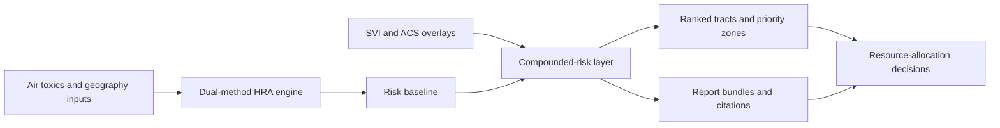
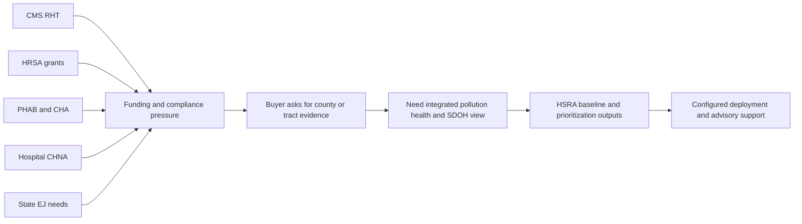

# HSRA Overall Research Summary

**Last Updated:** 2026-03-09

## Summary

Health and Social Risk Assessment (HSRA) is best framed as an auditable, tract- and county-level decision-support product built on the LSARS HRA engine. Its strongest current proof is not generic dashboarding. It is the combination of air-toxics health-risk methods, HARP2-parity credibility, SDOH overlays, ranked-priority outputs, and a Tennessee anchor story that turns surveillance into defensible resource allocation.

The commercial opportunity is strongest when HSRA is sold as a software-plus-services offer. The base product supports public-data-driven prioritization. The higher-value motions add state-first configuration, buyer-specific workflow design, and optional premium data for segmentation and intervention planning.

Externally, the demand story is strongest in public-sector and adjacent health-improvement programs that now require county- or tract-level measurement. The clearest near-term example is the CMS Rural Health Transformation Program, but the broader pull also includes HRSA rural grants, PHAB-driven community health assessments, nonprofit hospital CHNAs, environmental-justice screening gaps, and cancer-control programs that need integrated pollution-plus-health-plus-SDOH evidence.

## What HSRA Does Today

- Calculates health risk using both EPA-style and CA-OEHHA-style methods.
- Produces auditable outputs including baseline HRA, top pollutants, hazard summaries, ranked tracts, and methodology notes.
- Combines environmental burden with SDOH indicators such as CDC SVI and ACS-derived measures.
- Supports tract, county, and related geography workflows useful for statewide and sub-county prioritization.
- Provides a strong technical credibility story through documented HARP2 parity.

## Why Buyers Care Now

The strongest buyer need is not just analytics access. Buyers need a defensible answer to resource-allocation questions such as where to send screening resources first, how to justify county-level investments, or how to show that environmental burden and social vulnerability were considered together. HSRA is useful because it can collapse multiple fragmented public datasets into one prioritization narrative.

## Commercial Model

HSRA should be sold as a layered offer rather than a one-size-fits-all product.

- `Core license`: auditable HRA plus SDOH prioritization.
- `Configuration services`: state-first data integration, scorecards, reports, and workflow tailoring.
- `Premium data module`: HPR-style enrichment for segmentation, outreach, and intervention design.
- `Consulting and advisory`: question framing, intervention planning, stakeholder alignment, and evidence packaging.

The safest sales motion is to lead with the public-data baseline, then add services or premium data only when a buyer's use case clearly needs them.

## Best-Fit Buyers

- State health departments that need defensible intervention prioritization.
- State Medicaid and rural-health teams that need county or community metrics tied to funded programs.
- Local health departments that need tract-level disparity analysis for CHA, CHIP, or PHAB workflows.
- Nonprofit hospital community-benefit teams that need sharper CHNA prioritization.
- Environmental-health, EJ, and cancer-control programs that need a combined burden view rather than disconnected tools.

## Positioning Versus Proof

The strongest implemented claims are technical and output-oriented: dual-methodology HRA, HARP2 parity, SDOH overlays, ranked tracts, and auditable reports. Tennessee is a strong pilot and business-case narrative, but it should not be generalized as proof of nationwide deployment. HPR-based segmentation is a premium extension, not part of the default current-state HSRA offer. Broader LSARS messaging around AI, permit acceleration, or community investment should stay in positioning unless separately corroborated.

## Recommended EPMS Enrichment Order

1. `capability`
2. `stakeholder`
3. `persona`
4. `jtbd`
5. `metric`
6. `risk`
7. `pilot`
8. `marketing`

That order keeps claim hygiene intact because it starts with the most evidence-backed product facts and only adds market-facing wrappers after the base graph is grounded.

## Immediate Next Actions

- Upload the full local HSRA research package into EPMS using `save_research` only.
- Complete entity-based enrichment using the evidence-first order above.
- File an EPMS Jira bug for broken save-path behavior and template-related failures.
- Keep checklist-section writes separate until the unstable backend path is repaired.

## Sources

- `../lsars-hra/README.md`
- `../lsars-hra/docs/LSARS_HRA_API_DOCUMENTATION.md`
- `../lsars-hra/docs/architecture.md`
- `../lsars-hra/apps/backend/services/sdoh_service.py`
- `../lsars-hra/apps/backend/report/sdoh_data.py`
- `../lsars-hra/docs/investor/03_Traction_Pilots/Pilot_OnePager_TN_Health.md`
- `../lsars-hra/docs/investor/research/Research_Health_Equity_Pilots.md`
- `../lsars-hra/docs/state_first/TN_PILOT_DATA_STRATEGY.md`
- `../lsars-hra/docs/plans/LSARS-509-TN-DATA-SOURCE-EXPANSION.md`
- `docs/inputs/HPR/LCI-GQM.html`
- `docs/inputs/HPR/LCI-data-model-master.xlsx`
- `docs/inputs/HSRA/HSRA-pophealthmap.ai-deck-2026Mar9.pdf`
- `docs/research/market/hsra-demand-signals-rural-health-2026.md`
- `docs/research/hsra/hsra-source-map-and-evidence-register-2026.md`
- `docs/research/hsra/hsra-product-summary-2026.md`
- `docs/research/hsra/hsra-license-and-services-opportunity-2026.md`
- `docs/research/hsra/hsra-government-market-analysis-2026.md`
- `docs/research/hsra/hsra-competitive-landscape-2026.md`
