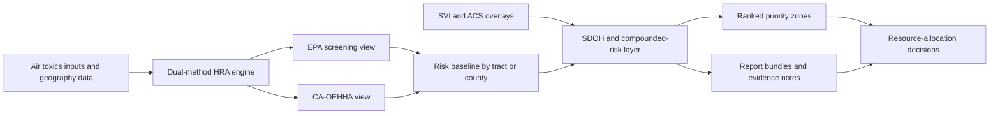

# HSRA Product Summary

**Last Updated:** 2026-03-09

## What HSRA Is

Health and Social Risk Assessment (HSRA) is best described as a tract/county-level risk-analysis product built on the LSARS HRA engine. In its current technical form, it combines air-toxics health-risk analysis, population-vs-regulatory views, Social Determinants of Health overlays, and report-ready outputs that can support public-health planning, environmental-justice analysis, and resource-prioritization workflows.

## Claim Classes Used In This Document

- `Implemented`: evidenced in current code, technical docs, or current outputs
- `Configurable`: plausible with the current product plus services/configuration
- `Premium extension`: dependent on premium HPR data or similar enrichment
- `Positioning`: strategic or GTM framing that should not be mistaken for default out-of-the-box proof

## What HSRA Does Today

- Calculates health risk using both U.S. EPA and CA-OEHHA-aligned methods
- Supports population screening and permit-grade reporting workflows
- Produces report bundles with top pollutants, hazard metrics, and worked examples
- Overlays environmental burden with SDOH indicators such as CDC SVI and ACS-derived measures
- Supports tract, county, and related geography workflows used for statewide and sub-county analysis
- Enables ranked-tract and compounded-risk views that are useful for prioritization, not just description

## Core Technical Capabilities

This architecture view shows the core HSRA flow: auditable risk calculation first, then SDOH enrichment, then decision-ready outputs.

### Dual-Methodology HRA (`Implemented`)

The underlying engine supports both:

- EPA-style screening (`MICR = C x IUR`), and
- CA-OEHHA-style age-weighted calculations (`MICR = C x CPF x ASF`).

That matters because it allows HSRA to speak to both national screening use cases and more detailed, receptor-sensitive public-health or permit-support use cases.

### HARP2-Parity Foundation (`Implemented`)

The engine is documented as validated against CARB HARP2 to 5 significant figures. That gives HSRA a strong auditable-methodology story for public-sector and expert-reviewed settings where credibility matters more than dashboard novelty.

### SDOH and Compounded-Risk Layer (`Implemented`)

HSRA is not just an emissions-to-risk calculator. The current codebase and report objects show support for:

- SVI theme percentile data,
- ACS-derived metrics,
- compounded HRA x SDOH scoring,
- barrier segmentation, and
- ranked tract outputs for prioritization.

### Report and Decision Outputs (`Implemented`)

The current product evidence supports outputs such as:

- baseline HRA by geography,
- population-weighted and regulatory views,
- top-pollutant summaries,
- hazard index summaries,
- HEM report generation,
- ranked tract lists, and
- data-source citations and methodology notes.

## Who HSRA Serves (`Configurable`)

The strongest current-fit audiences are:

- state health agencies,
- local health departments,
- Medicaid/public-health planners,
- nonprofit hospitals doing community health planning,
- environmental-justice or permitting-adjacent teams,
- public-health researchers and policy programs.

In broader LSARS positioning, HSRA also supports permit-acceleration and community-investment narratives, but those should be treated as solution-context claims rather than HSRA-only current-state claims unless separately validated.

## Tennessee Anchor Use Case (`Configurable` / pilot framing)

The Tennessee internal materials provide the clearest business-case narrative today. In that framing, HSRA helps Tennessee analyze county- and tract-level combinations of:

- pollution burden,
- cancer and related public-health burden indicators,
- social vulnerability and access barriers,
- priority zones for mobile services, screenings, and built-environment investments.

The Tennessee one-pager is especially strong because it frames HSRA as a way to convert surveillance into auditable resource allocation rather than just another public-health dashboard. That should still be treated as a pilot/business-case framing, not blanket proof of generalized statewide deployment.

## Public-Data Mode vs Premium-Data Mode

### Public-Data HSRA (`Implemented` + `Configurable`)

Public-data HSRA is grounded in the current LSARS HRA stack and state-first data strategy:

- EPA AirToxScreen baseline concentrations
- HRA methods and report outputs
- CDC SVI and ACS overlays
- Tennessee and other public health datasets where configured

This is enough to support strong tract/county-level public-health and prioritization use cases.

### Premium-Data-Enhanced HSRA (`Premium extension`)

HPR LCI materials expand the product into a richer population-intelligence and intervention-design layer. The HPR goal/question framework adds:

- engagement segmentation,
- communication preferences,
- household structure,
- food, housing, transportation, and access barriers,
- behavioral health and EAP design signals,
- outreach and messaging optimization,
- benchmark/reporting enrichment.

That premium-data mode is especially relevant when the buyer wants not just risk identification, but a richer design layer around who to reach, how to reach them, and how to segment populations for program decisions.

## What To Treat As Positioning, Not Current-State Proof (`Positioning`)

- broad Human-AI transformation language
- permit-acceleration outcome promises
- community-investment recommendation examples presented as narrative scenarios
- AI narrative text shown in mockups or demo language without direct implementation evidence

These can still be useful for messaging, but they should not be confused with the narrower set of capabilities already evidenced in code and technical docs.

## Source-to-Claim Map

| Claim | Sources |
|---|---|
| HSRA supports EPA and CA-OEHHA methods | `../lsars-hra/README.md`, `../lsars-hra/docs/LSARS_HRA_API_DOCUMENTATION.md` |
| HSRA has HARP2-parity credibility | `../lsars-hra/README.md`, `../lsars-hra/docs/architecture.md` |
| HSRA supports SDOH overlays and prioritization-style outputs | `../lsars-hra/apps/backend/services/sdoh_service.py`, `../lsars-hra/apps/backend/report/sdoh_data.py` |
| Tennessee is a high-fit pilot/business case | `../lsars-hra/docs/investor/03_Traction_Pilots/Pilot_OnePager_TN_Health.md`, `../lsars-hra/docs/investor/research/Research_Health_Equity_Pilots.md` |
| Premium HPR mode expands the question set beyond public data | `docs/inputs/HPR/LCI-GQM.html`, `docs/inputs/HPR/LCI-data-model-master.xlsx` |
| Broader permit/community-investment framing exists in LSARS messaging | `videos/scripts/LSARS HSRA+PI explainer.SCRIPT.md`, `docs/inputs/HSRA/HSRA-pophealthmap.ai-deck-2026Mar9.pdf` |

## Sources

- `../lsars-hra/README.md`
- `../lsars-hra/docs/LSARS_HRA_API_DOCUMENTATION.md`
- `../lsars-hra/docs/architecture.md`
- `../lsars-hra/apps/backend/services/sdoh_service.py`
- `../lsars-hra/apps/backend/report/sdoh_data.py`
- `../lsars-hra/docs/investor/03_Traction_Pilots/Pilot_OnePager_TN_Health.md`
- `../lsars-hra/docs/investor/research/Research_Health_Equity_Pilots.md`
- `docs/inputs/HPR/LCI-GQM.html`
- `docs/inputs/HPR/LCI-data-model-master.xlsx`
- `videos/scripts/LSARS HSRA+PI explainer.SCRIPT.md`
- `docs/inputs/HSRA/HSRA-pophealthmap.ai-deck-2026Mar9.pdf`
