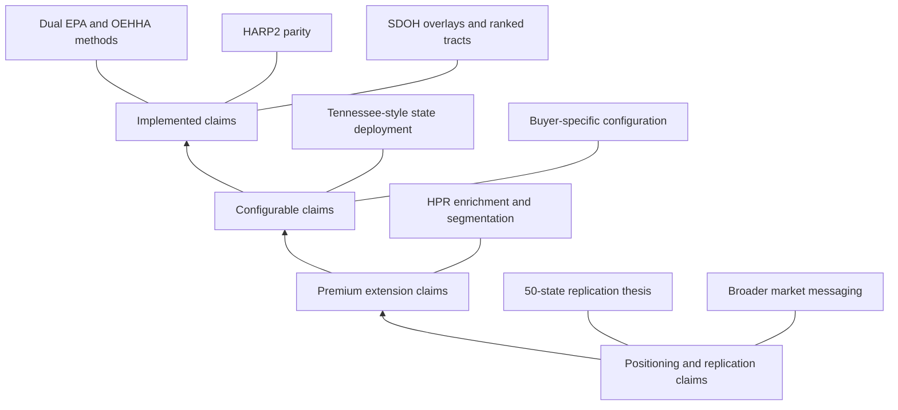
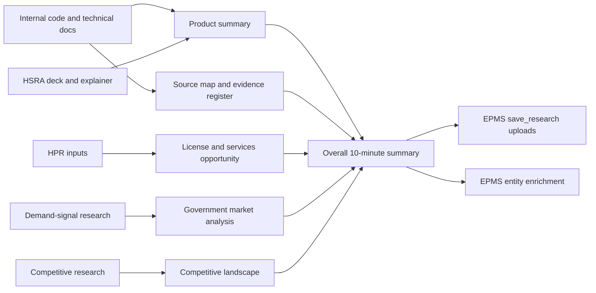

# HSRA Source Map and Evidence Register

**Last Updated:** 2026-03-09

## Purpose

This document is the source-of-truth map for the MKT-1 HSRA research package. It records which internal and external sources support which claims, what each source is strong enough to prove, and where claim boundaries still need to be respected.

## Evidence Register

| Source | Type | What It Strongly Supports | How To Use It | Claim Boundary |
|---|---|---|---|---|
| `../lsars-hra/README.md` | Internal technical/product doc | HSRA/HRA engine overview, dual EPA/OEHHA methods, HARP2 parity, 50-state coverage, SDOH integration, core use cases | Product summary, EPMS product idea, value props | Product framing here is technical and high-confidence, but not a full GTM document |
| `../lsars-hra/docs/LSARS_HRA_API_DOCUMENTATION.md` | Internal technical doc | Core endpoints, report bundle outputs, population vs regulatory views, top pollutants, hazard indices, data-source citations | Product summary, EPMS definitions, feature/output claims | Supports implemented outputs, not marketing promises |
| `../lsars-hra/docs/architecture.md` | Internal architecture doc | Layered architecture, source-data-first approach, tested calculator, HARP2 validation structure | Product summary, source map, red-team/devil's-advocate section | Supports methodology and architecture claims, not commercial positioning |
| `../lsars-hra/apps/backend/services/sdoh_service.py` | Internal implementation source | GEOID handling, tract/county/ZCTA support, SDOH data retrieval, compounded risk analytics, ranked tract logic | Product summary, EPMS draft, evidence register | Use to confirm implementation detail, not buyer language |
| `../lsars-hra/apps/backend/report/sdoh_data.py` | Internal implementation source | SDOH report object model, HRA profile summary, citations, burden concentration, ranked tracts, methodology notes | Product summary, EPMS outputs section | Confirms output structure and citation model |
| `../lsars-hra/docs/investor/03_Traction_Pilots/Pilot_OnePager_TN_Health.md` | Internal pilot/strategy doc | Tennessee resource-prioritization story, target sponsors, pilot deliverables, success metrics | Product summary, government market analysis, EPMS industry targets | Pilot framing is directional and strategic, not production proof by itself |
| `../lsars-hra/docs/investor/research/Research_Health_Equity_Pilots.md` | Internal market research | Tennessee health-equity pilot rationale, state/local stakeholder map, resource-allocation framing | Government market analysis, license/services packaging | Good for public-sector need framing; not a substitute for official program guidance |
| `../lsars-hra/docs/state_first/TN_PILOT_DATA_STRATEGY.md` | Internal strategy doc | State-first data strategy, cached evidence-card approach, public-data gap handling, Tennessee-specific data priorities | Product summary, license/services opportunity, EPMS market-model inputs | Supports state-specific deployment design more than broad market claims |
| `../lsars-hra/docs/plans/LSARS-509-TN-DATA-SOURCE-EXPANSION.md` | Internal implementation plan | Evidence-card ETL priorities, Tennessee data-source inventory, gap categories, tract-level extensions | Government analysis, premium-data packaging, EPMS customer questions | Supports data roadmap and state-specific extensibility |
| `videos/scripts/LSARS HSRA+PI explainer.SCRIPT.md` | Internal positioning script | HSRA role inside broader LSARS permit-acceleration story, configuration/services role, example community metrics | License/services opportunity, EPMS product-family framing | Treat as positioning unless corroborated by technical/docs sources |
| `lsaProductExpertAlignment.md` | Internal positioning/approval doc | Who can credibly speak about HSRA, safe proof angles, reviewer guidance | EPMS product-family framing, reviewer mapping | Not a product capability source |
| `docs/inputs/HSRA/HSRA-pophealthmap.ai-deck-2026Mar9.pdf` | Internal positioning deck | Product purpose, target audiences, Putnam County/Tennessee examples, permit/public-health positioning, financial-burden concepts | Product summary, EPMS product idea, industry targets | Treat UI mockups and AI narrative as positioning unless confirmed elsewhere |
| `docs/inputs/HPR/LCI-GQM.html` | Premium-data concept/input doc | 8 strategic goals, 29 questions, 200 data elements, buyer-question framing, data-level structure | License/services opportunity, EPMS goals/problems and customer questions | Supports HPR packaging logic, not proof that all premium data is already integrated |
| `docs/inputs/HPR/LCI-data-model-master.xlsx` | Premium-data reference workbook | Detailed HPR data model, source-file mapping, data-level coverage, premium-data content breadth | License/services opportunity, EPMS market-model inputs | Use for data-model scope, not for current implementation claims unless corroborated |
| `docs/research/market/hsra-demand-signals-rural-health-2026.md` | Local market research | Federal/state demand signals, rural-health funding, PHAB/CHNA/EJ/registry buyer questions | Government market analysis, EPMS market segments | Broad public-sector demand source; not a competitor doc |
| `docs/research/hsra/chatgpt-deep-research-result-2026.md` | External research synthesis | 50-state demand signals, RHT funding specifics, configured public-sector procurement analogs, adjacent vendor evidence, premium-data commercialization analogs, safe-to-cite external claims | Competitive landscape, government market analysis, license/services opportunity, EPMS market-facing positioning | Strong for external demand/market/category proof; do not use it to expand implemented-current-state product claims |

## High-Confidence Product Claims

This evidence hierarchy is the claim-hygiene rule for the whole package: the farther a claim sits from the implemented base, the more carefully it must be worded.

| Claim | Primary Sources |
|---|---|
| HSRA/HRA supports both EPA and CA-OEHHA calculation methods | `../lsars-hra/README.md`, `../lsars-hra/docs/LSARS_HRA_API_DOCUMENTATION.md` |
| The engine is validated against HARP2 to 5 significant figures | `../lsars-hra/README.md`, `../lsars-hra/docs/architecture.md` |
| HSRA supports 50-state tract-level baseline analysis using EPA data | `../lsars-hra/README.md`, `../lsars-hra/docs/LSARS_HRA_API_DOCUMENTATION.md` |
| HSRA can combine air-toxics burden with SDOH overlays and compounded-risk analysis | `../lsars-hra/README.md`, `../lsars-hra/apps/backend/services/sdoh_service.py`, `../lsars-hra/apps/backend/report/sdoh_data.py` |
| Tennessee is a strong public-health allocation use case for HSRA | `../lsars-hra/docs/investor/03_Traction_Pilots/Pilot_OnePager_TN_Health.md`, `../lsars-hra/docs/investor/research/Research_Health_Equity_Pilots.md` |
| HPR premium data expands the question set into engagement, communications, household, and intervention design | `docs/inputs/HPR/LCI-GQM.html`, `docs/inputs/HPR/LCI-data-model-master.xlsx` |
| The strongest current external demand signal is CMS RHT with county/community outcome requirements | `docs/research/hsra/chatgpt-deep-research-result-2026.md` |
| External evidence supports a repeatable problem shape across states more than a finished 50-state software category | `docs/research/hsra/chatgpt-deep-research-result-2026.md` |

## Claims That Need Careful Wording

- HSRA should be described as a **health-and-social risk decision platform** only when the statement is grounded in both technical capability and positioning material.
- AI insight, permit acceleration, and community investment recommendations should be presented as part of the broader LSARS solution context unless directly tied to implemented HSRA outputs.
- Premium HPR data should be presented as an **optional enrichment path**, not as a default capability already active in the current public-data HSRA deployment.
- Competitive differentiation should be framed as an **integration advantage** rather than an absolute claim that no competitor can do any similar task.
- Public-sector expansion beyond Tennessee should be described as a **replication thesis supported by demand signals**, not validated nationwide adoption.

## Open Gaps

- Final product naming normalization between `HSRA`, `HRA`, and broader `LSARS` packaging
- Which HPR data elements are already operationalized vs still part of future premium packaging
- Which EPMS sections need SME review before being treated as approved product messaging
- Whether a separate local competitive-landscape research note should be maintained alongside the final category summary

## Research Package Structure

This package flow shows how the local docs fit together before they are pushed into EPMS.

## Source-to-Claim Usage Rules

- Use internal technical docs and source files for implementation/current-state claims
- Use deck/script materials for positioning and audience framing only when corroborated
- Use HPR files for premium-data and buyer-question expansion, not baseline implementation claims
- Use the demand-signals market note and official public sources for funding/program/buyer-demand claims

## Sources

- `../lsars-hra/README.md`
- `../lsars-hra/docs/LSARS_HRA_API_DOCUMENTATION.md`
- `../lsars-hra/docs/architecture.md`
- `../lsars-hra/apps/backend/services/sdoh_service.py`
- `../lsars-hra/apps/backend/report/sdoh_data.py`
- `../lsars-hra/docs/investor/03_Traction_Pilots/Pilot_OnePager_TN_Health.md`
- `../lsars-hra/docs/investor/research/Research_Health_Equity_Pilots.md`
- `../lsars-hra/docs/state_first/TN_PILOT_DATA_STRATEGY.md`
- `../lsars-hra/docs/plans/LSARS-509-TN-DATA-SOURCE-EXPANSION.md`
- `videos/scripts/LSARS HSRA+PI explainer.SCRIPT.md`
- `lsaProductExpertAlignment.md`
- `docs/inputs/HSRA/HSRA-pophealthmap.ai-deck-2026Mar9.pdf`
- `docs/inputs/HPR/LCI-GQM.html`
- `docs/inputs/HPR/LCI-data-model-master.xlsx`
- `docs/research/market/hsra-demand-signals-rural-health-2026.md`
- `docs/research/hsra/chatgpt-deep-research-result-2026.md`
