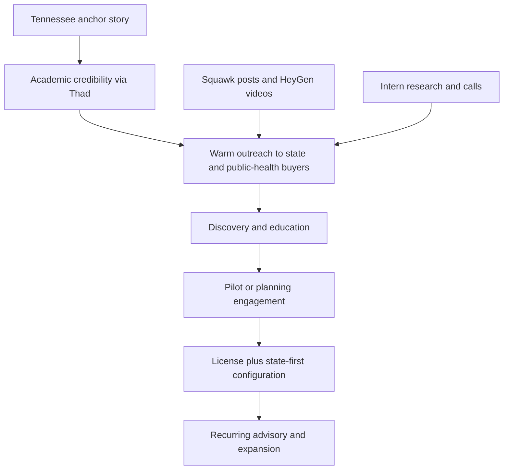
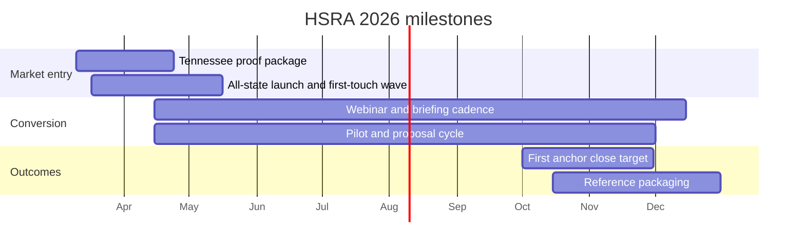

# HSRA Strategy Briefing

**Last Updated:** 2026-03-12

## Executive Summary

HSRA / PopHealthMap should be marketed in 2026 as a **public-health decision-support platform plus consulting capability**, not as a generic analytics dashboard. The strongest path to revenue is to use Tennessee as the anchor story, then run a relationship-led campaign into state health, rural health, Medicaid, hospital, and university/public-health accounts that face pressure to make county- and tract-level resource decisions. The right message is not "buy our AI." It is "here is a defensible way to prioritize where interventions, screening, and public-health investment should go first."

The commercial motion should combine four layers: a core HSRA license, state-first configuration, consulting/advisory support, and premium data only when the buyer's use case requires it. This keeps the offering aligned with current proof: HSRA already has an auditable methodology story, tract/county outputs, HARP2-parity credibility, and Tennessee pilot framing. What closes deals fastest is turning that into a planning, pilot, and configuration offer for buyers who already have funding or reporting pressure.

The safest reading of the market is not to limit outreach at the top of the funnel. It is to use Tennessee plus CMS Rural Health Transformation to support an **all-state launch with differentiated messaging**, while accepting that only a smaller subset of states will respond quickly enough to enter active pursuit in 2026.

## Strategy In One View

## Core Objectives For 2026

| Objective | What success looks like |
| --- | --- |
| Establish HSRA category story | Buyers understand HSRA as auditable prioritization for public-health action, not vague AI software |
| Build a repeatable outreach engine | Thad, intern, and marketing manager run a steady rhythm of email, calls, content, and follow-up |
| Convert interest into paid engagements | Discovery calls become pilots, planning engagements, configuration work, and licenses |
| Produce proof stronger than demos | Tennessee proof assets and one or more real buyer-facing references support broader expansion |

## Why This Market Is Attractive Right Now

- CMS Rural Health Transformation provides a live 50-state signal that county/community measurement matters now.
- HRSA rural-health programs, PHAB assessment pressure, hospital CHNA cycles, and state equity/EJ work create adjacent demand.
- April-June 2026 is the key budget and planning window for many state buyers, so spring outreach matters more than waiting for late-year procurement cycles.
- Public-health teams often have fragmented data, but they still need one integrated prioritization story.
- HSRA's differentiation is the integrated view of pollution burden, health burden, and SDOH at tract/county level with auditable methods.

## Who To Target First

The highest-fit 2026 targets are:

1. state health department leaders and rural-health transformation teams
2. Medicaid or public-health program leaders who need county/community metrics
3. local health departments with CHA/CHIP or PHAB pressure
4. nonprofit hospitals doing CHNA and community-benefit planning
5. university and public-health collaborators who can open state-facing conversations

The campaign should open with an all-state launch, but not with one generic message. It should move in waves while using tailored message lanes tied to visible state priorities:

- `March-April`: Tennessee proof package, all-state launch, and first-touch coverage
- `April-June`: response shaping, webinars, and second-touch follow-up
- `July-September`: pilot shaping and proposal activity with the most responsive states/accounts
- `October-December`: close anchor opportunities and package early proof for 2027 expansion

Recommended coverage model:

- `all 50 states` receive tailored messaging and multi-channel touches at launch
- `12-16 states/accounts` sit in active pursuit at any given time
- `6-10 states/accounts` move into live discovery or demo activity
- `3-6 opportunities` sit in the commercial pipeline where LSA Digital owns follow-up

## State Prioritization Snapshot

The state strategy is now explicit: all 50 states still receive launch messaging, but the campaign narrows quickly into a ranked active-pursuit set based primarily on visible unmet need, then on adoption readiness and access path. Tier A states get the fastest research, strongest state-specific tailoring, and earliest live discovery effort. Tier B states remain the fast-follower and bridge bench, while Tier C states stay in broad launch coverage until response signals or new research justify moving them up.

- `Tier A`: Tennessee, Texas, Mississippi, Alabama, Georgia, Arkansas, Kentucky, West Virginia, Kansas, North Carolina, New York
- `Tier B`: Oklahoma, Louisiana, New Mexico, Pennsylvania, Colorado, Maryland, South Carolina, Connecticut, Minnesota, Oregon, Massachusetts, California, Washington
- `Tier C`: the remaining 28 states stay in launch coverage and nurture until response data or stronger public evidence changes their standing

California and Washington now sit in Tier B as bridge states because the team has stronger partnership coverage and/or a better practical chance of physically meeting buyers across the `NY / MA / CA / WA` corridor.

For the full 50-state ranking, methodology, and evidence notes, see [HSRA State Prioritization Ranking 2026](./HSRA-state-prioritization-ranking-2026.md). For the current active-pursuit account list and owner assignments, see [HSRA Tier 1 State Account Scorecard](./HSRA-tier-1-state-account-scorecard.md).

## Ownership Model

| Role | Main job | Time expectation |
| --- | --- | --- |
| Thad Perry | credibility, first-touch outreach, live discovery calls, script approval, webinars | 7-10 hrs/week |
| Thad's Intern | account research, list building, phone follow-up, scheduling, pipeline hygiene | 17-25 hrs/week |
| Marketing Manager | Squawk campaign, HeyGen videos, one-pagers, webinar support, reporting | 10-14 hrs/week |
| Mike Idengren | live discovery calls, offer packaging, proposals, tailored demos, commercial close support | 14-18 hrs/week |

## Detailed Documents

Use this briefing as the high-level read, then go deeper based on what you need next.

### Strategy and execution

- [HSRA Marketing and Sales Plan](./HSRA-marketing-and-sales-plan.md) - full operating plan, buyer map, wave structure, workstreams, and targets
- [HSRA 30-Day Outreach Execution Plan](./HSRA-30-day-outreach-execution-plan.md) - 30-day runbook, route order, status model, and state-first cadence
- [HSRA Tactical Contact Playbook](./HSRA-tactical-contact-playbook.md) - state-by-state message lanes, account types, channel templates, and research packet structure
- [HSRA Outreach Email Set](./HSRA-outreach-email-set.md) - source email set that feeds the tactical playbook templates and follow-up variants
- [HSRA Tier 1 State Account Scorecard](./HSRA-tier-1-state-account-scorecard.md) - active-pursuit states, account hooks, and ownership model
- [HSRA State Prioritization Ranking 2026](./HSRA-state-prioritization-ranking-2026.md) - 50-state ranking, tier rationale, and working matrix

### Research and evidence

- [HSRA Overall Research Summary](../../research/hsra/hsra-overall-research-summary-2026.md) - product framing, buyer fit, and commercial model in one place
- [HSRA Government Market Analysis](../../research/hsra/hsra-government-market-analysis-2026.md) - Tennessee anchor story, public-sector fit, and replication thesis
- [HSRA License and Services Opportunity](../../research/hsra/hsra-license-and-services-opportunity-2026.md) - license, configuration, consulting, and premium-data packaging logic
- [HSRA Demand Signals - Rural Health](../../research/market/hsra-demand-signals-rural-health-2026.md) - CMS RHT and other near-term public-health demand signals
- [HSRA Competitive Landscape](../../research/hsra/hsra-competitive-landscape-2026.md) - adjacent vendors and differentiation context
- [HSRA Product Summary](../../research/hsra/hsra-product-summary-2026.md) - technical capabilities and proof points behind the HSRA offer

## Operating Plan

### 1. Relationship-first outreach

The first contact should look like a collaboration note from a public-health academic, not a software sales email. Use Thad's `.edu` account when the objective is trust-building, peer dialogue, and public-interest framing. Once an opportunity is qualified, move commercial follow-up through LSA Digital. In the opening launch, all states receive some combination of tailored email, LinkedIn/content reinforcement, and phone follow-up; only the most responsive states move into heavier discovery and demo effort.

### 2. Content that supports conversations

Marketing should support sales, not run separately from it. Squawk and HeyGen should produce a simple stream of assets that make meetings easier to win:

- short posts on why tract/county prioritization matters now
- trust-building posts on methodology, auditability, and evidence
- short Thad videos for public-health leaders and hospital/community-benefit teams
- one-page buyer briefs and webinar decks
- visibility through `NOSORH`, `NACCHO`, `ASTHO`, and `RHIhub`, so HSRA appears in institutional channels as well as direct outreach

### 3. Pilot-centric conversion

HSRA should be sold in a ladder:

1. educational briefing
2. discovery conversation
3. pilot or planning engagement
4. license plus state-first configuration
5. premium enrichment only if needed

That ladder matches how public-sector buyers reduce risk and how HSRA creates value fastest.

## Timeline And Milestones

## Expected 2026 Outcomes

| Metric | Base case | Stretch case |
| --- | ---: | ---: |
| States touched at launch | 50 | 50 |
| Active pursuit states/accounts | 12-16 | 14-18 |
| Named target contacts | 150-250 | 220-320 |
| Personalized Thad-led emails | 180-260 | 260-360 |
| Phone follow-up attempts | 250-400 | 350-500 |
| Positive replies / referrals | 20-30 | 30-40 |
| Intro calls | 12-18 | 18-24 |
| Discovery meetings | 8-12 | 12-16 |
| Demo / workshop meetings | 5-7 | 8-10 |
| Active negotiations / proposals | 4-6 | 6-8 |
| Closed sales | 3-4 | 5-6 |

### Outcome interpretation

- `150-250 named contacts` is large enough to support an all-state launch without pretending every state will move quickly.
- `12-18 intro calls` and `8-12 discovery meetings` indicate real traction for a high-trust public-sector motion.
- `4-6 proposals` means the campaign is converting from education into buying behavior.
- `3-4 closed sales` is the defensible base case for 2026 if paid pilots, planning engagements, configuration work, and licenses all count as closes.

## What Leadership Should Watch

- Are Thad's emails and calls producing peer-level engagement, not just polite replies?
- Is the intern keeping follow-up disciplined within 3 business days?
- Is the Marketing Manager shipping assets that directly help outreach and meetings?
- Are proposals framed as license plus configuration/advisory, rather than pure software?
- Are we building proof assets from real buyer interactions by Q3?

## Main Risks

- treating Tennessee as proof of nationwide product-market fit instead of an anchor story
- confusing all-state launch coverage with all-state active pursuit
- using generic AI messaging instead of public-health and auditability language
- overloading Thad with low-value activity instead of high-leverage conversations
- failing to maintain a disciplined pipeline scorecard
- assuming `.edu` is a technical spam-filter bypass rather than a human credibility signal

## Bottom Line

HSRA can generate meaningful 2026 revenue if LSA Digital treats it as a **credibility-led, public-sector licensing plus consulting offer with broad launch coverage and response-driven narrowing**. The combination of Thad's academic voice, intern-supported outreach, marketing-driven content, Mike's 14-18 hours per week on discovery and commercial motion, and LSA Digital follow-up creates a practical path to **3-4 base-case closed sales**, with `5-6` as realistic upside if Tennessee proof and multi-channel execution outperform. The key is discipline: launch broadly, narrow intelligently, and add support if the commercial pipeline outgrows the team's handling capacity.

## Sources

### Internal documents

- [Strategic Plan - LSA sales 2026Mar9](../Strategic Plan - LSA sales 2026Mar9.md)
- [HSRA Overall Research Summary](../../research/hsra/hsra-overall-research-summary-2026.md)
- [HSRA Government Market Analysis](../../research/hsra/hsra-government-market-analysis-2026.md)
- [HSRA License and Services Opportunity](../../research/hsra/hsra-license-and-services-opportunity-2026.md)
- [HSRA Demand Signals - Rural Health](../../research/market/hsra-demand-signals-rural-health-2026.md)
- [Marketing Campaign Feb 2026](../../../marketingCampaignFeb2026.md)
- [LSA Product Expert Alignment](../../../lsaProductExpertAlignment.md)

### External references

- [ASTHO Legislative Priorities](https://www.astho.org/advocacy/legislative-priorities/)
- [NACCHO Annual](https://www.nacchoannual.org)
- [NOSORH](https://www.nosorh.org)
- [RHIhub](https://www.ruralhealthinfo.org)
- [CMS Rural Health Transformation Program Overview](https://www.cms.gov/priorities/rural-health-transformation-rht-program/overview)
- [HRSA Rural Health](https://www.hrsa.gov/rural-health)
