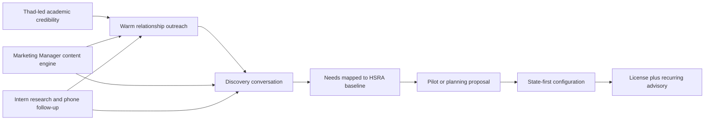
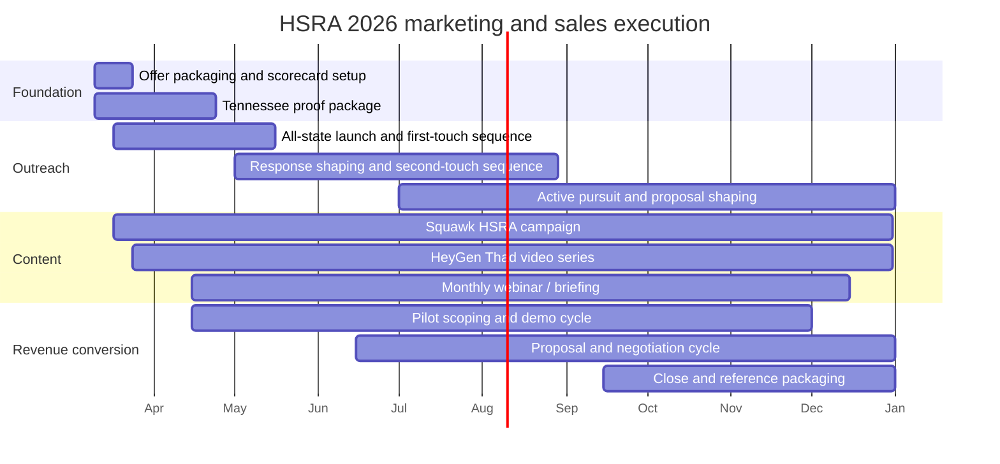

# HSRA Marketing and Sales Plan

**Last Updated:** 2026-03-10

## Purpose

This plan defines the 2026 marketing and sales motion for **HSRA / PopHealthMap** as a licensing plus consulting offer. It converts the existing Tennessee anchor story, HSRA product research, and LSA Digital marketing assets into a practical operating plan with owners, monthly targets, quarterly outcomes, and clear expectations for Dr. Thad Perry, Thad's interns, and the Marketing Manager.

## Strategic Thesis

HSRA should be sold as a **public-interest, academically credible, auditable decision-support product** for state and regional health organizations that need tract- and county-level prioritization. The winning commercial motion is not a generic software blast. It is:

1. `Academic credibility first` - lead with Dr. Thad Perry's public-health and informatics perspective, especially for initial relationship-building outreach.
2. `Public-data baseline first` - position HSRA as an auditable tract/county prioritization layer using implemented public-data capabilities.
3. `Configuration and consulting second` - convert buyer interest into state-first data configuration, workflow design, pilot support, and advisory work.
4. `Premium enrichment only when justified` - introduce premium data and deeper intervention design only after the buyer's use case demands it.

## What We Are Selling

| Offer layer | What the buyer gets | Best-fit buyer | Primary owner |
| --- | --- | --- | --- |
| Core HSRA license | Auditable HRA + SDOH prioritization, tract/county outputs, ranked geographies, report bundles | State health departments, local health departments, hospitals | Mike Idengren + Thad Perry |
| State-first configuration | State data mapping, scorecards, reports, workflow tailoring, pilot setup | State agencies, Medicaid/rural health programs, universities | Mike Idengren |
| Consulting and advisory | Question framing, intervention prioritization, stakeholder alignment, presentation support | State agencies, university partners, hospital/community-benefit teams | Thad Perry |
| Premium enrichment | Segmentation, outreach design, premium data logic, deeper intervention planning | Advanced public-health programs, employers, payers | Mike Idengren |

## Why Now

- CMS Rural Health Transformation creates a live 50-state demand signal for county/community measurement.
- HRSA rural grants, PHAB-driven assessment work, CHNA cycles, and state EJ gaps create adjacent buying triggers.
- April-June 2026 is the key budget and planning window for many state buyers, making spring outreach materially more valuable than a late-year launch.
- Tennessee gives HSRA a credible anchor story right now, even if it is not yet proof of nationwide adoption.
- Dr. Thad Perry's `.edu` identity is a practical credibility advantage for collaboration-oriented outreach to public agencies and universities; use it as a trust signal, not as a guaranteed deliverability claim.
- Academic Health Department-style language gives the outreach a recognizable public-interest collaboration frame for agencies already used to university-health department relationships.
- The fastest path to revenue is **license + consulting + pilot support**, not waiting for a national self-serve software motion.

## Primary Buyer Map

| Buyer type | Core pain | Why HSRA fits | Best opener | Close path |
| --- | --- | --- | --- | --- |
| State health department leadership | Need defensible county/tract prioritization for resource allocation | HSRA combines pollution, health burden, and SDOH into one auditable prioritization view | Thad `.edu` email + collaboration note | Pilot or planning engagement, then configuration + license |
| Rural health / Medicaid teams | Need measurable county/community evidence tied to funded initiatives | HSRA gives a county/community baseline and prioritization framework | Tennessee anchor + funding-pressure framing | License + advisory + scorecard support |
| Local health departments | Need CHA/CHIP/PHAB-ready disparity analysis | HSRA provides tract-level analysis and report-ready outputs | Educational webinar + case-style examples | Pilot + annual service support |
| Nonprofit hospitals / community benefit teams | Need stronger CHNA prioritization and community-investment justification | HSRA sharpens where need is highest and why | Public-health planning language, not technical language | Consulting package + recurring reporting |
| University/public-health collaborators | Need applied research and state-facing impact projects | HSRA fits academic-public health collaboration and grant support | Peer-to-peer outreach from Thad | Joint project or sponsored pilot |

## Market Prioritization Logic

All states should receive messaging at campaign start, but not with one generic pitch. Use an **all-state launch** with **state-specific messaging lanes**, then let the funnel narrow based on response, fit, and sales-cycle velocity.

| Layer | Coverage | Commercial treatment |
| --- | --- | --- |
| Launch universe | All 50 states plus relevant university and hospital/public-health collaborators | At least one tailored email touch, supporting content touch, and phone-routing effort in the opening wave |
| Active pursuit cohort | 12-16 states/accounts at any given time | Repeated outreach, live discovery calls, demos, pilot discussions, and proposal pursuit |
| Engaged accounts | 6-10 states/accounts | Live discovery is underway and next-step asks are active |
| Commercial pipeline | 3-6 opportunities | LSA Digital owns scoping, demos, proposals, and close motion |

Use a four-wave approach inside that broader launch model.

| Wave | Period | Target profile | Example focus |
| --- | --- | --- | --- |
| Wave 0 - Package | March | Tennessee proof packaging, message-lane setup, all-state contact assembly | TN Tech, Tennessee public-health stakeholders, state-need research pack |
| Wave 1 - All-state launch | March-April | All states receive a first-touch sequence with tailored messaging by need and buyer type | RHT states, CHNA/CHA/PHAB states, EJ-screening states, cancer-control states |
| Wave 2 - Response shaping | May-June | Fast responders and high-fit accounts move into heavier follow-up while all other states stay in nurture | Discovery scheduling, webinars, second/third touches |
| Wave 3 - Active pursuit and close shaping | July-December | The most responsive states/accounts move into sustained discovery, proposals, and close plans | Rural health offices, Medicaid transformation teams, hospital/community-benefit teams |

### State Targeting Scorecard

Prioritize accounts that score highly on at least three of these:

- active rural-health transformation or comparable state funding pressure
- visible county/tract disparity burden
- public health assessment, CHNA, or accreditation cycle pressure
- existing academic/public-health relationship path
- likely need for state-specific configuration rather than commodity dashboards
- presence of a university or public-health partner that makes a Thad-led intro more credible

## Go-To-Market Motion

### Channel mix

| Channel | Use | Owner | Cadence |
| --- | --- | --- | --- |
| Thad `.edu` outreach | First-touch collaboration notes to agencies, universities, and public-health stakeholders across all states | Thad Perry | Opening launch wave, then weekly |
| Intern phone outreach | Follow-up calls, office routing, scheduler support, CRM hygiene, and nonresponse recovery | Thad's Intern | 4-5 days per week |
| LinkedIn direct outreach | Warm nudges, connection requests, and credibility reinforcement for active and warm accounts | Mike Idengren + Marketing Manager | Weekly |
| Squawk social/content | LinkedIn/X post stream, short thought-leadership posts, state-triggered case framing | Marketing Manager | 3-5 posts per week |
| HeyGen video | 60-90 second Thad clips for state/public-health audiences and campaign follow-up | Marketing Manager | 2-4 videos per month |
| Webinar / briefing | Small-group educational session on rural health prioritization and state-specific use cases | Thad Perry + Mike Idengren + Marketing Manager | 1-2 per month starting April |
| LSA Digital commercial follow-up | Qualified-opportunity discovery, scoping, proposal work, and negotiation flow | Mike Idengren + LSA Digital | As soon as opportunity is qualified |
| Conference / association channel | NOSORH, NACCHO, ASTHO, RHIhub, and related public-health visibility | Marketing Manager + Thad Perry | Monthly touchpoint plan |

## Role Ownership

### Thad's Intern - primary ownership

The intern is the force multiplier for list-building, follow-up, and meeting logistics.

| Workstream | Weekly expectation | Deliverable |
| --- | --- | --- |
| Target-account research | 8-10 hrs | 20-30 new contacts/week with agency, role, trigger, and notes |
| Outreach support | 4-6 hrs | Personalized drafts queued for Thad review; follow-up tasks logged |
| Phone calls | 5-7 hrs | 30-40 calls/week to offices, program leads, or schedulers |
| Meeting operations | 2-3 hrs | Calendar holds, prep dossiers, meeting notes, action tracking |
| CRM / scorecard hygiene | 1-2 hrs | Up-to-date pipeline sheet with statuses and next actions |

**Intern KPIs**

- 60-100 new named contacts researched per month during launch and heavy follow-up periods
- 120-160 follow-up calls per month
- 8-12 meetings scheduled or materially advanced per quarter
- less than 48-hour lag between conversation and CRM update

### Marketing Manager - primary ownership

The Marketing Manager turns HSRA research into repeatable awareness and meeting-conversion assets.

| Workstream | Weekly expectation | Deliverable |
| --- | --- | --- |
| Squawk campaign execution | 5-6 hrs | 3-5 HSRA posts/week tied to state needs, buyer triggers, and active outreach lanes |
| Content packaging | 4-5 hrs | One-pagers, state-specific briefing decks, website/page updates, and message-lane variants |
| HeyGen production | 2-4 hrs | 2-4 approved Thad avatar videos/month |
| Campaign reporting | 1-2 hrs | Weekly scorecard and monthly campaign readout |
| Event / webinar support | 1-2 hrs | Registrations, invites, reminders, recap assets |

**Marketing Manager KPIs**

- 12-20 HSRA social posts/month
- 2-4 HeyGen videos/month
- 1 new or refreshed sales asset/month
- 1 webinar or briefing pack/month starting May
- 25-35 percent of first meetings influenced by content touchpoints

### Thad Perry - commitments and oversight

Thad should stay in the highest-leverage parts of the motion: credibility, message approval, first meetings, and subject-matter leadership.

| Responsibility | Weekly time | Why it matters |
| --- | --- | --- |
| Review and send top-priority outreach from `.edu` account | 1.5-2 hrs | Preserves authenticity and academic credibility |
| Join high-value discovery/presentation calls | 2-3 hrs | Converts curiosity into trust and momentum |
| Approve thought leadership and HeyGen scripts | 1 hr | Keeps claims safe and voice consistent |
| Record or approve short video content | 0.5-1 hr | Scales Thad's presence without full live time |
| Weekly pipeline review with intern + marketing manager | 1 hr | Maintains discipline and prioritization |
| Monthly webinar / external briefing | 1.5-2 hrs | Builds peer-level authority and warm demand |

**Expected ongoing time commitment:** roughly **7-10 hours per week**, with occasional spikes to 12 hours in proposal or webinar weeks.

### Mike Idengren - commercial lead and live discovery owner

Mike should own packaging, LSA Digital commercial follow-up, live discovery participation, proposal design, and staffing elasticity if the funnel expands faster than the current team can absorb.

| Responsibility | Weekly time | Deliverable |
| --- | --- | --- |
| Live discovery calls | 4-6 hrs | Participation in qualified discovery, briefing, and demo conversations |
| Offer packaging and proposal drafting | 4-5 hrs | Pilot scopes, license + services proposals |
| Demo tailoring and meeting prep | 3-4 hrs | Buyer-specific demo flow, prep dossiers, and next-step packages |
| LSA Digital commercial follow-up | 3-4 hrs | Qualification handoff, proposal follow-up, negotiation support, and close plan |
| Pipeline triage and staffing elasticity | 1-2 hrs | Prioritization, escalation, and recommendation on adding sales help if traction surges |

**Expected ongoing time commitment:** roughly **14-18 hours per week**.

## 2026 Quarterly Objectives

| Quarter | Strategic objective | Pipeline target | Revenue motion emphasis |
| --- | --- | --- | --- |
| Q1 late / Q2 early (Mar-Apr) | Launch all-state campaign and establish the opening top-of-funnel before summer budget cycles mature | 50 states touched, 110 named contacts, 5-7 positive replies/referrals, 3-4 intro calls | Awareness + discovery |
| Q2 (May-Jun) | Maintain all-state coverage while shaping a response-driven active pursuit cohort | 180 cumulative named contacts, 8-10 intro calls, 4-6 substantive discovery meetings, 2 webinars | Discovery + pilot shaping |
| Q3 (Jul-Sep) | Convert fastest-moving states and accounts into demos, workshops, and scoped proposals | 220 cumulative named contacts, 8-12 discovery meetings, 5-7 demos/workshops, 3-4 proposals | Proposals + pilot conversion |
| Q4 (Oct-Dec) | Close multiple opportunities and expand staff support if traction exceeds current handling capacity | 250 cumulative named contacts, 4-6 active negotiations/proposals, 3-4 closed sales | Closing + expansion proof |

## Monthly Plan And Targets

| Month | Core objective | Primary owner | Named contacts added | States touched / retouched | Live conversations | Discovery / first meetings | Proposals / negotiations | Closed sales |
| --- | --- | --- | ---: | ---: | ---: | ---: | ---: | ---: |
| March | Launch all-state first-touch wave with tailored message lanes and opening phone support | Mike + Marketing Manager + Intern + Thad | 70 | 50 | 3-4 | 1 | 0 | 0 |
| April | Run second-touch sequence, first webinar, and early discovery from responders | Thad + Mike + Intern + Marketing Manager | 40 | 30 | 3-4 | 1-2 | 0 | 0 |
| May | Keep all-state nurture moving while prioritizing faster responders during budget window | Thad + Marketing Manager + Mike | 35 | 25 | 3-4 | 1-2 | 0-1 | 0 |
| June | Expand state-specific briefing packs and move qualified accounts into live discovery | Mike + Marketing Manager + Intern | 35 | 20 | 3-4 | 1-2 | 0-1 | 0 |
| July | Push pilot framing for summer and early-fall planning cycles | Mike + Thad | 25 | 15 | 2-3 | 1-2 | 1 | 0 |
| August | Intensify calls, LinkedIn follow-up, and webinar-driven conversion | Intern + Marketing Manager + Mike | 20 | 15 | 2-3 | 1-2 | 1 | 0-1 |
| September | Advance strongest accounts into scope review and proposal paths | Mike + Thad | 15 | 10 | 2-3 | 1-2 | 1 | 0-1 |
| October | Push first closes and keep all-state nurture alive for late responders | Mike + Thad + Marketing Manager | 5 | 10 | 2-3 | 1-2 | 1-2 | 1 |
| November | Work negotiation paths while using proof assets to reopen warm states | Mike + Intern + Marketing Manager | 3 | 8 | 2-3 | 1 | 1-2 | 1 |
| December | Close remaining high-probability opportunities and identify staffing needs for 2027 | Mike + Thad | 2 | 6 | 1-2 | 1 | 1 | 1-2 |

## 2026 Funnel Targets

These are the **base-case targets** for a wide-net, relationship-led public-sector motion. The funnel starts broader than the prior version on purpose because slow replies and nonresponses will naturally narrow it.

| Metric | Q2 base case | Q3 base case | Q4 base case | 2026 total target |
| --- | ---: | ---: | ---: | ---: |
| States receiving tailored launch messaging | 50 | 50 | 50 | 50 |
| States/accounts in active pursuit at a given time | 12-16 | 12-16 | 12-16 | 12-16 |
| Named target contacts | 180 | 220 cumulative | 250 cumulative | 150-250 |
| Personalized Thad-led emails sent | 180 | 50 | 30 | 180-260 |
| Marketing nurtures sent or surfaced | 100 | 90 | 70 | 260 |
| Phone calls / office follow-ups | 160 | 140 | 100 | 250-400 |
| LinkedIn direct touches / connection attempts | 70 | 60 | 50 | 180 |
| Positive replies / referrals | 12-16 | 18-24 cumulative | 20-30 cumulative | 20-30 |
| Intro calls | 6-8 | 10-14 cumulative | 12-18 cumulative | 12-18 |
| Substantive discovery meetings | 3-4 | 6-8 cumulative | 8-12 cumulative | 8-12 |
| Demo / workshop meetings | 0-1 | 2-4 cumulative | 5-7 cumulative | 5-7 |
| Active negotiations / proposal reviews | 0-1 | 2-3 cumulative | 4-6 cumulative | 4-6 |
| Closed sales | 0 | 0-1 | 3-4 cumulative | 3-4 |

### Stretch scenario

If Tennessee proof strengthens quickly, state-specific messaging performs well, and added staffing comes in as needed, a stretch outcome is:

- 220-320 named contacts
- 18-24 intro calls
- 12-16 discovery meetings
- 6-8 proposals
- 5-6 closed sales

### Expected close mix

- `1 anchor state/university project` is the highest-priority close.
- `1-2 advisory or pilot engagements` are realistic secondary wins in the base case.
- `0-1 premium enrichment or hospital/community-benefit expansion` is possible, but should not be the only upside lever.

## Tactical Workstreams

### 1. Academic-first outreach motion

Owner: **Thad Perry**

- Use `tperry@tntech.edu` for collaboration-oriented first touches where that institutional framing is appropriate.
- Move qualified opportunities into LSA Digital follow-up immediately once the conversation shifts toward scope, implementation, or commercial next steps.
- Use language such as `research partnership`, `pilot collaboration`, or `Academic Health Department-style collaboration` where appropriate.
- Position the first contact as peer dialogue around rural health prioritization, not a vendor blast.
- Offer 20-30 minute exploratory briefings and feedback requests.
- Avoid procurement officers until a real opportunity exists; target program leaders, epidemiologists, rural-health leads, and public-health planners first.
- Start the campaign with all-state first-touch coverage, but tailor each message lane to the state's visible trigger: RHT, CHNA/CHA/PHAB, EJ screening, or cancer-control / screening prioritization.

### 2. Intern-powered account development

Owner: **Thad's Intern**

- Build and maintain a 50-state rolling target list of state health leaders, rural-health offices, Medicaid transformation leaders, university/public-health partners, and hospital/community-benefit leads.
- Prepare short dossiers before each outreach wave: role, current initiative, likely trigger, known funding or assessment pressure.
- Make follow-up calls within 3 business days of each email.
- Route all responses into a single scorecard with next action, owner, and due date.

### 3. Marketing engine via Squawk and HeyGen

Owner: **Marketing Manager**

- Run a dedicated HSRA content stream with three recurring themes:
  - `Why now`: rural health transformation, county/tract measurement, public-interest planning.
  - `Why trust us`: methodology, auditability, HARP2 parity, evidence cards, Dr. Perry perspective.
  - `What buyers can do with it`: screening prioritization, CHNA/CHA support, state-first dashboards, intervention planning.
- Package content into four message lanes so all-state outreach can still feel state-specific:
  - `rural transformation and Medicaid pressure`
  - `CHA / CHIP / CHNA / PHAB planning`
  - `EJ and environmental-health screening`
  - `cancer-control and screening prioritization`
- Build short Thad videos for distinct audience slices:
  - state health leadership
  - rural health program managers
  - hospital/community-benefit leaders
  - university/public-health collaborators
- Create one reusable visual per month: buyer flow, offer stack, Tennessee story, or implementation sequence.
- Pursue visibility through `NOSORH`, `NACCHO`, `ASTHO`, and `RHIhub` so content is reinforced by institutional channels, not only social media.

### 4. Meeting conversion and proposals

Owner: **Mike Idengren**

- Mike participates directly in live discovery calls once an account is qualified or appears likely to move toward implementation or proposal discussion.
- Every first meeting should end with one of three next steps: technical demo, pilot scoping workshop, or state-specific briefing.
- Use a standard proposal ladder:
  1. educational briefing
  2. discovery and state-fit assessment
  3. pilot scope / planning engagement
  4. license + configuration proposal
- Keep commercial documents focused on what is implemented, configurable, and optional.

### 5. Staffing elasticity if traction spikes

Owner: **Mike Idengren + LSA Digital**

- Do not artificially shrink the top of the funnel to protect current staffing comfort.
- If positive replies, discovery calls, or proposal requests outpace current handling capacity, add contract sales support, additional research help, or scheduling/admin support.
- Use Friday revenue reviews to determine whether response volume justifies added staffing.

### 6. Proof-building and reference creation

Owner: **Marketing Manager + Thad Perry**

- Publish a Tennessee-oriented proof package by end of April:
  - short positioning brief
  - one buyer-facing infographic
  - 2 short video clips
  - 1 webinar deck
- By September, create at least one sanitized buyer-story artifact that can be used as proof for Wave 3 accounts.

## 2026 Execution Calendar

## Weekly Operating Rhythm

| Cadence | Participants | Agenda | Output |
| --- | --- | --- | --- |
| Monday pipeline standup | Thad, intern, marketing manager, Mike | Review new targets, prior outreach, meetings, blockers | Updated scorecard and weekly priorities |
| Wednesday content review | Marketing manager + Thad | Approve posts, scripts, clips, webinar topics | Approved asset queue |
| Friday revenue review | Mike + Thad + intern | Check conversion, proposals, next asks, state prioritization | Close plan and next-week focus |
| Monthly strategy review | All core owners | Evaluate metrics, states, messaging, funnel health | Wave reprioritization and asset plan |

## Scorecard Metrics To Review Weekly

- new target accounts added
- states touched and message lane coverage
- outreach sent by Thad `.edu`, LSA Digital, LinkedIn, and marketing channels
- phone follow-ups completed
- LinkedIn direct touches completed
- live conversations booked
- first meetings held
- demos / presentations scheduled
- proposals or negotiations opened
- closes, stalls, and lost reasons
- content assets published and influenced meetings

## Risks And Mitigations

| Risk | Why it matters | Mitigation |
| --- | --- | --- |
| Overclaiming national proof | Weakens credibility with public-sector buyers | Keep Tennessee as anchor story, not nationwide proof |
| Too much generic outreach | Government audiences ignore hard-sell vendor messaging | Use state-specific message lanes and collaboration-oriented outreach led by Thad |
| Top-of-funnel too small | Too few responses mature into late-year opportunities | Launch all-state outreach early and let response patterns narrow the field |
| Thad becomes a bottleneck | Academic credibility is central, but his time is limited | Keep Thad focused on first-touch authority and high-value calls while Mike joins discovery and LSA Digital takes qualified follow-up |
| Content drift into vague AI marketing | Damages trust in a methodology-heavy offering | Use auditability, public-health, and resource-allocation framing |
| No consistent follow-up system | Meetings die without disciplined next actions | Intern owns CRM hygiene and 3-day follow-up rule |
| Offer gets packaged as pure software | Reduces close odds and underprices value | Always sell HSRA as license plus configuration/advisory motion |
| Response volume exceeds current team capacity | Good traction stalls if follow-up becomes slow | Add sales/admin/research support when Friday reviews show current capacity is saturated |

## Success Definition For 2026

By the end of 2026, HSRA should have:

- a repeatable Thad-led credibility motion
- a consistent HSRA thought-leadership stream through Squawk and short video
- an all-state launch motion with disciplined state-specific messaging and follow-up
- 12-18 intro calls, 8-12 substantive discovery meetings, and 4-6 active proposal/negotiation paths
- 3-4 closed sales across anchor state/university, pilot, or advisory engagements
- at least one reusable public or semi-public proof artifact stronger than a generic demo

## Sources

- `docs/strategic-plan/Strategic Plan - LSA sales 2026Mar9.md`
- `docs/research/hsra/hsra-overall-research-summary-2026.md`
- `docs/research/hsra/hsra-government-market-analysis-2026.md`
- `docs/research/hsra/hsra-license-and-services-opportunity-2026.md`
- `docs/research/hsra/hsra-product-summary-2026.md`
- `docs/research/market/hsra-demand-signals-rural-health-2026.md`
- `marketingCampaignFeb2026.md`
- `lsaProductExpertAlignment.md`
- `videos/scripts/LSA Demo.SHORT_HSRA.2026Feb9.SCRIPT.md`
- `videos/scripts/LSARS HSRA+PI explainer.SCRIPT.md`
- https://www.astho.org/advocacy/legislative-priorities/
- https://www.nacchoannual.org
- https://www.nosorh.org
- https://www.ruralhealthinfo.org
- https://www.cms.gov/priorities/rural-health-transformation-rht-program/overview
- https://www.hrsa.gov/rural-health
- https://www.phaboard.org
