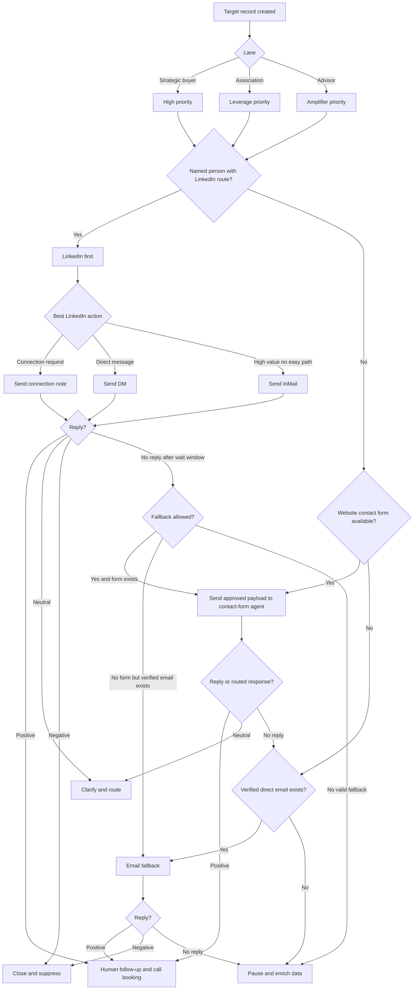

# MEDICODAX 30-Day Outreach Execution Plan

**Last Updated:** 2026-03-11

## Purpose

This document is the operational runbook for MEDICODAX outbound outreach.

It is designed for a `LinkedIn-first`, `website-contact-form-second`, `email-last` process, with enough data and rules that:

- a human owner can prioritize the right targets quickly
- an AI-assisted outreach workflow can operate consistently
- a separate AI agent can later automate website contact-form submissions without having to guess strategy

Use this with:

- `docs/strategic-plan/medicodax/medicodax-tactical-contact-playbook.md`
- `docs/strategic-plan/medicodax/medicodax-wholesale-brokers.md`
- `docs/strategic-plan/medicodax/medicodax-wholesale-marketing-and-sales-plan.md`
- `docs/strategic-plan/medicodax/medicodax-wholesale-marketing-and-sales-briefing.md`

## Core Operating Rule

The outreach hierarchy for MEDICODAX is:

1. `LinkedIn first` for named individuals
2. `Website contact form second` for institutional entry or fallback
3. `Email last` only when it is verified and strategically justified

That means the system should not spray all channels at once. It should move one target through a controlled routing path.

## Why This Model Fits MEDICODAX

- MEDICODAX is a `strategic human-AI medical coding and workflow asset`, not a commodity SaaS blast.
- The strongest proof points remain `human final decision control`, `auditability`, `workflow adaptation`, and `multi-EHR / FHIR-oriented architecture`.
- Both `home health` and `outpatient / ambulatory` are active lanes.
- Contact forms are valuable because they can route the message to the right internal team without relying on cold-email deliverability.
- Email is still useful, but only as a verified direct route or a later fallback once another touch has happened.

## High-Level Process



## Required Data Per Target

Do not contact a target until this minimum record exists.

| Field | Why it matters |
| --- | --- |
| `organization` | Basic account identity |
| `lane` | Determines message objective and routing logic |
| `why_this_target_matters` | Prevents low-fit spraying |
| `named_person` | Enables LinkedIn-first motion |
| `linkedin_profile_url` | Best first route when verified |
| `linkedin_company_url` | Fallback when personal profile is not verified |
| `website_contact_form_url` | Required for the separate form-submission agent |
| `verified_email` | Optional fallback only |
| `public_phone` | Useful for human follow-up and validation |
| `message_family` | Keeps copy consistent by lane |
| `current_status` | Prevents duplicate touches |
| `last_touch_date` | Enables timing rules |
| `next_allowed_action` | Enforces channel order |
| `source_confidence` | Distinguishes verified vs inferred routes |

## Status Model

Use only these statuses in the tracker.

- `research`
- `ready`
- `sent-linkedin`
- `sent-contact-form`
- `sent-email`
- `replied-positive`
- `replied-neutral`
- `replied-negative`
- `needs-human`
- `paused`
- `closed`

## Lane Objectives

| Lane | First objective | Best first route |
| --- | --- | --- |
| `strategic buyer` | Book a strategic fit conversation | LinkedIn to named leader |
| `association` | Get routed to the right business, event, or partner owner | LinkedIn to named leader, then institutional form |
| `advisor` | Confirm buyer-fit and intro potential | LinkedIn to named advisor, then form or verified email |

## Route Priority Rules

| Situation | Route to use |
| --- | --- |
| Named person with verified LinkedIn profile | LinkedIn first |
| Named person known but LinkedIn URL not verified | LinkedIn company page plus name search, then website form |
| No named person, but strong institutional contact form | Website form first |
| Verified direct email already known for a named person | Use only after LinkedIn or form, unless the relationship is warm |
| No response after LinkedIn wait window | Website form fallback |
| No LinkedIn path and no contact form | Verified email fallback |

## Timing Rules

- `Day 0`: LinkedIn connection request, DM, or InMail
- `Day 3-4 business days`: if no response and a form exists, submit via website contact form
- `Day 6-7 business days`: if no response and only a verified direct email exists, use email fallback
- `Day 10+ business days`: either pause, enrich data, or escalate to human review if the target remains high priority

## InMail Allocation

Use the `100` monthly InMails this way:

| Bucket | Count | Use |
| --- | ---: | --- |
| Strategic buyers | 60 | Highest-priority direct targets |
| Associations and ecosystem leaders | 25 | Visibility, events, partnerships, and member routes |
| Advisors | 15 | Intro amplifiers and later-stage strategic routes |

Email should not consume strategic attention until a LinkedIn and form path has been attempted or ruled out.

## Contact Data - Top 30 Operational Table

`Primary route` assumes LinkedIn first whenever a named route exists. `Fallback` assumes website-form second and email last.

When a personal LinkedIn profile URL is not listed here, do not guess the slug. Search the name plus company inside LinkedIn while logged in, then use the institutional form route if the profile cannot be confirmed quickly.

| Rank | Person | Org | Lane | LinkedIn route | Website form route | Public email | Public phone | Primary route | Fallback | Confidence |
| --- | --- | --- | --- | --- | --- | --- | --- | --- | --- | --- |
| 1 | `William J. Simione, III` | SimiTree | strategic buyer | `https://www.linkedin.com/in/william-j-simione-iii-15bb8117/` | `https://simitreehc.com/contact-us/` |  | `800.949.0388` | LinkedIn InMail | Website form | high |
| 2 | `Zain Jafri` | SimiTree | strategic buyer | `https://www.linkedin.com/in/zainjafri/` | `https://simitreehc.com/contact-us/` |  | `800.949.0388` | LinkedIn InMail | Website form | high |
| 3 | `Nick Seabrook` | SimiTree | strategic buyer | `https://www.linkedin.com/in/nick-seabrook-b57a7a35/` | `https://simitreehc.com/contact-us/` |  | `800.949.0388` | LinkedIn InMail | Website form | high |
| 4 | `J'non Griffin` | SimiTree | strategic buyer | `https://www.linkedin.com/in/jnon-griffin-36560720/` | `https://simitreehc.com/contact-us/` |  | `800.949.0388` | LinkedIn InMail | Website form | high |
| 5 | `Kayla Wormser` | McBee | strategic buyer | `https://www.linkedin.com/in/kayla-wormser-430533b9/` | `https://mcbeeassociates.com/contact/` | `info@mcbeeassociates.com` | `610.964.9680` | LinkedIn InMail | Website form, then email | high |
| 6 | `Bob Braun` | McBee | strategic buyer | `https://www.linkedin.com/in/braunbob/` | `https://mcbeeassociates.com/contact/` | `info@mcbeeassociates.com` | `610.964.9680` | LinkedIn InMail | Website form, then email | high |
| 7 | `Jeffrey Silvershein` | McBee | strategic buyer | `https://www.linkedin.com/in/jeffrey-silvershein/` | `https://mcbeeassociates.com/contact/` | `info@mcbeeassociates.com` | `610.964.9680` | LinkedIn InMail | Website form, then email | high |
| 8 | `Melinda A. Gaboury` | HPS Solutions | strategic buyer | LinkedIn profile not verified in current repo data | `https://hpssolutions.com/` | `info@hpssolutions.com` | `480-857-3900` | LinkedIn company search plus named search | Website route, then email | medium |
| 9 | `Robbi D. Funderburk James` | HPS Solutions | strategic buyer | LinkedIn profile not verified in current repo data | `https://hpssolutions.com/` | `info@hpssolutions.com` | `480-857-3900` | LinkedIn company search plus named search | Website route, then email | medium |
| 10 | `Dee Kornetti` | AHCC | association | LinkedIn profile not verified in current repo data | `https://www.decisionhealth.com/` | `AHCCMembers@decisionhealth.com` | `1-800-650-6787` | LinkedIn name search plus company route | AHCC member inbox | medium |
| 11 | `Bevan Erickson` | AAPC | association | LinkedIn profile not verified in current repo data; company route `https://www.linkedin.com/company/aapc/` | `https://www.aapc.com/partnerships/` | `localchapters@aapc.com` | `1-844-825-1679` | LinkedIn name search plus company route | Partnerships form, then chapter route | medium |
| 12 | `Raemarie Jimenez` | AAPC | association | LinkedIn profile not verified in current repo data; company route `https://www.linkedin.com/company/aapc/` | `https://www.aapc.com/partnerships/` | `localchapters@aapc.com` | `1-844-825-1679` | LinkedIn name search plus company route | Partnerships form, then chapter route | medium |
| 13 | `David D. Cella` | AHIMA | association | LinkedIn profile not verified in current repo data; company route `https://www.linkedin.com/company/ahima/` | `https://www.ahima.org/` |  | `312-233-1100` | LinkedIn name search plus company route | AHIMA for Business route | medium |
| 14 | `Jennifer Sheets` | Alliance for Care at Home | association | LinkedIn profile not verified in current repo data | `https://allianceforcareathome.org/about/contact-us/` |  | `800-646-6460` | LinkedIn name search | Website form with routed department | medium |
| 15 | `Carrie Hoover` | Alliance for Care at Home | association | LinkedIn profile not verified in current repo data | `https://allianceforcareathome.org/about/contact-us/` |  | `800-646-6460` | LinkedIn name search | Education route in contact form | medium |
| 16 | `Michel'le Anderson` | Alliance for Care at Home | association | LinkedIn profile not verified in current repo data | `https://allianceforcareathome.org/about/contact-us/` |  | `800-646-6460` | LinkedIn name search | Business-development route in contact form | medium |
| 17 | `Brian Greenberg` | Greenberg Advisors | advisor | `https://www.linkedin.com/in/brian-greenberg-51a4788/` | `https://greenberg-advisors.com/contact-us/` | `bgreenberg@greenberg-advisors.com` | `301-576-4000` | LinkedIn InMail | Website form, then direct email | high |
| 18 | `Zach Eisenberg` | Greenberg Advisors | advisor | LinkedIn profile not verified in current repo data; company route `https://www.linkedin.com/company/greenberg-advisors-llc/` | `https://greenberg-advisors.com/contact-us/` | `zeisenberg@greenberg-advisors.com` | `301-576-4000` | LinkedIn company route plus name search | Website form, then direct email | high |
| 19 | `Sarah Marks` | VERTESS | advisor | LinkedIn profile not verified in current repo data | `https://vertess.com/` |  | `1-201-388-7738` | LinkedIn name search | Website route, then phone | medium |
| 20 | `Bradley M. Smith` | VERTESS | advisor | LinkedIn profile not verified in current repo data | `https://vertess.com/` |  | `1-817-793-3773` | LinkedIn name search | Website route, then phone | medium |
| 21 | `Neil Johnson` | LECO | advisor | LinkedIn profile not verified in current repo data; company route on official site | `https://www.lawrenceevans.com/contact-us/` | `info@lawrenceevans.com` | `614-448-1304` | LinkedIn name search | Website form, then email | high |
| 22 | `Christopher Luckett` | LECO | advisor | LinkedIn profile not verified in current repo data; company route on official site | `https://www.lawrenceevans.com/contact-us/` | `info@lawrenceevans.com` | `614-448-1304` | LinkedIn name search | Website form, then email | medium |
| 23 | `Michael White` | Founders Advisors | advisor | Official people page plus company route `https://www.linkedin.com/company/founders-advisors/` | `https://foundersib.com/contact-us/` |  | `205.949.2043` | LinkedIn first | Website form | medium |
| 24 | `Thomas Dixon` | Founders Advisors | advisor | Official people page plus company route `https://www.linkedin.com/company/founders-advisors/` | `https://foundersib.com/contact-us/` |  | `205.949.2043` | LinkedIn first | Website form | medium |
| 25 | `Chris Weingartner` | Founders Advisors | advisor | Official people page plus company route `https://www.linkedin.com/company/founders-advisors/` | `https://foundersib.com/contact-us/` |  | `205.949.2043` | LinkedIn first | Website form | medium |
| 26 | `Michael Gravel` | iMerge Advisors | advisor | Company route `https://www.linkedin.com/company/776521/` | `https://imergeadvisors.com/contact/` |  | `206-659-7650` | LinkedIn company route plus name search | Contact form | medium |
| 27 | `Todd Lorbach` | iMerge Advisors | advisor | Company route `https://www.linkedin.com/company/776521/` | `https://imergeadvisors.com/contact/` |  | `206-659-7650` | LinkedIn company route plus name search | Contact form | medium |
| 28 | `Blake Taylor` | Synergy Business Brokers | backup broker | LinkedIn name search plus company route `https://www.linkedin.com/company/synergy-business-brokers` | `https://synergybb.com/contact-us/` |  | `888-750-5950` | LinkedIn name search | Website form | medium |
| 29 | `Jennifer Mueller` | AHIMA | association | LinkedIn profile not verified in current repo data; company route `https://www.linkedin.com/company/ahima/` | `https://www.ahima.org/` |  | `312-233-1100` | LinkedIn name search plus company route | AHIMA business route | medium |
| 30 | `Dana Perrino` | AHIMA | association | LinkedIn profile not verified in current repo data; company route `https://www.linkedin.com/company/ahima/` | `https://www.ahima.org/` |  | `312-233-1100` | LinkedIn name search plus company route | AHIMA business route | medium |

## Message Families

Use one message family per target. Do not mix multiple asks in the first touch.

| ID | Use for | Goal |
| --- | --- | --- |
| `L1` | strategic buyers | secure a strategic fit conversation |
| `L2` | associations | identify the right partnership, event, or member route |
| `L3` | advisors | test buyer-introduction and transaction fit |
| `F1` | website forms for strategic buyers | request routing to the right internal owner |
| `F2` | website forms for associations | request routing to business, event, or sponsor owner |
| `F3` | website forms for advisors | request fit review and next-step discussion |
| `E1` | email fallback | last-resort direct follow-up after other channels |

## LinkedIn-First Workflow

### Strategic buyers

1. Send connection request or InMail to named person.
2. Wait `3-4 business days`.
3. If no reply, hand target to the contact-form agent using the buyer-specific website route.
4. Use verified email only if there is no response after the form step or if a direct address exists and the account remains high priority.

### Associations

1. Use LinkedIn to approach the named executive or business-development leader.
2. If no response, use the institutional business, membership, sponsorship, or education form.
3. Only use email when the institution publishes a role-specific inbox that clearly matches the ask.

### Advisors

1. Use LinkedIn to reach the named managing director, founder, or business-development lead.
2. If no response, use the official contact form.
3. Use verified direct email only after the LinkedIn and form attempt or if the direct address is already clearly public and relevant.

## What The Website Contact-Form Agent Needs

This document intentionally separates `strategy` from `form automation`.

The separate AI agent that submits website contact forms should receive only structured records, not strategy decisions.

### Required handoff fields

| Field | Description |
| --- | --- |
| `target_id` | Unique row id from outreach tracker |
| `organization` | Account name |
| `lane` | strategic buyer, association, or advisor |
| `named_person` | Person already targeted on LinkedIn, if any |
| `website_contact_form_url` | Exact URL to open |
| `message_family` | F1, F2, or F3 |
| `approved_subject` | Subject to paste if field exists |
| `approved_message_body` | Final message body |
| `submitter_name` | Human sender name |
| `submitter_email` | Sender email for replies |
| `submitter_phone` | Optional phone if needed |
| `field_mapping` | Any known custom field names or department choices |
| `source_confidence` | high, medium, low |
| `last_touch_date` | So the agent does not jump the queue |
| `notes` | Special constraints, e.g. choose Education or Membership |

### The contact-form agent should do

- open the exact form URL
- populate approved fields only
- submit the message
- record success, failure, or captcha/manual-block state
- capture the timestamp and resulting status

### The contact-form agent should not do

- choose which targets to contact
- rewrite strategy or select message families
- skip LinkedIn-first sequencing without explicit instruction
- improvise new copy beyond approved message variants

## Website Form Routing Notes

| Org | Form-routing note |
| --- | --- |
| `SimiTree` | Use the official contact page after LinkedIn silence; ask for strategic, product, or partnership routing |
| `McBee` | Use contact page after LinkedIn silence; general inbox exists but remains fallback |
| `HPS Solutions` | Use site route when available; emphasize coding, OASIS, and strategic fit |
| `DecisionHealth / AHCC` | Use AHCC member or institutional route for event, education, or community routing |
| `AAPC` | Use partnerships or business-solutions route, not generic customer-service language |
| `AHIMA` | Use AHIMA for Business or secure inquiry path |
| `Alliance for Care at Home` | Use contact form with department routing such as Membership, Education, or Exhibit/Supporters |
| `LECO` | Use contact page only after LinkedIn attempt; direct email is fallback |
| `VERTESS` | Use contact page after LinkedIn attempt |
| `Greenberg Advisors` | Use contact form after LinkedIn attempt; direct executive emails are last fallback |
| `Synergy` | Use official contact page only if backup-broker lane is activated |
| `iMerge` | Use contact page with the sell-side option after LinkedIn attempt |
| `Founders` | Use official contact page after LinkedIn attempt |

## Top 10 LinkedIn-First Targets

These should consume the first wave of Premium InMails.

1. `William J. Simione, III` - SimiTree
2. `Zain Jafri` - SimiTree
3. `Nick Seabrook` - SimiTree
4. `J'non Griffin` - SimiTree
5. `Kayla Wormser` - McBee
6. `Bob Braun` - McBee
7. `Jeffrey Silvershein` - McBee
8. `Melinda A. Gaboury` - HPS Solutions
9. `Dee Kornetti` - AHCC
10. `Brian Greenberg` - Greenberg Advisors

## Top 10 Personalized InMail Messages

### 1. William J. Simione, III - SimiTree

```text
Subject: MEDICODAX home-health coding workflow solution - possible strategic fit

Hi Bill,

I am reaching out because SimiTree appears to be one of the few firms that already combines home-health consulting, coding and OASIS scale, technology investment, and M&A thinking in the same platform.

MEDICODAX is a strategic Human-AI medical coding and workflow solution built around human final decision control, auditability, workflow adaptation, and multi-EHR / FHIR-oriented architecture. The system is designed to accommodate high-volume retail, consulting/wholesale, and enterprise deployment models, with home health as a strong immediate lane and outpatient as a second lane. We are not approaching this as a broad SaaS launch; the preferred path is a strategic transaction that preserves post-close implementation and development support by LSA Digital. You can see a preview and read more at https://medicodax.com, or feel free to reply here to schedule a discussion/demo.

Best,
[Name]
```

### 2. Zain Jafri - SimiTree

```text
Subject: Product and AI fit question - MEDICODAX

Hi Zain,

I am reaching out because your role at SimiTree looks especially relevant to evaluating workflow and AI solutions that are practical in real post-acute environments.

MEDICODAX is a strategic Human-AI medical coding and workflow solution built around auditable human oversight, adaptive workflow logic, and multi-EHR / FHIR-oriented architecture. The system is designed to accommodate high-volume retail, consulting/wholesale, and enterprise deployment models, and it is strongest today in home health with outpatient as an adjacent lane. The preferred path is a strategic transaction with post-close implementation and product support by LSA Digital. You can see a preview and read more at https://medicodax.com, or feel free to reply here to schedule a discussion/demo.

Best,
[Name]
```

### 3. Nick Seabrook - SimiTree

```text
Subject: Strategic partnership or buyer fit for MEDICODAX?

Hi Nick,

I am reaching out because your client-development and strategic-partnership role at SimiTree seems closely aligned with the kind of conversation MEDICODAX needs.

MEDICODAX is a strategic Human-AI medical coding and workflow solution with strongest current fit in home health, plus an outpatient / ambulatory expansion lane. It is built around human final decision control, auditability, workflow adaptation, and multi-EHR readiness, and the system is designed to accommodate high-volume retail, consulting/wholesale, and enterprise deployment models. We are trying to determine whether the best path is a direct strategic fit, a channel or commercialization conversation, or an introduction to the right internal owner. You can see a preview and read more at https://medicodax.com, or feel free to reply here to schedule a discussion/demo.

Best,
[Name]
```

### 4. J'non Griffin - SimiTree

```text
Subject: MEDICODAX coding workflow solution - home-health fit?

Hi J'non,

I am reaching out because your background in coding, compliance, and OASIS leadership is very close to the real operating environment MEDICODAX is designed for.

MEDICODAX is a strategic Human-AI coding and workflow solution built around human final decision control, auditability, workflow adaptation, and multi-EHR / FHIR-oriented architecture. The system is designed to accommodate high-volume retail, consulting/wholesale, and enterprise deployment models, with home health as the strongest immediate lane and outpatient as another viable path. You can see a preview and read more at https://medicodax.com, or feel free to reply here to schedule a discussion/demo.

Best,
[Name]
```

### 5. Kayla Wormser - McBee

```text
Subject: MEDICODAX and McBee's coding / OASIS lane

Hi Kayla,

I am reaching out because your role at McBee seems especially relevant to a strategic coding workflow discussion.

MEDICODAX is a strategic Human-AI medical coding and workflow solution built around auditable human oversight, adaptive workflow logic, and multi-EHR / FHIR-oriented architecture. The system is designed to accommodate high-volume retail, consulting/wholesale, and enterprise deployment models, and it appears especially relevant where coding productivity, QA discipline, and documentation variability create operating pressure across home health and outpatient settings. We are exploring whether this fits best as a direct strategic conversation, a service-line enhancement, or a partnership path. You can see a preview and read more at https://medicodax.com, or feel free to reply here to schedule a discussion/demo.

Best,
[Name]
```

### 6. Bob Braun - McBee

```text
Subject: MEDICODAX post-acute workflow solution - possible fit

Hi Bob,

I am reaching out because your post-acute sales role at McBee looks close to the kind of client and market conversations where MEDICODAX may fit.

MEDICODAX is a strategic Human-AI medical coding and workflow solution with strongest current relevance in home health and adjacent outpatient workflow environments. It is built around human final decision control, auditability, workflow adaptation, and multi-EHR readiness, and the system is designed to accommodate high-volume retail, consulting/wholesale, and enterprise deployment models. The preferred path is a strategic transaction or commercialization relationship with post-close implementation support by LSA Digital. You can see a preview and read more at https://medicodax.com, or feel free to reply here to schedule a discussion/demo.

Best,
[Name]
```

### 7. Melinda A. Gaboury - HPS Solutions

```text
Subject: MEDICODAX and HPS - strategic coding workflow fit?

Hi Melinda,

I am reaching out because HPS appears to be one of the most relevant home care and hospice coding firms for a MEDICODAX conversation.

MEDICODAX is a strategic Human-AI medical coding and workflow solution designed around human final decision control, auditability, workflow adaptation, and multi-EHR / FHIR-oriented architecture. The system is designed to accommodate high-volume retail, consulting/wholesale, and enterprise deployment models, with home health as the strongest immediate lane and outpatient as a second deployment path. We are exploring whether this fits best as a direct strategic transaction, workflow enhancement, or a channel discussion with post-close implementation support from LSA Digital. You can see a preview and read more at https://medicodax.com, or feel free to reply here to schedule a discussion/demo.

Best,
[Name]
```

### 8. Dee Kornetti - AHCC

```text
Subject: AHCC route for MEDICODAX?

Hi Dee,

I am reaching out because AHCC looks like one of the strongest communities for serious home-health coding and compliance professionals.

MEDICODAX is a strategic Human-AI coding and workflow solution built around human oversight, auditability, workflow adaptation, and multi-EHR / FHIR-oriented architecture. The system is designed to accommodate high-volume retail, consulting/wholesale, and enterprise deployment models, with home health as one of the clearest immediate fits. You can see a preview and read more at https://medicodax.com, or feel free to reply here to schedule a discussion/demo or point me to the best education, event, or visibility route.

Best,
[Name]
```

### 9. Bevan Erickson - AAPC

```text
Subject: AAPC partnership or product-fit question

Hi Bevan,

I am reaching out because AAPC appears to be one of the strongest organizations in coding education, member reach, and employer-facing solutions, especially on the outpatient side.

MEDICODAX is a strategic Human-AI medical coding and workflow solution built around human final decision control, auditability, workflow adaptation, and multi-EHR / FHIR-oriented architecture. The system is designed to accommodate high-volume retail, consulting/wholesale, and enterprise deployment models, with outpatient and ambulatory workflows as one strong fit and home health as another. You can see a preview and read more at https://medicodax.com, or feel free to reply here to schedule a discussion/demo or point me to the best internal owner.

Best,
[Name]
```

### 10. Brian Greenberg - Greenberg Advisors

```text
Subject: MEDICODAX HCIT / RCM solution - fit for your buyer network?

Hi Brian,

I am reaching out because Greenberg Advisors appears to be one of the closest advisor fits for MEDICODAX at the intersection of HCIT, revenue cycle, and strategic transaction work.

MEDICODAX is a strategic Human-AI medical coding and workflow solution with viable deployment lanes in outpatient and home-health settings. It is built around human final decision control, auditability, workflow adaptation, and multi-EHR / FHIR-oriented architecture, and the system is designed to accommodate high-volume retail, consulting/wholesale, and enterprise deployment models. The preferred path is a strategic transaction with post-close implementation and development support by LSA Digital. You can see a preview and read more at https://medicodax.com, or feel free to reply here to schedule a discussion/demo.

Best,
[Name]
```

## 30-Day Cadence

### Week 1 - LinkedIn launch

**Goal:** use LinkedIn on the top strategic names before any broader institutional fallback.

- Send LinkedIn connection requests, DMs, or InMails to ranks `1-10`.
- Use `10-12` InMails in this week, focused on the strongest strategic names.
- Do not send cold emails in Week 1 unless there is no LinkedIn path and no form path.
- Prepare contact-form payloads in the tracker, but do not submit them yet unless the target has no usable LinkedIn route.

### Week 2 - LinkedIn expansion plus form fallback

**Goal:** finish first-wave LinkedIn and begin contact-form fallback where LinkedIn did not move.

- Send LinkedIn first touches to ranks `11-20`.
- Submit website contact forms for Week 1 non-responders where a verified form route exists.
- Keep emails in reserve except for verified direct executive addresses that remain strategically important.

### Week 3 - Association and advisor routing

**Goal:** turn silence into routed introductions, not just more noise.

- Continue LinkedIn for remaining named people.
- Use website forms for association routing, sponsorship routing, education routing, and advisor intake routes.
- Send one short LinkedIn follow-up to the strongest non-responders.
- Use email only where the direct address is verified and the account remains high priority after LinkedIn and form steps.

### Week 4 - Escalation and conversion

**Goal:** narrow to the accounts that can actually produce meetings, intros, or real next steps.

- Escalate positive replies to human follow-up immediately.
- Use remaining InMails on the highest-value unconverted strategic buyers and redirected names.
- Pause low-signal accounts rather than continuing to stack weak touches.
- Turn active conversations into calls, buyer briefs, or next-step packets.

## Daily Rhythm

1. Select `3-5` highest-priority targets.
2. Check whether each one is `ready` and has a complete target record.
3. Execute the next allowed route in order: LinkedIn, then form, then email only if justified.
4. Log the result and update `next_allowed_action`.
5. Escalate all positive or ambiguous replies to a human owner the same day.

## Success Criteria For 30 Days

- `30` target records are fully built, not just named
- `25+` LinkedIn-first touches are completed
- `10-15` website-form fallbacks are executed with approved payloads
- `8-12` meaningful replies, redirects, or qualified next steps are generated
- `3-5` clearly high-fit paths emerge across buyers, associations, and advisors

## Practical Rules

- Do not treat website forms as a bulk substitute for weak LinkedIn research.
- Do not treat email as the default channel just because an address exists.
- Do not stack LinkedIn, form, and email on the same day for the same target.
- Use one message objective per target: `strategic fit`, `association route`, or `advisor fit`.
- Escalate to a human when the reply contains strategic interest, objections, compliance questions, or redirect options.

## Sources

- `docs/strategic-plan/medicodax/medicodax-tactical-contact-playbook.md`
- `docs/strategic-plan/medicodax/medicodax-wholesale-brokers.md`
- `docs/strategic-plan/medicodax/medicodax-wholesale-marketing-and-sales-plan.md`
- `docs/strategic-plan/medicodax/medicodax-wholesale-marketing-and-sales-briefing.md`
- official and repo-verified contact data already captured in `docs/strategic-plan/medicodax/medicodax-tactical-contact-playbook.md`
