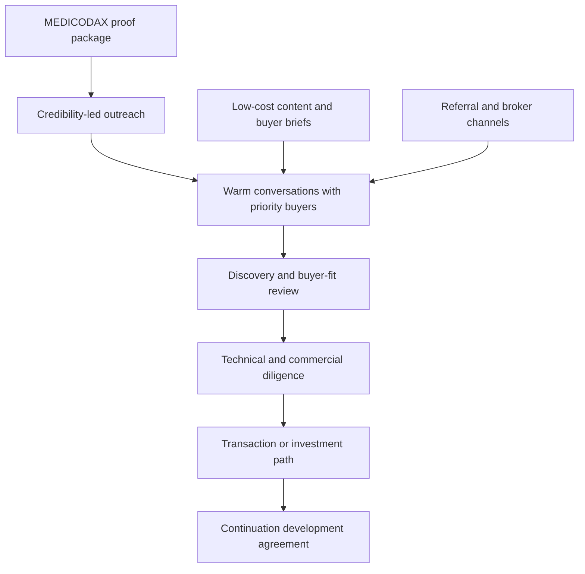
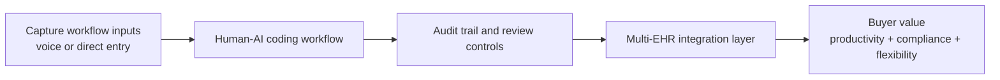
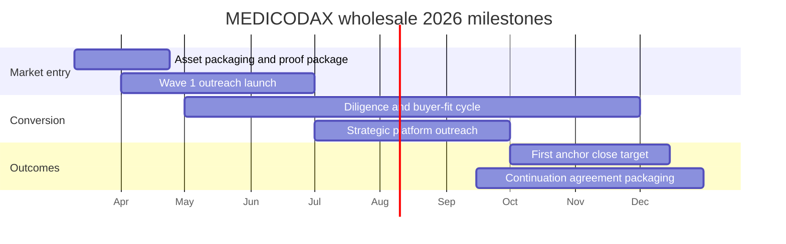

# MEDICODAX Wholesale Strategy Briefing

**Last Updated:** 2026-03-10

## Executive Summary

MEDICODAX wholesale should be marketed in 2026 as a **strategic human-AI medical coding asset plus continuation development team**, not as a broad retail SaaS launch or a BDA-only joint venture story. The strongest path to revenue is to use the current MEDICODAX proof package, multi-EHR workflow story, and coding-operations pain signals as the lead narrative, then run a relationship-led campaign into medical coding and training firms first, home-health aligned operators second, strategic healthcare workflow / RCM buyers third, and healthcare-aligned investors fourth.

The commercial motion should combine the wholesale asset, continuation development services, domain configuration support, and retail / enterprise upside as an optional future layer. This keeps the offer aligned with current proof while creating a practical path from buyer curiosity to diligence, paid work, and a strategic transaction. What closes deals fastest is turning MEDICODAX into a believable `build-vs-buy` shortcut for firms that already own distribution, customers, or operations.

The safest reading of the market is **not** "launch MEDICODAX broadly and hope buyers appear." It is a focused 2026 process that actively sells into only **12-18 priority accounts**, while keeping adjacent buyers warm through low-cost content, direct follow-up, and selective intermediary visibility.

## Strategy In One View

## High-Level Solution Components

## Core Objectives For 2026

| Objective | What success looks like |
| --- | --- |
| Establish the category story | Buyers understand MEDICODAX as an auditable coding workflow asset, not vague AI software |
| Build a repeatable buyer-outreach engine | Mike, Beverly, marketing, and coordinator support run a steady rhythm of targeted outreach, follow-up, and asset refresh |
| Convert interest into paid commercial motion | Discovery calls become diligence sessions, paid workshops, continuation SOWs, licenses, or strategic transaction paths |
| Produce proof stronger than demos | MEDICODAX has a reusable buyer brief, architecture visual, workflow proof, and diligence-ready FAQ supporting later deals |

## Why This Market Is Attractive Right Now

- Medical coding remains a large and growing market, and AI-assisted coding has already crossed from novelty into active buying and build-vs-buy discussion.
- The coder shortage and ongoing revenue leakage from documentation and coding quality create immediate operating pressure.
- MEDICODAX already has buyer-relevant proof points: human final decision loop, real-time auditing, adaptive workflow logic, and multi-EHR security framing.
- RCM and healthcare workflow vendors need differentiated AI workflow capability without taking on a full greenfield build.
- Home-health and post-acute coding remain especially urgent workflow niches, while training firms are an underused buyer category that can extend into software-enabled recurring revenue.

## Who To Target First

The highest-fit 2026 targets are:

1. medical coding and audit firms that can absorb MEDICODAX into existing service operations
2. coding education, training, and credentialing firms that want a workflow layer, not just content
3. home-health aligned coding, compliance, or workflow operators with urgent documentation and review pain
4. RCM, healthcare workflow, and hospital-tech platform buyers that prefer bolt-on capability over greenfield build
5. healthcare-aligned investors, search buyers, and sponsors who value a continuation team and strategic optionality

The campaign should **not** attempt a generic mass-market blast. It should move in waves while limiting active outbound to a narrow priority set:

- `March-April`: asset packaging, proof package, first-intro shortlist, and buyer brief
- `April-June`: coding, training, and home-health operator outreach
- `July-September`: strategic platform, RCM, and corp-dev outreach plus active diligence
- `October-December`: close motion, investor backstop, and continuation-agreement packaging

Recommended coverage model:

- `12-18 priority accounts` in active outreach
- `15-25 adjacent accounts` kept warm through content, light follow-up, and referral paths
- `remaining market` addressed through thought leadership, selective listing visibility, and partner awareness

## Ownership Model

| Role | Main job | Time expectation |
| --- | --- | --- |
| Mike Idengren | packaging, founder outreach, high-value meetings, diligence, transaction structure, continuation scope | 8-13 hrs/week |
| Beverly Eubanks | workflow credibility, domain-sensitive messaging, selected buyer calls | 3-5 hrs/week |
| Coordinator / intern | list building, referral research, follow-up, scheduling, pipeline hygiene | 16-22 hrs/week |
| Marketing Manager | buyer assets, low-cost campaign, teaser support, reporting, briefing refresh | 10-14 hrs/week |

## Operating Plan

### 1. Credibility-first outreach

The first contact should feel like a strategic note about a coding-workflow asset, not a generic AI sales email. Use language such as `human-AI coding platform asset`, `auditable workflow`, and `continuation development team`. Keep BDA in the background as origin context and proof of buyer logic, not as the center of the commercial story.

### 2. Content that supports conversations

Marketing should support buyer confidence, not run separately from the transaction motion. The core content set should make outreach and diligence easier to win:

- buyer-facing positioning brief
- architecture and workflow visuals
- short narrated briefing or clip
- transaction-oriented FAQ and diligence summary
- selective visibility through low-cost channels and intermediaries

### 3. Commercial ladder

MEDICODAX should be sold in a ladder:

1. teaser and buyer brief
2. discovery and fit assessment
3. technical and commercial diligence session
4. paid workshop, continuation SOW, investment path, or transaction structure
5. strategic close with LSA continuation role preserved where possible

That ladder matches how buyers reduce risk at alpha / demo-ready stage and how MEDICODAX creates value fastest.

### 4. Channel strategy

For the detailed broker shortlist, fee-model checks, comparison scorecard, first-contact email, and one-week execution sprint, use `docs/strategic-plan/medicodax/medicodax-wholesale-brokers.md`.

Use three lanes in parallel:

- `Direct strategic outreach` - founder-led contact into coding firms, training firms, RCM buyers, and corp-dev targets
- `Curated intermediary outreach` - success-fee or low-upfront brokers first, then healthcare IT advisors for larger processes
- `Selective listing visibility` - controlled teaser exposure through software deal marketplaces and advisor networks

Practical options to test in 2026:

- `Acquire.com` for low-friction market testing and buyer exposure
- `Synergy Business Brokers` and `Sigma Mergers` for success-fee-first search
- `iMerge Advisors`, `Founders Advisors`, and `Axial` via advisor if the process matures into a larger healthcare IT transaction

## Timeline And Milestones

## Expected 2026 Outcomes

| Metric | Base case | Stretch case |
| --- | ---: | ---: |
| Active priority accounts | 12-18 | 18-22 |
| Named target contacts | 30-45 | 40-55 |
| Personalized founder outreach messages | 26-32 | 35-40 |
| Phone follow-up attempts | 54-72 | 75-90 |
| Positive replies or referrals | 8-10 | 10-14 |
| Intro calls | 8-12 | 10-12 |
| Discovery meetings | 5-8 | 6-8 |
| Demo or diligence meetings | 3-5 | 4-6 |
| Active negotiations or proposal paths | 2-4 | 3-4 |
| Closed sales | 1-2 | 2 |

### Outcome Interpretation

- `30-45 named contacts` is enough to test multiple buyer paths without losing personalization.
- `8-12 intro calls` indicates real traction for a founder-led strategic process rather than a passive listing exercise.
- `2-4 active negotiations` means MEDICODAX is converting from curiosity into real commercial behavior.
- `1-2 closes` is the safest 2026 base case; anything above that is upside.

## What Leadership Should Watch

- Are founder and domain-led messages producing serious buyer engagement, not just polite replies?
- Is BDA staying in the story as context, rather than making the asset feel too customized to one operator?
- Are content assets making diligence easier, or are they still too marketing-heavy?
- Are we protecting the continuation-services term early enough in discussions?
- Is retail staying in third position rather than stealing time from the transaction motion?

## Main Risks

- overclaiming MEDICODAX as mature SaaS instead of a credible alpha-stage asset
- leaning too hard on the BDA-specific operating model
- spreading across too many buyer types at once
- paying retainers too early without clear healthcare buyer access
- weak follow-up discipline in a small but high-value funnel
- treating retail upside as the primary 2026 story

## Bottom Line

MEDICODAX can generate meaningful 2026 revenue if LSA Digital treats it as a **strategic coding-workflow asset with a built-in continuation team**, not a generic app launch. The combination of implemented workflow proof, Beverly's domain credibility, founder-led buyer development, low-cost support content, and disciplined intermediary use creates a practical path to **1-2 meaningful closes**, with upside beyond that if one coding, home-health, or strategic platform buyer moves quickly. The key is discipline: keep the claims safe, keep the funnel narrow, and make every month advance either buyer fit, diligence, or a continuation-backed close. Use `docs/strategic-plan/medicodax/medicodax-wholesale-brokers.md` as the operational guide for choosing and engaging the right broker or advisor.

## Sources

- `docs/strategic-plan/medicodax/medicodax-wholesale-marketing-and-sales-plan.md`
- `docs/strategic-plan/medicodax/medicodax-wholesale-brokers.md`
- `docs/strategic-plan/Strategic Plan - LSA sales 2026Mar9.md`
- `lsaProductExpertAlignment.md`
- `marketingCampaignFeb2026.md`
- `posts/2026/02/2026-02-15_2026-T-019_medicodax-jwt-multi-ehr/post-medicodax-jwt-multi-ehr-2026-T-019.md`
- `posts/2026/02/2026-02-15_2026-T-020_medicodax-dynamic-workflow-adaptation/post-medicodax-dynamic-workflow-adaptation-2026-T-020.md`
- EPMS product research for `be662e54-f7a1-486f-ab0b-fb25bab13b8e`
- https://www.precedenceresearch.com/medical-coding-market
- https://www.ama-assn.org/about/leadership/addressing-another-health-care-shortage-medical-coders
- https://blog.nym.health/how-ai-is-improving-clinical-documentation-accuracy-and-compliance
- https://www.businesswire.com/news/home/20250820930915/en/Nym-Rated-a-Top-Performer-by-KLAS-in-First-Report-Dedicated-to-Autonomous-Medical-Coding
- https://acquire.com
- https://axial.net
- https://synergybb.com
- https://sigmamergers.com
- https://imergeadvisors.com
- https://foundersib.com
