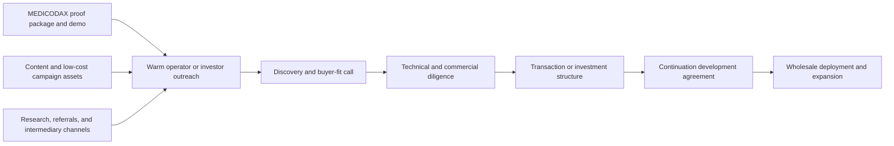
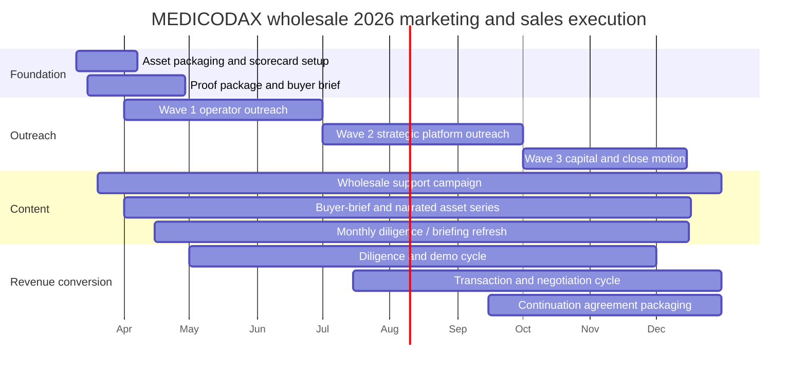

# MEDICODAX Wholesale Marketing and Sales Plan

**Last Updated:** 2026-03-10

## Purpose

This plan defines the 2026 marketing and sales motion for **MEDICODAX wholesale / enterprise** as an asset sale, strategic investment, and continuation-services offer. It converts the existing MEDICODAX BDA proposal, MEDICODAX product proof points, and LSA Digital marketing assets into a practical operating plan with owners, monthly targets, quarterly outcomes, and clear expectations for Mike Idengren, Beverly Eubanks, the Marketing Manager, and any coordinator or intern support.

## Strategic Thesis

MEDICODAX wholesale should be sold as a **human-AI medical coding platform asset plus specialized continuation team** for healthcare-aligned buyers who need productivity gains, auditability, and multi-EHR flexibility without betting on a black-box coding product. The winning commercial motion is not a broad self-serve SaaS launch. It is:

1. `Asset-quality proof first` - lead with implemented product facts: multi-EHR architecture, audit-first workflow, human final decision loop, and domain-informed workflow adaptation.
2. `Strategic buyer fit first` - prioritize buyers who already run coding operations, training, home-health workflows, or healthcare IT platforms and can absorb the product into an existing revenue engine.
3. `Transaction plus continuation services` - structure outreach so every serious conversation includes the option for LSA Digital to continue platform development, integration, and product scaling after the sale or investment.
4. `Retail as optional upside` - keep retail and marketplace expansion visible as future upside, but do not let it dilute the 2026 wholesale / enterprise buyer story.

## What We Are Selling

| Offer layer | What the buyer gets | Best-fit buyer | Primary owner |
| --- | --- | --- | --- |
| Core MEDICODAX wholesale asset | Product IP, demo-ready workflow, multi-tenant and multi-EHR architecture, buyer-facing product thesis, and diligence package | Medical coding firms, coding/training firms, healthcare workflow platforms, hospital-tech groups, healthcare-aligned investors | Mike Idengren |
| Continuation development agreement | Ongoing LSA product development, roadmap execution, AI workflow tuning, integration work, security hardening, and implementation support | Strategic buyers or investors that want continuity after transaction | Mike Idengren + LSA Digital team |
| Domain configuration and rollout support | Workflow design, coding-rules adaptation, buyer onboarding support, SME-guided validation, and implementation planning | Coding operators, training firms, home-health aligned buyers, enterprise pilots | Beverly Eubanks + Mike Idengren |
| Optional expansion path | Retail / marketplace packaging, home-health variants, and enterprise deployments after wholesale buyer alignment | Buyers seeking platform upside beyond internal operations | Mike Idengren |

## Why Now

- The medical coding market remains large and growing, while AI-assisted coding has moved from novelty to active category competition; buyers do not need education on the category, they need confidence in fit and execution.
- A 30 percent medical coder shortage and continuing revenue leakage from coding/documentation quality make productivity and auditability a live operating problem now, not a future thesis.
- MEDICODAX already has a demo-ready architecture story, including multi-EHR integration, JWT / FHIR security framing, human review controls, and dynamic workflow adaptation tied to real documentation conditions.
- The fastest 2026 revenue path is not waiting for mass retail adoption. It is finding an aligned buyer or investor that can monetize wholesale operations quickly and keep LSA under contract for further development.
- Buyers in coding services, training, home health, and healthcare workflow software can view retail as upside, but they are more likely to move when the primary story is operational leverage and strategic control.

## Primary Buyer Map

| Buyer type | Core pain | Why MEDICODAX fits | Best opener | Close path |
| --- | --- | --- | --- | --- |
| Medical coding and audit firms | Coder shortages, margin pressure, and inconsistent documentation quality across many clients | MEDICODAX is built around human-AI coding support, auditability, and multi-EHR workflows that resemble a service-provider reality | Operator-to-operator note focused on productivity and QA leverage | Asset purchase, minority investment, or pilot-to-transaction path with continuation MSA |
| Coding education and training firms | Need differentiated technology, modern curriculum, and scalable practical tooling for client services or learner programs | MEDICODAX can become both a production tool and a training / enablement asset | Capability briefing on technology-enabled coding workforce transformation | Strategic investment or licensing / asset deal plus ongoing LSA roadmap support |
| Home-health aligned coding, compliance, or consulting groups | Need workflow support that respects documentation variability, home-health realities, and review discipline | Beverly-led domain story and workflow realism give MEDICODAX a credible angle for this segment | Beverly-introduced conversation around workflow pain and audit discipline | Pilot / due-diligence review leading to strategic partnership or acquisition |
| Healthcare workflow / RCM platform companies | Need differentiated AI workflow capabilities without building from zero | MEDICODAX offers a product asset with multi-EHR, audit trail, and human-in-the-loop position already framed | Product-development or corp-dev outreach tied to build-vs-buy economics | Asset sale, strategic partnership, or minority investment with product integration roadmap |
| Hospital-tech conglomerates and enterprise healthcare IT groups | Need buyer-ready innovation with clearer operational use than generic AI demos | MEDICODAX provides a specific use case with compliance-aware architecture and future enterprise deployment options | Executive briefing focused on coding operations leverage and continuation team availability | Strategic investment, tuck-in acquisition, or enterprise co-development agreement |
| Healthcare-aligned private investors, search buyers, and sponsors | Need a credible healthcare software wedge with domain backing and a practical post-close operating path | MEDICODAX can be acquired or recapitalized with LSA continuing as the development engine | Investor memo centered on asset transfer plus contracted execution continuity | Minority investment, majority recap, or staged acquisition |

## Market Prioritization Logic

Do not market MEDICODAX wholesale to every possible healthcare buyer in the same way. Use a broad healthcare AI relevance narrative with active outbound only in a narrow Tier 1 set.

| Tier | Coverage | Commercial treatment |
| --- | --- | --- |
| Tier 1 - active accounts | 12-18 strategic buyers and investors | Direct founder and SME outreach, tailored briefings, diligence follow-up, and transaction pursuit |
| Tier 2 - warm accounts | 15-25 adjacent buyers, channel partners, and investor introductions | Light outreach, briefing invitations, selective follow-up, and periodic proof updates |
| Tier 3 - awareness only | Broader coding, healthcare IT, and retail-interest market | Content-led awareness, marketplace visibility, and partner amplification only |

Use a wave-based approach inside that tier model.

| Wave | Period | Target profile | Example focus |
| --- | --- | --- | --- |
| Wave 0 - Asset packaging | March-April | Internal packaging and first-intro friendly accounts | Diligence room, buyer brief, shortlist, investor thesis, proof assets |
| Wave 1 - Relationship operators | April-June | Coding firms, training firms, and home-health aligned buyers reachable through existing trust paths | Productivity, compliance, and workflow modernization story |
| Wave 2 - Strategic platforms | July-September | RCM software, healthcare workflow vendors, hospital-tech groups, and corp-dev teams | Build-vs-buy economics, tuck-in fit, continuation team availability |
| Wave 3 - Capital and optional upside | October-December | Healthcare-aligned investors, search buyers, and selected retail-adjacent expansion channels | Transaction close, continuation contract, or recapitalization path |

### Account Targeting Scorecard

Prioritize accounts that score highly on at least three of these:

- already operates coding, audit, training, or documentation-heavy healthcare workflows
- serves multiple clients, sites, or EHR environments and can value multi-tenant flexibility
- has visible pressure from coder shortages, margin compression, audit risk, or documentation quality issues
- has healthcare-aligned leadership that can understand compliance-sensitive workflow products
- can support an acquisition, strategic investment, or paid co-development path in 2026
- is open to keeping LSA Digital as post-close development and integration partner

## Go-To-Market Motion

### Channel Mix

| Channel | Use | Owner | Cadence |
| --- | --- | --- | --- |
| Founder-led outreach | First-touch notes to strategic buyers, corp-dev contacts, and investors | Mike Idengren | Weekly |
| Beverly-led domain outreach | Workflow-credibility conversations for home-health and coding-service aligned buyers | Beverly Eubanks | 2-4 priority touches per month |
| Intermediary / broker channel | Outreach to healthcare-aware brokers, advisors, success-fee-friendly agents, and referral partners such as Synergy Business Brokers or Sigma Mergers; evaluate iMerge or Founders Advisors for larger strategic processes | Mike Idengren | Weekly during active transaction periods |
| Asset-listing / buyer-marketplace channel | Selected software deal sites and investor networks such as Acquire.com, plus curated teaser placement through advisors where appropriate | Marketing Manager + Mike Idengren | Monthly refresh |
| Low-cost digital campaign | LinkedIn posts, short buyer briefs, one-pagers, lightweight video, and email nurture to reinforce deal story | Marketing Manager | 2-3 touches per week |
| Conference / association / partner channel | Coding, RCM, home-health, and healthcare IT ecosystem visibility for introductions | Mike Idengren + Marketing Manager | Monthly touchpoint plan |
| Proposal and diligence support | Buyer-specific deck, roadmap, architecture brief, FAQ, and next-step asks | Mike Idengren | As opportunities mature |

Use `docs/strategic-plan/medicodax/medicodax-wholesale-brokers.md` as the detailed working guide for broker selection, fee-model checks, first-contact outreach, and final intermediary choice.

## Role Ownership

### Coordinator / intern - primary ownership

This role is the force multiplier for list-building, follow-up, and process discipline.

| Workstream | Weekly expectation | Deliverable |
| --- | --- | --- |
| Target-account research | 6-8 hrs | 8-12 new buyer or investor contacts with account notes and fit score |
| Outreach support | 4-5 hrs | Drafts queued, follow-ups scheduled, CRM updated |
| Referral and broker research | 3-4 hrs | Shortlist of intermediaries, marketplaces, and warm intro paths using the detailed broker guide |
| Meeting operations | 2-3 hrs | Calendar holds, buyer dossiers, notes, next-step tracker |
| Pipeline hygiene | 1-2 hrs | Current status, next action, owner, and date for every active account |

**Coordinator / intern KPIs**

- 10-15 qualified named contacts added per month during active build periods
- 100 percent of active accounts updated within 48 hours of any interaction
- 6-10 broker, referral, or investor-introduction paths surfaced per quarter
- less than 5 business days between first response and scheduled next step

### Marketing Manager - primary ownership

This role turns MEDICODAX product evidence into buyer-facing transaction and market-entry assets.

| Workstream | Weekly expectation | Deliverable |
| --- | --- | --- |
| Campaign execution | 3-4 hrs | 2-3 MEDICODAX wholesale touches per week across social, email, or direct-support assets |
| Content packaging | 4-5 hrs | One-pagers, buyer deck updates, diligence summaries, landing-page copy |
| Video and briefing support | 2-3 hrs | Short clips, narrated deck fragments, or webinar-style explainers |
| Intermediary support | 1-2 hrs | Teaser copy, marketplace summaries, and outreach collateral |
| Reporting | 1-2 hrs | Weekly pipeline scorecard and monthly channel readout |

**Marketing Manager KPIs**

- 8-10 MEDICODAX wholesale-oriented content assets or updates per month
- 1 new or refreshed buyer-facing sales asset per month
- 2 short briefing clips or narrated assets per month
- 25-35 percent of active conversations influenced by content touchpoints
- every active outreach wave supported by at least one new proof asset

### Beverly Eubanks - credibility and domain oversight

Beverly should stay focused on the highest-leverage domain areas: workflow realism, buyer trust, and home-health or coding-operations credibility.

| Responsibility | Weekly time | Why it matters |
| --- | --- | --- |
| Review domain-sensitive claims and buyer materials | 1-1.5 hrs | Keeps workflow and compliance language credible |
| Join selected buyer or investor calls | 1-2 hrs | Converts technical curiosity into operating confidence |
| Shape segment-specific talk tracks | 0.5-1 hr | Helps distinguish coding-firm, training, and home-health angles |
| Support proof packaging | 0.5 hr | Makes the product story feel grounded in real coding work |
| Monthly pipeline review | 0.5 hr | Keeps domain priorities aligned with market outreach |

**Expected ongoing time commitment:** roughly **3-5 hours per week**, with occasional spikes during priority meetings.

### Mike Idengren - deal and delivery owner

Mike should own packaging, buyer prioritization, transaction structure, and continuation-services framing.

| Responsibility | Weekly time | Deliverable |
| --- | --- | --- |
| Offer and transaction packaging | 3-5 hrs | Buyer deck, diligence package, pricing and structure options |
| High-priority outreach and meetings | 3-4 hrs | First calls, follow-up, and relationship development |
| Proposal, diligence, and negotiation | 2-4 hrs | Buyer-specific next steps, diligence answers, structure memo |
| Post-close continuation scoping | 1-2 hrs | Transition plan, development roadmap, service agreement outline |

## 2026 Quarterly Objectives

| Quarter | Strategic objective | Pipeline target | Revenue motion emphasis |
| --- | --- | --- | --- |
| Q1 late / Q2 early (Mar-Apr) | Package MEDICODAX as a buyer-ready wholesale asset and build Tier 1 shortlist | 12 named Tier 1 accounts, 3 warm intro paths, 1-2 live conversations | Asset packaging + awareness |
| Q2 (May-Jun) | Launch relationship-led outreach into coding, training, and home-health aligned operators | 18-24 cumulative named contacts, 4-5 live conversations, 2-3 first meetings | Discovery + buyer qualification |
| Q3 (Jul-Sep) | Expand into strategic platforms and convert best accounts into diligence and structure discussions | 26-34 cumulative named contacts, 5-8 substantive meetings, 2-4 active diligence paths | Diligence + structure |
| Q4 (Oct-Dec) | Close an investment, acquisition, license, or paid continuation-backed strategic deal and package 2027 options | 30-45 cumulative contacts, 2-4 active negotiations, 1-2 closes | Closing + continuation agreement |

## Monthly Plan And Targets

| Month | Core objective | Primary owner | Named contacts added | Live conversations | First meetings | Proposals / negotiations | Closed sales |
| --- | --- | --- | ---: | ---: | ---: | ---: | ---: |
| March | Build buyer brief, teaser, diligence list, and first target-account scorecard | Mike + Marketing Manager | 6 | 1 | 0 | 0 | 0 |
| April | Launch Wave 1 outreach and secure first operator or investor conversations | Mike + Beverly | 6 | 2 | 1 | 0 | 0 |
| May | Deepen coding-firm and training-firm outreach; publish first transaction-support assets | Mike + Marketing Manager | 5 | 2 | 1 | 0-1 | 0 |
| June | Qualify best-fit buyers and capture at least one warm diligence path | Mike | 4 | 1-2 | 1 | 0-1 | 0 |
| July | Launch Wave 2 to strategic platforms and healthcare workflow companies | Mike + Marketing Manager | 4 | 2 | 1 | 0-1 | 0 |
| August | Push buyer-specific demos, diligence follow-up, and intermediary channels | Mike + Coordinator | 3 | 1-2 | 1 | 1 | 0 |
| September | Narrow to highest-probability accounts and structure transaction options | Mike | 2 | 1 | 0-1 | 1 | 0 |
| October | Move best buyer or investor into formal negotiation and continuation scope | Mike + Beverly | 2 | 1 | 0-1 | 1 | 0-1 |
| November | Secure anchor agreement or signed term path; package retail upside as optional expansion | Mike | 1-2 | 1 | 0-1 | 1 | 0-1 |
| December | Close remaining high-probability path or lock January close with transition-ready materials | Mike + Marketing Manager | 1 | 0-1 | 0 | 0-1 | 0-1 |

## 2026 Funnel Targets

These are the **base-case targets** for a relationship-led strategic buyer motion. Stretch performance is possible, but should not be the planning baseline.

| Metric | Q2 base case | Q3 base case | Q4 base case | 2026 total target |
| --- | ---: | ---: | ---: | ---: |
| Tier 1 accounts in active motion | 12-15 | 12-18 | 10-12 | 12-18 |
| Named target contacts | 18-24 | 26-34 cumulative | 30-45 cumulative | 30-45 |
| Personalized founder outreach messages sent | 10-12 | 10-12 | 6-8 | 26-32 |
| Marketing nurtures sent or surfaced | 12-15 | 16-20 | 12-15 | 40-50 |
| Phone calls or office follow-ups | 18-24 | 24-30 | 12-18 | 54-72 |
| Positive replies or referrals | 4-5 | 6-8 cumulative | 8-10 cumulative | 8-10 |
| Intro calls | 3-4 | 5-7 cumulative | 8-12 cumulative | 8-12 |
| Substantive discovery meetings | 2-3 | 4-6 cumulative | 5-8 cumulative | 5-8 |
| Demo or diligence meetings | 1 | 2-3 cumulative | 3-5 cumulative | 3-5 |
| Active negotiations or proposal reviews | 0-1 | 1-2 cumulative | 2-4 cumulative | 2-4 |
| Closed sales | 0 | 0-1 | 1-2 cumulative | 1-2 |

### Stretch Scenario

If a warm intermediary channel opens quickly or one strategic operator moves faster than expected, a stretch outcome is:

- 40-55 named contacts
- 10-12 intro calls
- 6-8 substantive discovery meetings
- 3-4 active diligence or negotiation paths
- 1 strategic deal plus 1 paid pilot, diligence, or continuation-services close

### Expected Close Mix

- `1 strategic transaction with continuation services` is the highest-priority close.
- `0-1 minority investment or staged acquisition path` is a realistic secondary win in the base case.
- `0-1 retail or marketplace expansion agreement` is possible, but should not be built into the 2026 base forecast.

## Tactical Workstreams

### 1. Credibility-first strategic outreach

Owner: **Mike Idengren**

- Lead with the MEDICODAX asset story, not a generic AI promise.
- Use language such as `human-AI coding platform asset`, `multi-EHR workflow engine`, and `continuation development team`.
- Tailor openers by buyer type: operator efficiency for coding firms, curriculum or service differentiation for training firms, tuck-in economics for software buyers, and execution continuity for investors.
- Keep claims tied to implemented product facts: auditability, workflow adaptation, human final decision loop, and architecture readiness.
- Treat retail as optional upside after the core wholesale / enterprise fit is understood.

### 2. Buyer development and intermediary channel buildout

Owner: **Coordinator / intern**

- Maintain a rolling list of strategic operators, healthcare software buyers, and healthcare-aligned investors.
- Track likely referral sources, boutique brokers, software deal intermediaries, and success-fee-friendly introduction paths separately from direct buyers.
- Create short dossiers before every outreach wave: buyer type, likely acquisition thesis, who might champion, and whether continuation services are likely attractive.
- Route all responses into a single scorecard with next action, owner, and transaction stage.

### 3. Marketing engine for asset sale support

Owner: **Marketing Manager**

- Run a dedicated MEDICODAX wholesale content stream with recurring themes:
  - `Why this asset exists now` - coder shortage, revenue leakage, and workflow modernization pressure
  - `Why trust the product` - human review, audit trail, workflow realism, and multi-EHR proof
  - `Why a buyer wins` - build-vs-buy advantage, speed to market, and continuation-team access
- Build short assets for distinct audience slices:
  - coding and audit firms
  - training and enablement businesses
  - healthcare IT platform and corp-dev teams
  - investors and sponsors
- Create one reusable visual or buyer asset per month.
- Use low-cost channels first: direct email support, LinkedIn posting, lightweight landing-page copy, short narrated briefings, and partner-introduction packets.

### 4. Meeting conversion, diligence, and transaction ladder

Owner: **Mike Idengren**

- Every first meeting should end with one of three next steps: buyer-fit diligence call, technical demo / architecture review, or transaction-structure discussion.
- Use a standard proposal ladder:
  1. teaser and buyer brief
  2. discovery and fit assessment
  3. technical and commercial diligence package
  4. transaction and continuation-services structure
- Keep all transaction materials explicit about what is implemented, what is roadmap, and what is optional upside.

### 5. Proof package and reference creation

Owner: **Marketing Manager + Beverly Eubanks**

- Publish an anchor MEDICODAX wholesale proof package by end of April, including:
  - one buyer-facing positioning brief
  - one solution architecture visual
  - one workflow realism visual tied to documentation conditions
  - one transaction-oriented FAQ or diligence summary
- By September, create at least one sanitized buyer-story or diligence-ready narrative that can support later-wave strategic accounts.

### 6. Channel options for marketing the asset for sale

Owner: **Mike Idengren + Marketing Manager**

Detailed broker and advisor comparison, outreach questions, and decision steps live in `docs/strategic-plan/medicodax/medicodax-wholesale-brokers.md`.

- Use a three-lane channel approach: direct strategic outreach, curated intermediary outreach, and selective asset-listing visibility.
- Test software-business marketplaces and investor networks only with a controlled teaser; do not expose sensitive diligence before buyer qualification.
- Start with low-friction or no-upfront options such as Acquire.com for market testing and success-fee brokers such as Synergy Business Brokers or Sigma Mergers for active buyer search.
- For larger or more complex strategic processes, consider healthcare IT-focused advisors such as iMerge Advisors or Founders Advisors and Axial access through an advisor if the expected valuation and buyer mix justify the process.
- Prefer agents, brokers, or advisors that can work on success fee, back-end commission, or low-upfront arrangements when possible; if retainers are required, reserve them for channels with clear healthcare buyer access.
- Treat low-cost digital marketing as support for credibility, not as the main deal engine: posts, short videos, founder notes, and lightweight briefing distribution should reinforce direct outreach.

## 2026 Execution Calendar

## Weekly Operating Rhythm

| Cadence | Participants | Agenda | Output |
| --- | --- | --- | --- |
| Monday pipeline standup | Mike, marketing manager, coordinator / intern | Review target list, outreach, replies, and blockers | Updated scorecard and weekly priorities |
| Wednesday asset review | Marketing manager + Mike + Beverly as needed | Approve buyer materials, claims, visuals, and follow-up collateral | Approved asset queue |
| Friday deal review | Mike + coordinator / intern | Check active accounts, next asks, diligence status, and timing | Deal-stage updates and next-step plan |
| Monthly strategy review | Core owners | Evaluate buyer mix, channels, and proof gaps | Wave reprioritization and asset plan |

## Scorecard Metrics To Review Weekly

- new target accounts added
- outreach sent by buyer type and owner
- intermediary and referral paths activated
- follow-ups completed
- live conversations booked
- first meetings held
- demos or diligence sessions scheduled
- proposals, term discussions, or negotiations opened
- active close probability by account
- content assets published and influenced meetings

## Risks And Mitigations

| Risk | Why it matters | Mitigation |
| --- | --- | --- |
| Over-positioning MEDICODAX as mature SaaS | Buyers will distrust a story that outruns current product stage | Keep the story asset-first, proof-tied, and explicit about current readiness |
| Staying trapped in the BDA-only narrative | Limits buyer imagination and narrows the market too early | Reframe BDA as evidence of buyer logic, not the only valid partner structure |
| Too much retail emphasis too early | Distracts from the most monetizable 2026 motion | Treat retail as optional upside and third-priority narrative only |
| No disciplined diligence packaging | Serious buyers lose momentum when materials are not transaction-ready | Build and refresh buyer brief, FAQ, architecture summary, and continuation scope monthly |
| Weak follow-up across a small high-value funnel | A relationship-led motion can die from missed next steps | Coordinator owns SLA for follow-up and scorecard hygiene |
| Over-reliance on paid intermediaries | Up-front fees can outstrip realistic near-term close odds | Prefer success-fee or low-upfront channels and reserve retainers for high-fit specialists |

## Success Definition For 2026

By the end of 2026, MEDICODAX wholesale should have:

- a repeatable strategic-buyer narrative stronger than a generic demo
- a disciplined Tier 1 account list across coding operators, strategic platform buyers, and healthcare-aligned investors
- a consistent low-cost content and briefing stream that supports direct outreach
- 8-12 intro calls, 5-8 substantive meetings, and 2-4 active diligence or negotiation paths
- 1 anchor transaction, investment path, or signed strategic continuation-backed agreement, plus optional paid diligence or continuation work
- at least one reusable diligence-ready proof package stronger than a founder-only pitch

## Sources

- `docs/strategic-plan/Strategic Plan - LSA sales 2026Mar9.md`
- `docs/strategic-plan/medicodax/medicodax-wholesale-brokers.md`
- `docs/templates/marketing-and-sales-plan-template.md`
- `docs/templates/marketing-and-sales-briefing-template.md`
- `docs/strategic-plan/hsra/HSRA-marketing-and-sales-plan.md`
- `lsaProductExpertAlignment.md`
- `marketingCampaignFeb2026.md`
- `posts/2026/02/2026-02-15_2026-T-019_medicodax-jwt-multi-ehr/post-medicodax-jwt-multi-ehr-2026-T-019.md`
- `posts/2026/02/2026-02-15_2026-T-020_medicodax-dynamic-workflow-adaptation/post-medicodax-dynamic-workflow-adaptation-2026-T-020.md`
- `posts/2026/02/2026-02-15_2026-T-035_hitl-ux-patterns-scale/post-hitl-ux-patterns-scale-2026-T-035.md`
- EPMS product research for `be662e54-f7a1-486f-ab0b-fb25bab13b8e` including `BDA-LSA LLC "HAI-MED CODER" Proposal (Summary)` and `BDA-LSA LLC "HAI-MED CODER" Proposal (Appendix)`
- https://www.precedenceresearch.com/medical-coding-market
- https://www.ama-assn.org/about/leadership/addressing-another-health-care-shortage-medical-coders
- https://blog.nym.health/how-ai-is-improving-clinical-documentation-accuracy-and-compliance
- https://www.businesswire.com/news/home/20250820930915/en/Nym-Rated-a-Top-Performer-by-KLAS-in-First-Report-Dedicated-to-Autonomous-Medical-Coding
- https://acquire.com
- https://axial.net
- https://synergybb.com
- https://sigmamergers.com
- https://imergeadvisors.com
- https://foundersib.com
