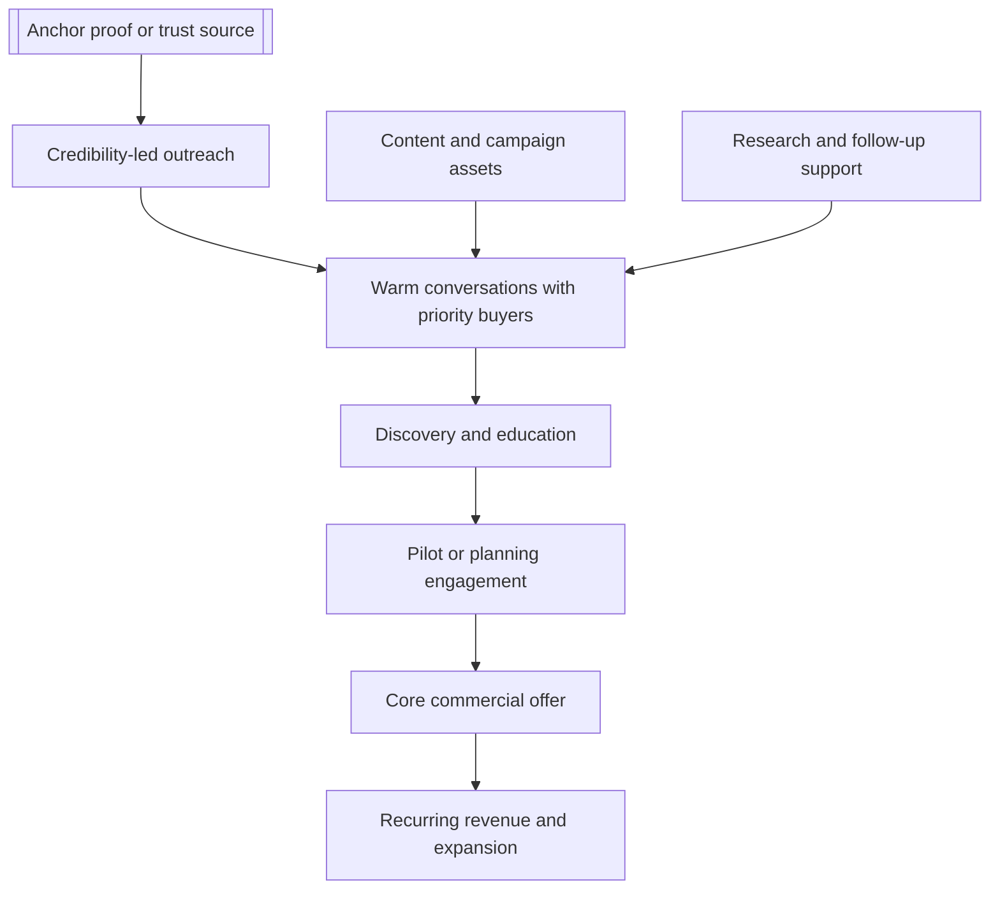

# [Product or Offer] Marketing and Sales Briefing

**Last Updated:** YYYY-MM-DD

Use this template to create a concise leadership-facing briefing that summarizes the full marketing and sales plan. Replace bracketed placeholders, keep the document decision-oriented, and link back to the full plan and supporting research where needed.

## Executive Summary

[Product or offer] should be marketed in [year] as a **[positioning statement]**, not as [positioning to avoid]. The strongest path to revenue is to use [anchor proof, relationship path, or market signal] as the lead story, then run a [relationship-led / partner-led / channel-led] campaign into [priority buyer groups] that face [specific pressure, opportunity, or need].

The commercial motion should combine [offer layer 1], [offer layer 2], [offer layer 3], and [optional offer layer 4]. This keeps the offer aligned with current proof while creating a practical path from interest to revenue. What closes deals fastest is turning existing credibility, product readiness, and buyer urgency into [pilot / planning / configuration / license / services] conversations.

The safest reading of the market is **not** [overly broad go-to-market approach]. It is [focused commercial approach], while actively selling into only [priority coverage range] and keeping the rest warm through content, partner visibility, and selective follow-up.

## Strategy In One View



## Core Objectives For [Year]

| Objective | What success looks like |
| --- | --- |
| Establish category story | Buyers understand [product] as [clear differentiated value], not [vague or weak framing] |
| Build a repeatable outreach engine | [Key roles] run a steady rhythm of outreach, follow-up, content, and pipeline management |
| Convert interest into paid engagements | Discovery calls become [pilots, projects, subscriptions, licenses, or services] |
| Produce proof stronger than demos | [Anchor proof assets and buyer-facing references] support broader expansion |

## Why This Market Is Attractive Right Now

- [Policy, funding, or regulatory signal]
- [Planning or budget-cycle pressure]
- [Buyer pain that makes timing favorable]
- [Market fragmentation or status quo weakness]
- [Why this offer is differentiated right now]

## Who To Target First

The highest-fit [year] targets are:

1. [Buyer group 1]
2. [Buyer group 2]
3. [Buyer group 3]
4. [Buyer group 4]
5. [Buyer group 5]

The campaign should **not** attempt a generic mass-market blast. It should move in waves while limiting active outbound to a narrow priority set:

- `[Period 1]`: [Focus]
- `[Period 2]`: [Focus]
- `[Period 3]`: [Focus]
- `[Period 4]`: [Focus]

Recommended coverage model:

- `[Priority segment size]` in active outreach
- `[Warm segment size]` kept warm through content, webinars, or selective follow-up
- `[Remaining market]` addressed through thought leadership, conferences, or partner awareness

## Ownership Model

| Role | Main job | Time expectation |
| --- | --- | --- |
| [Founder / expert / lead seller] | [Credibility, first-touch outreach, discovery calls, approvals] | [Hours per week] |
| [Operations / intern / SDR] | [Research, list building, follow-up, scheduling, pipeline hygiene] | [Hours per week] |
| [Marketing manager] | [Campaign execution, content packaging, video/webinar support, reporting] | [Hours per week] |
| [Commercial / delivery owner] | [Offer packaging, proposals, tailored demos, close support] | [Hours per week] |

## Operating Plan

### 1. [Relationship-first or credibility-first outreach]

[Describe how first-touch outreach should feel, who should send it, and how the tone should differ from generic sales outreach.]

### 2. Content that supports conversations

[Describe the content engine that helps convert interest into meetings, including posts, briefs, decks, videos, webinars, or proof assets.]

- [Asset type 1]
- [Asset type 2]
- [Asset type 3]
- [Asset type 4]
- [Visibility channel or institution]

### 3. [Pilot-centric or conversion-focused commercial ladder]

[Product] should be sold in a ladder:

1. [Step 1]
2. [Step 2]
3. [Step 3]
4. [Step 4]
5. [Optional step 5]

That ladder should match how buyers reduce risk and how [product] creates value fastest.

## Timeline And Milestones

```mermaid
gantt
    title [Product] [Year] milestones
    dateFormat  YYYY-MM-DD
    axisFormat  %b

    section Market entry
    Anchor proof package                          :a1, [start date], [duration]
    Wave 1 outreach launch                        :a2, [start date], [duration]
    section Conversion
    Webinar or briefing cadence                   :b1, [start date], [duration]
    Pilot and proposal cycle                      :b2, [start date], [duration]
    section Outcomes
    First anchor close target                     :c1, [start date], [duration]
    Reference packaging                           :c2, [start date], [duration]
```

## Expected [Year] Outcomes

| Metric | Base case | Stretch case |
| --- | ---: | ---: |
| Active priority accounts | [#] | [#] |
| Named target contacts | [#] | [#] |
| Personalized outreach messages | [#] | [#] |
| Phone follow-up attempts | [#] | [#] |
| Positive replies or referrals | [#] | [#] |
| Intro calls | [#] | [#] |
| Discovery meetings | [#] | [#] |
| Demo or workshop meetings | [#] | [#] |
| Active negotiations or proposals | [#] | [#] |
| Closed sales | [#] | [#] |

### Outcome Interpretation

- `[Metric range 1]` is enough to test multiple buyer paths without losing personalization.
- `[Metric range 2]` indicates real traction for the intended go-to-market motion.
- `[Metric range 3]` means the campaign is converting from education into buying behavior.
- `[Metric range 4]` is the safest base case; anything above that is upside.

## What Leadership Should Watch

- Are [top outreach owners] producing real engagement, not just polite replies?
- Is follow-up happening within the expected service-level window?
- Is marketing shipping assets that directly help outreach and meetings?
- Are proposals framed around the real commercial motion, rather than an oversimplified offer?
- Are proof assets being built from real buyer interactions on schedule?

## Main Risks

- [Risk 1]
- [Risk 2]
- [Risk 3]
- [Risk 4]
- [Risk 5]
- [Risk 6]

## Bottom Line

[Product or offer] can generate meaningful [year] revenue if [company or team] treats it as a **[positioning summary]**. The combination of [credibility source], [support function], [marketing support], and [commercial packaging] creates a practical path to **[base-case close target]**, with upside beyond that if [proof source, channel, or market timing] accelerates. The key is discipline: keep the claim set safe, keep the motion focused, and keep every month tied to measurable account, meeting, proposal, and close targets.

## Sources

- `[full marketing and sales plan]`
- `[product research summary]`
- `[market analysis]`
- `[license or services opportunity analysis]`
- `[campaign or messaging source]`
- `[product alignment or collateral]`
- [relevant external source 1]
- [relevant external source 2]
