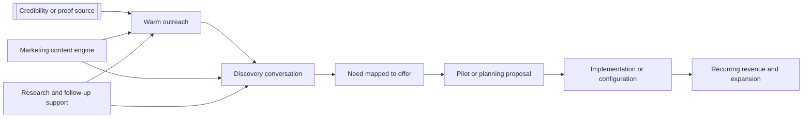

# [Product or Offer] Marketing and Sales Plan

**Last Updated:** YYYY-MM-DD

Use this template to create a product-specific marketing and sales plan. Replace bracketed placeholders, delete sections that do not apply, and adjust the monthly table to match the active selling window.

## Purpose

This plan defines the [YEAR] marketing and sales motion for **[product or offer name]** as a [licensing / consulting / services / hybrid] offer. It converts existing product research, customer signals, and marketing assets into a practical operating plan with owners, monthly targets, quarterly outcomes, and clear expectations for [key roles].

## Strategic Thesis

[Product or offer] should be sold as a **[positioning statement]** for [target buyers] who need [job to be done]. The winning commercial motion is not [what to avoid]. It is:

1. `[Pillar 1]` - [what this means in practice]
2. `[Pillar 2]` - [what this means in practice]
3. `[Pillar 3]` - [what this means in practice]
4. `[Pillar 4]` - [what this means in practice]

## What We Are Selling

| Offer layer | What the buyer gets | Best-fit buyer | Primary owner |
| --- | --- | --- | --- |
| Core [product/license/service] | [Primary deliverable and value] | [Best-fit buyer] | [Owner] |
| [Configuration / onboarding / implementation] | [Configured setup, workflows, enablement, or reports] | [Best-fit buyer] | [Owner] |
| [Consulting / advisory] | [Strategic support, workshops, design, or facilitation] | [Best-fit buyer] | [Owner] |
| [Premium / expansion layer] | [Advanced capability, enrichment, or expansion path] | [Best-fit buyer] | [Owner] |

## Why Now

- [Market timing signal or policy/funding trigger]
- [Budget cycle, planning cycle, or operational pressure]
- [Why this quarter or year matters more than waiting]
- [Existing proof point or anchor story that makes outreach credible now]
- [Why the fastest path to revenue is this motion rather than a broader or slower one]

## Primary Buyer Map

| Buyer type | Core pain | Why [product] fits | Best opener | Close path |
| --- | --- | --- | --- | --- |
| [Buyer segment 1] | [Pain] | [Fit] | [Opener] | [How deal advances] |
| [Buyer segment 2] | [Pain] | [Fit] | [Opener] | [How deal advances] |
| [Buyer segment 3] | [Pain] | [Fit] | [Opener] | [How deal advances] |
| [Buyer segment 4] | [Pain] | [Fit] | [Opener] | [How deal advances] |

## Market Prioritization Logic

Do not market to all potential buyers in the same way. Use a broad relevance narrative with active outbound only in a narrow Tier 1 set.

| Tier | Coverage | Commercial treatment |
| --- | --- | --- |
| Tier 1 - active accounts | [Number or description] | [Direct outreach, calls, demos, proposal pursuit] |
| Tier 2 - warm accounts | [Number or description] | [Light outreach, webinar invitations, selective follow-up] |
| Tier 3 - awareness only | [Number or description] | [Content-led awareness, event visibility, no heavy outbound] |

Use a wave-based approach inside that tier model.

| Wave | Period | Target profile | Example focus |
| --- | --- | --- | --- |
| Wave 0 - Anchor | [Dates] | [Anchor account or proof path] | [Initial validation focus] |
| Wave 1 - Relationship accounts | [Dates] | [Buyers most reachable through existing trust paths] | [Geographies, segments, or partner routes] |
| Wave 2 - Trigger-driven accounts | [Dates] | [Buyers with active funding, reporting, or planning pressure] | [Specific pressure or use case] |
| Wave 3 - Expansion accounts | [Dates] | [Buyers likely to move fast after proof exists] | [Upsell or adjacent opportunity] |

### Account Targeting Scorecard

Prioritize accounts that score highly on at least three of these:

- [Trigger 1]
- [Trigger 2]
- [Trigger 3]
- [Trigger 4]
- [Trigger 5]
- [Trigger 6]

## Go-To-Market Motion



### Channel Mix

| Channel | Use | Owner | Cadence |
| --- | --- | --- | --- |
| [Founder / expert outreach] | [First-touch notes, relationship building, credibility] | [Owner] | [Cadence] |
| [Phone or SDR follow-up] | [Routing, scheduler support, follow-up, CRM hygiene] | [Owner] | [Cadence] |
| [Content stream] | [Thought leadership, short posts, case framing] | [Owner] | [Cadence] |
| [Video or webinar] | [Short explainers, clips, briefings] | [Owner] | [Cadence] |
| [Proposal support] | [Discovery follow-up, scoping, commercial packaging] | [Owner] | [Cadence] |
| [Conference or partner channel] | [Institutional visibility and introductions] | [Owner] | [Cadence] |

## Role Ownership

### [Operations / intern / coordinator role] - primary ownership

This role is the force multiplier for list-building, follow-up, and meeting logistics.

| Workstream | Weekly expectation | Deliverable |
| --- | --- | --- |
| Target-account research | [Hours] | [New contacts or account dossiers] |
| Outreach support | [Hours] | [Drafts queued, tasks logged, follow-up tracked] |
| Phone calls | [Hours] | [Calls completed to offices, leads, or schedulers] |
| Meeting operations | [Hours] | [Calendar holds, notes, action tracking] |
| CRM / scorecard hygiene | [Hours] | [Updated pipeline with statuses and next actions] |

**[Operations / intern / coordinator role] KPIs**

- [KPI 1]
- [KPI 2]
- [KPI 3]
- [KPI 4]

### [Marketing manager role] - primary ownership

This role turns product research into repeatable awareness and meeting-conversion assets.

| Workstream | Weekly expectation | Deliverable |
| --- | --- | --- |
| Campaign execution | [Hours] | [Posts, campaigns, or nurture touches] |
| Content packaging | [Hours] | [One-pagers, decks, page updates, proof assets] |
| Video or webinar production | [Hours] | [Approved videos, webinars, or scripts] |
| Campaign reporting | [Hours] | [Weekly scorecard and monthly readout] |
| Event support | [Hours] | [Invites, reminders, recap assets] |

**[Marketing manager role] KPIs**

- [KPI 1]
- [KPI 2]
- [KPI 3]
- [KPI 4]
- [KPI 5]

### [Founder / expert / subject-matter lead] - commitments and oversight

This role should stay in the highest-leverage parts of the motion: credibility, message approval, first meetings, and subject-matter leadership.

| Responsibility | Weekly time | Why it matters |
| --- | --- | --- |
| Review and send top-priority outreach | [Hours] | [Why this should stay with this role] |
| Join high-value discovery or presentation calls | [Hours] | [Why this accelerates trust or close odds] |
| Approve thought leadership and scripts | [Hours] | [Why this protects claims and voice] |
| Record or approve short video content | [Hours] | [Why this scales presence] |
| Weekly pipeline review | [Hours] | [Why this maintains discipline] |
| Monthly webinar or external briefing | [Hours] | [Why this builds authority] |

**Expected ongoing time commitment:** roughly **[X-Y hours per week]**, with occasional spikes during proposal, launch, or webinar weeks.

### [Sales / commercial / delivery owner] - deal and delivery owner

This role should own packaging, pricing logic, proposals, and implementation scoping.

| Responsibility | Weekly time | Deliverable |
| --- | --- | --- |
| Offer packaging and proposal drafting | [Hours] | [Pilot scopes, proposals, pricing options] |
| Demo tailoring | [Hours] | [Buyer-specific demo flow and prep] |
| Commercial follow-up | [Hours] | [Negotiation support, next-step asks, close plan] |

## [Year] Quarterly Objectives

| Quarter | Strategic objective | Pipeline target | Revenue motion emphasis |
| --- | --- | --- | --- |
| Q1 late / Q2 early | [Objective] | [Target] | [Emphasis] |
| Q2 | [Objective] | [Target] | [Emphasis] |
| Q3 | [Objective] | [Target] | [Emphasis] |
| Q4 | [Objective] | [Target] | [Emphasis] |

## Monthly Plan And Targets

| Month | Core objective | Primary owner | Named contacts added | Live conversations | First meetings | Proposals / negotiations | Closed sales |
| --- | --- | --- | ---: | ---: | ---: | ---: | ---: |
| [Month 1] | [Objective] | [Owner] | [#] | [#] | [#] | [#] | [#] |
| [Month 2] | [Objective] | [Owner] | [#] | [#] | [#] | [#] | [#] |
| [Month 3] | [Objective] | [Owner] | [#] | [#] | [#] | [#] | [#] |
| [Month 4] | [Objective] | [Owner] | [#] | [#] | [#] | [#] | [#] |
| [Month 5] | [Objective] | [Owner] | [#] | [#] | [#] | [#] | [#] |
| [Month 6] | [Objective] | [Owner] | [#] | [#] | [#] | [#] | [#] |
| [Month 7] | [Objective] | [Owner] | [#] | [#] | [#] | [#] | [#] |
| [Month 8] | [Objective] | [Owner] | [#] | [#] | [#] | [#] | [#] |
| [Month 9] | [Objective] | [Owner] | [#] | [#] | [#] | [#] | [#] |
| [Month 10] | [Objective] | [Owner] | [#] | [#] | [#] | [#] | [#] |
| [Month 11] | [Objective] | [Owner] | [#] | [#] | [#] | [#] | [#] |
| [Month 12] | [Objective] | [Owner] | [#] | [#] | [#] | [#] | [#] |

## [Year] Funnel Targets

These are the **base-case targets** for a relationship-led motion. Stretch performance is possible, but should not be the planning baseline.

| Metric | Q2 base case | Q3 base case | Q4 base case | [Year] total target |
| --- | ---: | ---: | ---: | ---: |
| Tier 1 accounts in active motion | [#] | [#] | [#] | [#] |
| Named target contacts | [#] | [#] | [#] | [#] |
| Personalized outreach messages sent | [#] | [#] | [#] | [#] |
| Marketing nurtures sent or surfaced | [#] | [#] | [#] | [#] |
| Phone calls or office follow-ups | [#] | [#] | [#] | [#] |
| Positive replies or referrals | [#] | [#] | [#] | [#] |
| Intro calls | [#] | [#] | [#] | [#] |
| Substantive discovery meetings | [#] | [#] | [#] | [#] |
| Demo or workshop meetings | [#] | [#] | [#] | [#] |
| Active negotiations or proposal reviews | [#] | [#] | [#] | [#] |
| Closed sales | [#] | [#] | [#] | [#] |

### Stretch Scenario

If [anchor proof, partner channel, or market trigger] strengthens quickly, a stretch outcome is:

- [Stretch metric 1]
- [Stretch metric 2]
- [Stretch metric 3]
- [Stretch metric 4]
- [Stretch metric 5]

### Expected Close Mix

- `[Primary close type]` is the highest-priority close.
- `[Secondary close type]` is a realistic secondary win in the base case.
- `[Optional upsell or premium motion]` is possible, but should not be built into the base forecast.

## Tactical Workstreams

### 1. [Credibility-first or relationship-first outreach motion]

Owner: **[Owner]**

- [Guideline 1]
- [Guideline 2]
- [Guideline 3]
- [Guideline 4]
- [Guideline 5]

### 2. [Account development workstream]

Owner: **[Owner]**

- [Guideline 1]
- [Guideline 2]
- [Guideline 3]
- [Guideline 4]

### 3. [Marketing engine workstream]

Owner: **[Owner]**

- Run a dedicated [product] content stream with recurring themes:
  - `[Theme 1]`
  - `[Theme 2]`
  - `[Theme 3]`
- Build short content or videos for distinct audience slices:
  - [Audience 1]
  - [Audience 2]
  - [Audience 3]
- Create one reusable visual or sales asset per month.
- Pursue visibility through [organizations, channels, or partners] so content is reinforced by institutional channels, not only direct outreach.

### 4. [Meeting conversion and proposals]

Owner: **[Owner]**

- Every first meeting should end with one of three next steps: [option 1], [option 2], or [option 3].
- Use a standard proposal ladder:
  1. [Step 1]
  2. [Step 2]
  3. [Step 3]
  4. [Step 4]
- Keep commercial documents focused on what is implemented, configurable, and optional.

### 5. [Proof-building and reference creation]

Owner: **[Owner]**

- Publish an anchor proof package by [date], including:
  - [Asset 1]
  - [Asset 2]
  - [Asset 3]
  - [Asset 4]
- By [date], create at least one sanitized buyer-story or proof artifact that can support later-wave accounts.

## [Year] Execution Calendar

```mermaid
gantt
    title [Product] [Year] marketing and sales execution
    dateFormat  YYYY-MM-DD
    axisFormat  %b

    section Foundation
    Offer packaging and scorecard setup           :a1, [start date], [duration]
    Anchor proof package                          :a2, [start date], [duration]

    section Outreach
    Wave 1 outreach                               :b1, [start date], [duration]
    Wave 2 outreach                               :b2, [start date], [duration]
    Wave 3 outreach                               :b3, [start date], [duration]

    section Content
    Ongoing campaign                              :c1, [start date], [duration]
    Video or content series                       :c2, [start date], [duration]
    Monthly webinar or briefing                   :c3, [start date], [duration]

    section Revenue conversion
    Pilot scoping and demo cycle                  :d1, [start date], [duration]
    Proposal and negotiation cycle                :d2, [start date], [duration]
    Close and reference packaging                 :d3, [start date], [duration]
```

## Weekly Operating Rhythm

| Cadence | Participants | Agenda | Output |
| --- | --- | --- | --- |
| Monday pipeline standup | [Participants] | [Agenda] | [Output] |
| Midweek content review | [Participants] | [Agenda] | [Output] |
| Friday revenue review | [Participants] | [Agenda] | [Output] |
| Monthly strategy review | [Participants] | [Agenda] | [Output] |

## Scorecard Metrics To Review Weekly

- new target accounts added
- outreach sent by channel and owner
- follow-ups completed
- live conversations booked
- first meetings held
- demos or presentations scheduled
- proposals or negotiations opened
- closes, stalls, and lost reasons
- content assets published and influenced meetings

## Risks And Mitigations

| Risk | Why it matters | Mitigation |
| --- | --- | --- |
| [Risk 1] | [Why it matters] | [Mitigation] |
| [Risk 2] | [Why it matters] | [Mitigation] |
| [Risk 3] | [Why it matters] | [Mitigation] |
| [Risk 4] | [Why it matters] | [Mitigation] |
| [Risk 5] | [Why it matters] | [Mitigation] |
| [Risk 6] | [Why it matters] | [Mitigation] |

## Success Definition For [Year]

By the end of [year], [product or offer] should have:

- a repeatable [credibility, channel, or founder-led] motion
- a consistent thought-leadership or demand-generation stream
- a managed Tier 1 target list with disciplined follow-up
- measurable intro calls, discovery meetings, and proposal paths
- [number] closed sales across [close types]
- at least one reusable public or semi-public proof artifact stronger than a generic demo

## Sources

- `[primary strategic plan or company plan]`
- `[product research summary]`
- `[market analysis]`
- `[buyer or competitor research]`
- `[campaign or messaging document]`
- `[product alignment or sales collateral]`
