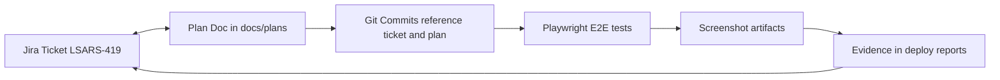

# The Traceability Checklist: Shipping Without Institutional Memory Loss

## Metadata
- **Post ID**: 2026-T-023
- **Audience**: tech
- **Product**: EPMS
- **Themes**: FUTUREAI_PRODDEV, AGENTICAI_DEVOPS
- **Expert**: Mike, Keith
- **Depends On**: —
- **Dependency Name**: —
- **Relationship**: Jira + lightweight plan docs + evidence hooks even in 60/40 mode
- **Assets**: —
- **CTA**: book a working session at [lsadigital.com](https://lsadigital.com)

## Post

"Vibe Engineering"—the blend of rapid vibe coding for exploration and production-grade engineering for shipping—fails the moment it becomes untraceable. We’ve seen teams move at 10x speed for two weeks only to hit a wall because nobody knows why a specific prompt-driven refactor happened.

To keep speed sustainable, we use a strict traceability loop. In our EPMS builds, this isn't just "process"; it's how we manage 556 test functions across 95 files while maintaining 29 Playwright E2E tests. If you can't prove it works, you haven't shipped it.

**The 60/40 Vibe Mode Checklist:**

- **Jira as the Anchor:** Every user story starts with a Jira ticket. It’s the high-level "what" and "why" that survives the ephemeral nature of chat threads.
- **Local Plan Docs:** We store lightweight markdown plans directly in the repo. These reference Jira IDs and provide the detailed A/C (Acceptance Criteria) that agents need to stay on track.
- **Evidence Hooks:** No UI ticket is closed without Playwright screenshot evidence. It’s the ultimate receipt for Human-UX (HUX) verification.
- **Commit Traceability:** Every commit message must link back to the plan doc and Jira ticket. This creates a searchable audit trail from requirement to implementation.

By anchoring rapid exploration to these durable artifacts, we ensure that today's "vibe" becomes tomorrow's institutional memory.

## Artifacts
- Remote:
  - https://lsadigital.com

## Post asset ideas
- [ ] Screenshot: A markdown plan doc referencing a Jira ticket number
- [ ] Example: Playwright E2E test output with screenshot artifacts
- [ ] Diagram: The traceability loop (Jira <-> Plan <-> Commit <-> Test)

### Architecture: Traceability Loop (Jira <-> Plan <-> Commit <-> Test)



### Code: Playwright Evidence Hook (`apps/ui/e2e/capture_ac_screenshots.spec.ts`)

```typescript
test('Capture A/C 13: DEMO badge in permit selector', async ({ page }) => {
  await page.goto('/');
  await expect(page.getByTestId('map-container')).toBeVisible({ timeout: 20000 });

  await injectGeographicState(page);
  await expect(page.getByTestId('side-panel-county')).toBeVisible({ timeout: 10000 });

  await page.getByTestId('validate-data-calculation-method').click();
  await page.getByTestId('report-type-hotspot').click();
  await page.getByTestId('generate-report-button').click();
  await expect(page.getByRole('heading', { name: 'Select a Permit' })).toBeVisible({ timeout: 10000 });

  await page.screenshot({
    path: `${SCREENSHOT_DIR}/ac13-demo-badge-permit-selector.png`,
    fullPage: false
  });

  const demoPermit = page.locator(`[data-testid="permit-item-${DEMO_PERMIT_ID}"]`);
  await expect(demoPermit).toBeVisible({ timeout: 5000 });
});
```

### Plan Structure: `docs/plans/LSARS-419-ENHANCED-SMOKE-TESTS-SCREENSHOTS.md` (Opening)

```markdown
# LSARS-419: Enhanced Deployment Smoke Tests with Screenshot Evidence

**Jira Ticket:** [LSARS-419](https://lsadigital.atlassian.net/browse/LSARS-419)
**Status:** 🟢 Complete
**Created:** 2026-01-10
**Updated:** 2026-01-10

---

## Agent Assignment Summary

| Agent | LLM | Config Scope | Phases | Role | Justification |
|-------|-----|--------------|--------|------|---------------|
| **Sisyphus** | Claude Opus 4.5 | system | All | Orchestration, test implementation | E2E test creation |
| **frontend-ui-ux-engineer** | Gemini 3 Flash | project | P2 | React component test IDs | May need to add data-testid attrs |
| **explore** | Gemini 3 Flash | project | All | Codebase pattern discovery | Find existing test patterns |
```
