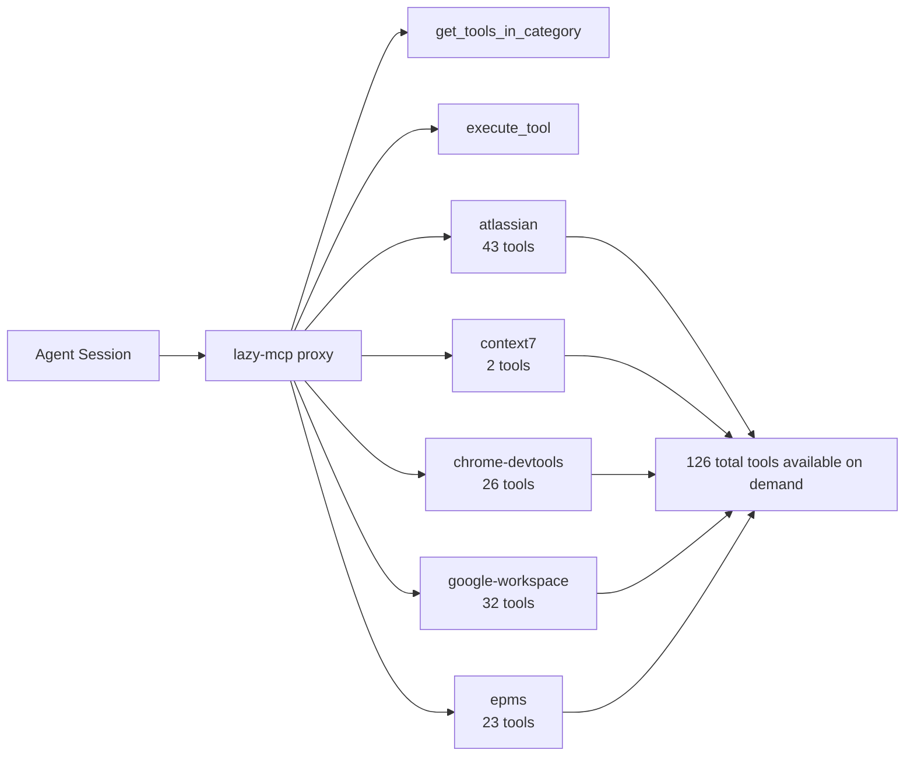

# Stop Prompting, Start Rehydrating: The MCP Proxy Pattern

## Metadata
- **Post ID**: 2026-T-025
- **CTA**: book a working session at [lsadigital.com](https://lsadigital.com)

## Post

Context windows are the new RAM, and they are perpetually leaking. If your agentic workflow relies on "remembering" the system architecture across a 50-message thread, you aren't building a system—you're building a house of cards.

In our LSARS/HSRA builds, we solved this with a system-level pattern: the MCP Proxy (lazy-mcp). Instead of stuffing every tool and doc into the initial prompt, we provide a rehydration layer that pulls context on demand.

Our current setup uses 5 specialized servers managing 126 tools, categorized for precision:
- **Atlassian (43 tools):** Jira tickets and Confluence specs.
- **Chrome-DevTools (26 tools):** Real-time browser state and HUX verification.
- **EPMS (23 tools):** Product management and roadmap data.
- **Google-Workspace (32 tools):** Collaborative docs and sheets.
- **Context7 (2 tools):** Deep technical documentation lookup.

This isn't just "RAG for code." It’s a dynamic rehydration layer. When an agent needs to verify a requirement, it doesn't guess; it calls the Atlassian server. When it needs to check a UI layout, it hits Chrome-DevTools.

This is the core of "Vibe Engineering"—the ability to vibe code at high speed because the infrastructure handles the "engineering" of context management. By offloading memory to a structured proxy, we keep the agent's focus on the task at hand, not on trying to remember what happened ten messages ago.

## Artifacts
- Remote:
  - https://lsadigital.com

## Post asset ideas
- [ ] Diagram: The lazy-mcp proxy architecture (Agent -> Proxy -> 5 Servers)
- [ ] Screenshot: The tool categorization list in a live session
- [ ] Example: A "context rehydration" trace showing a Jira lookup during a refactor

### Architecture: Lazy-MCP Proxy (126 Tools, 2 Meta-Tools at Startup)



### Config Snippet: `~/dev/common/lazy-mcp/config.json` (`mcpProxy` + server entries)

```json
{
  "mcpProxy": {
    "name": "Global Lazy MCP Proxy",
    "version": "1.0.0",
    "type": "stdio",
    "hierarchyPath": "/Users/idengrenme/dev/common/lazy-mcp/hierarchy",
    "options": {
      "lazyLoad": true
    }
  },
  "mcpServers": {
    "atlassian": {
      "transportType": "stdio",
      "command": "/Users/idengrenme/dev/mcp-sooperset/mcp-connect.sh"
    },
    "context7": {
      "transportType": "stdio",
      "command": "/Users/idengrenme/.local/share/fnm/node-versions/v20.19.5/installation/bin/npx",
      "args": ["-y", "@upstash/context7-mcp", "--api-key", "ctx7sk-***"]
    },
    "chrome-devtools": {
      "transportType": "stdio",
      "command": "/Users/idengrenme/.local/share/fnm/node-versions/v20.19.5/installation/bin/npx",
      "args": ["-y", "chrome-devtools-mcp@latest", "--browserUrl", "http://127.0.0.1:9222"]
    }
  }
}
```

### MCP Section Excerpt: `AGENTS.md` (Architecture + Tool Categories)

```markdown
## MCP TOOLS (via lazy-mcp proxy)

Tools are lazy-loaded through the `lazy-mcp` proxy. Only 2 meta-tools load at startup:
- `get_tools_in_category(path)` — Discover tools in a category
- `execute_tool(tool_path, arguments)` — Execute a discovered tool

### Architecture: Global Shared Config

~/dev/common/lazy-mcp/           # Shared across all projects
├── config.json                  # 5 servers: atlassian, context7, chrome-devtools, google-workspace, epms
└── hierarchy/                   # Generated tool discovery files

~/dev/marketing/.mcp.json        # Points to shared config (no graph-code - not a code project)

### Tool Categories (5 shared servers)

| Category | Tools | Use For | When |
|----------|-------|---------|------|
| `atlassian` | 43 | Jira tickets, Confluence pages | Content planning, docs |
| `chrome-devtools` | 26 | Browser automation, screenshots | Visual content capture |
| `context7` | 2 | Library documentation lookup | Tech research |
| `epms` | 23 | Product management data | Product info for content |
| `google-workspace` | 32 | Gmail, Calendar, Drive, Docs, Sheets | Content collaboration |
```
