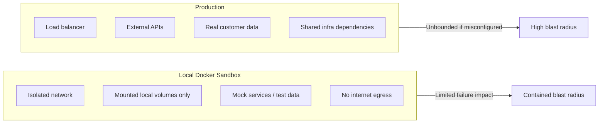

# The Agentic Sandbox: Rules for Safe Continuous Exploration

## Metadata
- **Post ID**: 2026-T-028
- **Audience**: tech
- **Product**: LSARS, HSRA
- **Themes**: FUTUREAI_PRODDEV, TECH_SECURITY
- **Expert**: Mike, Keith
- **Depends On**: —
- **Dependency Name**: —
- **Relationship**: Practical sandbox rules so CE stays fast without production incidents
- **Assets**: —
- **CTA**: book a working session at [lsadigital.com](https://lsadigital.com)

## Post

The fastest way to kill "Vibe Engineering" is a single security incident. If an agent accidentally wipes a production database or leaks a credential during a "vibe coding" session, the experiment is over. To move fast, you need a sandbox that is physically incapable of causing a disaster.

In our LSARS environment, we manage 9 Docker microservices and a complex connection pooling layer (300 max connections across 9 providers). We don't let agents "vibe" in that environment without strict guardrails.

**Development Sandbox Rules (The CE Protocol):**

- **No Prod Credentials:** This is non-negotiable. If a task requires production access, the dial shifts to 100% Engineering, and the agent is restricted to read-only observation.
- **Mocked Infrastructure:** We use Docker Compose to spin up local clones of the entire stack (Postgres, Redis, Pgbouncer). Agents explore against these clones, never the live cluster.
- **Tool Allowlists:** We use an MCP proxy to restrict which tools an agent can call based on the "Vibe Dial" setting. In high-vibe mode, destructive tools (like `rm` or `drop table`) are disabled.
- **Connection Caps:** Even in the sandbox, we enforce connection pooling limits to simulate production constraints and catch resource leaks early.
- **The Kill Switch:** Every agentic session has a single command to revoke all tool permissions instantly if the agent starts behaving unexpectedly.

By making the sandbox safe, we make exploration fearless. You can't have 10x velocity if you're constantly looking over your shoulder.

## Artifacts
- Remote:
  - https://lsadigital.com

## Post asset ideas
- [ ] Checklist: The "Safe Sandbox" audit for new agentic workflows
- [ ] Diagram: The blast radius of a local Docker sandbox vs. Production
- [ ] Example: An MCP tool allowlist configuration for "High Vibe" mode

### Checklist: "Safe Sandbox" Audit for New Agentic Workflows

- [ ] Tool permissions scoped by mode (read-only, edit, execute)
- [ ] Production credentials blocked in local agent sessions
- [ ] MCP allowlist enforced per workflow and role
- [ ] Network isolation enabled for sandbox containers
- [ ] Volumes mounted to non-critical paths only
- [ ] No direct write access to production databases
- [ ] External API calls routed through mocks/stubs where possible
- [ ] Connection caps set to mirror production constraints
- [ ] Session kill switch tested before long runs
- [ ] Rollback procedure documented and rehearsed
- [ ] Audit logs retained for all agent tool calls
- [ ] Human approval gate required for privilege escalation

### Diagram: Blast Radius (Local Sandbox vs Production)



### JSON Example: MCP Allowlists by "Vibe Dial"

```json
{
  "vibeDialProfiles": {
    "80_20_high_vibe": {
      "description": "Exploration mode with broad non-prod access",
      "allowTools": [
        "read",
        "grep",
        "glob",
        "lsp_diagnostics",
        "bash",
        "chrome-devtools.*",
        "atlassian.*",
        "context7.*",
        "epms.*",
        "google-workspace.*"
      ]
    },
    "20_80_high_engineering": {
      "description": "Restricted mode for controlled implementation",
      "allowTools": [
        "read",
        "lsp_diagnostics",
        "bash",
        "context7.resolve-library-id",
        "context7.query-docs"
      ]
    }
  }
}
```
