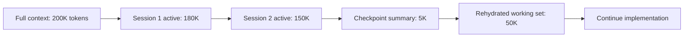

# Squeezing Code into 4MB: The New Art of Context Management

## Metadata
- **Post ID**: 2026-T-029
- **Audience**: tech
- **Product**: LSARS, HSRA
- **Themes**: FUTUREAI_PRODDEV
- **Expert**: Mike, Keith
- **Depends On**: —
- **Dependency Name**: —
- **Relationship**: Tactics for packing/caching/rehydrating context without losing correctness
- **Assets**: lsars-ny-full-ui.png, lsars-welcome-context-summary.png, lsars-zip-search-boston.png
- **CTA**: book a working session at [lsadigital.com](https://lsadigital.com)

## Post

Developing with agents in 2026 feels strangely like developing for the Game Boy in the 90s. You have immense power, but you’re constantly fighting a hard memory limit. In our world, that limit isn't 4MB of RAM—it’s the context window.

If you treat the context window like an infinite resource, your agent will eventually "swap to disk," losing the thread of the architecture and hallucinating solutions. In our LSARS build, with 2,669+ test functions to maintain, we can't afford that drift.

**Developer-Level Context Tactics:**

- **The AGENTS.md Manifest:** We maintain a single, high-density file that serves as the "BIOS" for any agent entering the repo. It contains the core rules, the "Vibe Dial" status, and the current system invariants.
- **Atomic Task Scoping:** Never ask an agent to "refactor the app." Ask it to "refactor the `aermod` router to use the new connection pooler." Small tasks fit in the window; big ones leak.
- **Context Rehydration:** Instead of long chat histories, we use "checkpoints." We summarize the current state into a plan doc, clear the thread, and have the agent rehydrate from the doc.
- **Test-Driven Context:** We use our 2,669+ tests as a "memory check." If a refactor breaks a test the agent didn't know existed, it’s a signal that the context window has compressed too far.

"Vibe Engineering" is about speed, but sustainable speed requires discipline. By treating context as a precious resource, we ensure our agents stay sharp, accurate, and aligned with the engineering reality.

## Artifacts
- Remote:
  - https://lsadigital.com

## Post asset ideas
- [ ] Diagram: Context compression over a long session (and how to reset)
- [ ] Template: A high-density AGENTS.md file for a new project
- [ ] Example: A "checkpoint" summary that rehydrates an agent's memory

### Diagram: Context Compression and Rehydration Across Sessions



### Template: High-Density `AGENTS.md` for Fast Rehydration

```markdown
# PROJECT KNOWLEDGE BASE

## STRUCTURE
- Key directories and what each owns
- Canonical docs and source-of-truth files

## RULES
| Rule | Description |
|------|-------------|
| CONTEXT7 FIRST | Resolve and query docs before implementation |
| CONSISTENT VOICE | Keep product and messaging style stable |

## MCP TOOLS
- Proxy architecture and lazy-loading model
- Startup meta-tools (`get_tools_in_category`, `execute_tool`)
- Tool categories with counts and usage boundaries

## AGENTS
| Agent | Model | Use For |
|-------|-------|---------|
| Sisyphus | claude-opus-4-5 | Orchestration |
| librarian | gemini-2.5-flash | External docs |
| document-writer | gemini-3-pro-preview | Content creation |
```

### Screenshots


*LSARS welcome modal — compact context summary of the entire application*


*ZIP code search (02101/Boston) — efficient direct navigation*


*Full-page New York view — all UI panels visible*
