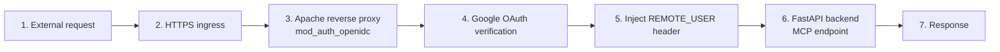
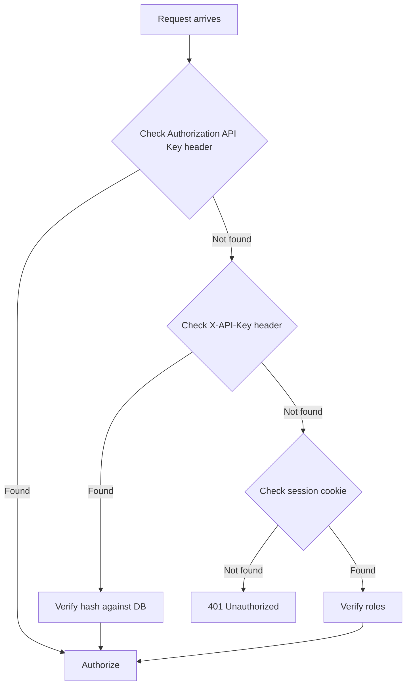

# Zero Trust is an Architecture, Not a Checklist

## Metadata
- **Post ID**: 2026-T-030
- **CTA**: book a working session at [lsadigital.com](https://lsadigital.com)

## Post

Most teams treat "Zero Trust" as a buzzword to be satisfied by a VPN or a complex password policy. This is a mistake. In production-grade agentic systems, Zero Trust is the architecture that removes misconfiguration from the equation entirely. It isn't about trusting users less; it's about building systems that don't require perfect human configuration to remain secure.

When we build agentic surfaces, we move away from "perimeter security" toward identity-aware enforcement at every boundary. This means using patterns like the Apache OIDC reverse proxy (mod_auth_openidc) to ensure that no request—whether from a human or an automated agent—ever touches an internal service without a verified identity. 

We implement three distinct layers of authentication: standard API Keys, X-API-Key (MCP OAuth) for cross-service communication, and Better Auth sessions for user-facing interfaces. By centralizing these controls, we prevent the "accidental exposure" that happens when a developer forgets to secure a new route in a 7,294-line MCP server. Instead of hoping every service got it right, we use `MCP_ALLOWED_ROLES` configuration for route-level authorization. This architectural enforcement ensures that even if a service is misconfigured, the identity-aware proxy acts as a hard stop. Security becomes a property of the system's design, not a byproduct of a flawless deployment.

## Artifacts
- Remote:
  - https://www.lsadigital.com/products/lsars
  - https://lsars.com/

## Post asset ideas
- [ ] Diagram: Identity-aware proxy vs. traditional perimeter security
- [ ] Code snippet: MCP_ALLOWED_ROLES configuration example
- [ ] Flowchart: The three auth methods in a single request lifecycle

### Diagram: Identity-Aware Proxy Flow



### Code: EPMS MCP Allowed Roles

```python
# EPMS-118: Roles allowed to access MCP endpoints
MCP_ALLOWED_ROLES = ["Admin", "Product Manager", "Product Researcher"]

def require_mcp_auth(required_roles: list[str] = MCP_ALLOWED_ROLES):
    """
    Combined auth: Accept API key, X-API-Key, or Better Auth session.
    Auth methods (checked in order):
    1. EPMS API Key: 'Authorization: Bearer <EPMS_API_KEY>' (static env var)
    2. X-API-Key: 'X-API-Key: <client_secret_hash>' (MCP OAuth client, AC-17)
    3. Better Auth: Standard session cookie auth
    """
```

### Diagram: Three Auth Methods in One Request Lifecycle


