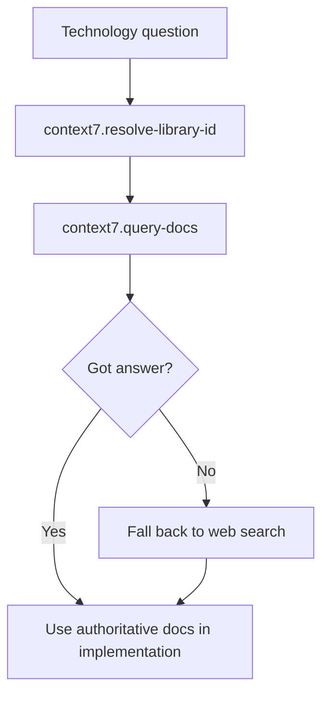

# Stop Letting Models Guess: The Context7 Mandate

## Metadata
- **Post ID**: 2026-T-031
- **CTA**: book a working session at [lsadigital.com](https://lsadigital.com)

## Post

Even the most advanced LLMs suffer from a common, expensive flaw: they try to solve problems they should simply look up. In a production environment, "guessing" is a liability. This is why we've made Context7 a non-negotiable tool in our agentic development workflow. It isn't a suggestion; it's a hard requirement that forces agents to consult authoritative documentation before writing a single line of code.

When an agent is tasked with implementing a complex feature—like managing 2,669+ test functions across 115 files in our LSARS codebase—the margin for error is zero. Without a dedicated lookup step, models rely on training data that might be stale or hallucinate API signatures that don't exist. Context7 solves this by providing a reliable path to truth. The agent first resolves the library ID, queries the specific documentation, and only then proceeds to implementation.

This shift fundamentally improves both Agent-UX (AUX) and Human-UX (HUX). The agent gains a deterministic source of information, reducing the "vibe coding" cycles where it tries multiple incorrect approaches. For the human developer, it means fewer hours spent debugging confident mistakes. By treating documentation lookup as a core tool rather than an optional step, we ensure that our systems are built on facts, not probability. If the answer exists in the docs, the agent should find it there first.

## Artifacts
- Remote:
  - https://lsadigital.com

## Post asset ideas
- [ ] Screenshot: Context7 resolving a library ID in real-time
- [ ] Comparison: Guess-driven code vs. Context7-informed implementation
- [ ] Workflow diagram: The "Context7 First" enforcement loop

### Code: Context7 Resolution Pattern (Two-Step MCP Flow)

```text
// Step 1: Resolve library
execute_tool("context7.resolve-library-id", {
  "libraryName": "playwright",
  "query": "wait for download"
})
// Result: { "libraryId": "/playwright/playwright" }

// Step 2: Query docs
execute_tool("context7.query-docs", {
  "libraryId": "/playwright/playwright",
  "query": "waitForEvent download"
})
// Result: Authoritative API docs with exact method signatures
```

### Comparison: Guess-Driven vs Context7-Informed Playwright Download Handling

| Dimension | Guess-Driven Implementation | Context7-Informed Implementation |
|-----------|-----------------------------|----------------------------------|
| Event timing | Click first, then hope a download appears | Register `waitForEvent('download')` before click |
| Flakiness | High in CI due to race conditions | Low, deterministic promise/event pairing |
| API signature accuracy | Often uses stale examples | Uses current official signatures from docs |
| Debug cycle | Multiple reruns and ad-hoc retries | Single-pass implementation from canonical docs |
| Team confidence | "It worked once" | "It matches official docs" |

### Diagram: "Context7 First" Enforcement Loop


