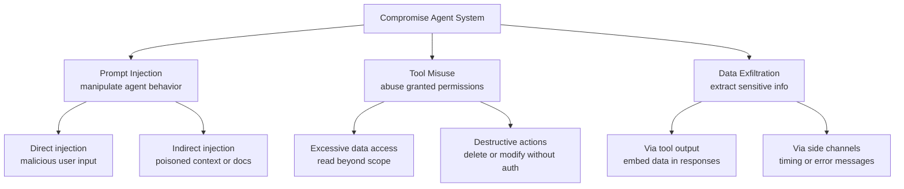

# Attack Trees, Not Just Checklists: Reframing Agent Security

## Metadata
- **Post ID**: 2026-T-034
- **CTA**: book a working session at [lsadigital.com](https://lsadigital.com)

## Post

Prompt injection is often framed as a "prompt engineering" problem, but that's a dangerous oversimplification. In a production-grade agentic system, prompt injection is a threat modeling problem. If your security strategy relies on asking the model to "be nice," you've already lost. We reframe agent security by focusing on attack trees—mapping out exactly how an adversary might use an agent to hijack goals, misuse tools, or exfiltrate sensitive data.

When we designed the security for MEDICODAX, we didn't just look at controls; we looked at the entire threat landscape of EHR integrations. We implemented JWT RS384 authentication with strict token lifetimes—1 hour for Epic and a mere 5 minutes for eCW. This ensures that even if a token is compromised, the window for misuse is minimal. We also enforce scoped FHIR resource access per tenant, meaning an agent can never "drift" into data it isn't explicitly authorized to see.

By treating security as an architecture discipline, we build boundaries that are enforced by code, not by policy docs. Every action an agent takes is recorded via SQLAlchemy event listeners for comprehensive audit logging. This allows us to trace every decision back to a specific identity and policy check. When you understand the attack tree—from prompt injection to tool misuse—you can design a system that is resilient by default. Security isn't about blocking features; it's about building the right boundaries so you can ship with confidence.

## Artifacts
- Remote:
  - https://lsadigital.com

## Post asset ideas
- [ ] Diagram: An attack tree for a tool-using agent
- [ ] Comparison: Token lifetimes for Epic vs. eCW integrations
- [ ] Code snippet: SQLAlchemy event listener for audit logging

### Diagram: Attack Tree for a Tool-Using Agent



### Table: Token Lifetime Comparison (MEDICODAX FHIR Client)

| Parameter | Epic | eClinicalWorks |
|---|---|---|
| Algorithm | RS384 | RS384 |
| JWT Expiry | 5 minutes | 5 minutes |
| Access Token Lifetime | 1 hour (default) | Varies by tenant |
| Scopes | 11 FHIR resource types | Tenant-specific |
| Key Management | Per-app private key | Per-tenant private key |

### Code: SQLAlchemy Event Listener for Audit Logging

```python
import logging
from sqlalchemy import event
from app.models.em_record import EMRecord
from app.services.audit_service import log_event

logger = logging.getLogger(__name__)


@event.listens_for(EMRecord, 'after_insert')
def log_em_record_create(mapper, connection, target):
    """Log EMRecord creation"""
    try:
        from app.core.database import SessionLocal
        db = SessionLocal()
        try:
            log_event(
                db=db,
                entity_type='em_record',
                entity_id=target.id,
                action='create',
                user_email='system',
                new_value=f"Created E&M record for patient {target.patient_id}",
                extra_data={'patient_id': target.patient_id, 'status': target.status},
            )
        finally:
            db.close()
    except Exception as e:
        logger.error(f"Failed to log EMRecord creation: {e}", exc_info=True)
```
