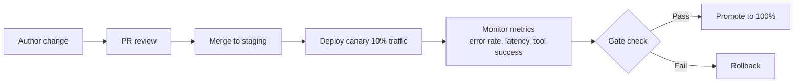

# Config is Infrastructure: Rolling Out Agent Behavior

## Metadata
- **Post ID**: 2026-T-036
- **CTA**: book a working session at [lsadigital.com](https://lsadigital.com)

## Post

In production, agent behavior is a release surface. Treating prompts and agent configurations as "notes" or "tweaks" is a recipe for a Monday morning postmortem. We treat every change to an agent's routing rules, tool permissions, or escalation thresholds as a change to production infrastructure. This means versioning everything, reviewing diffs, and using canary rollouts to ensure stability.

When you're managing a 7,294-line MCP server, you can't afford to "just try something." We use `MCP_ALLOWED_ROLES` configuration to define route-level authorization with the same rigor we apply to database migrations. If you can't reproduce what the agent did yesterday, you can't operate it today. By treating config as code, we ensure that behavior is repeatable and auditable.

Our rollout process is simple but strict:
- **Version everything:** No "floating" prompts or unrecorded config changes.
- **Review diffs:** Every change requires an approval and explicit intent.
- **Canary rollout:** Ship behavior changes to a small slice of traffic first.
- **Break-glass rollback:** A single switch to revert to the last known good state.

This approach allows us to maintain the speed of "vibe coding" exploration while staying safe at CI/CD tempo. When behavior is infrastructure, you don't just ship and hope; you deploy and verify.

## Artifacts
- Remote:
  - https://lsadigital.com

## Post asset ideas
- [ ] Example: A config diff showing `MCP_ALLOWED_ROLES` changes
- [ ] Diagram: The canary rollout and rollback flow for agent behavior
- [ ] Checklist: Pre-flight requirements for prompt/config changes

### Code: Config Diff for `MCP_ALLOWED_ROLES`

```diff
# epms/mcp/server.py
- MCP_ALLOWED_ROLES = ["Admin", "Product Manager"]
+ MCP_ALLOWED_ROLES = ["Admin", "Product Manager", "Product Researcher"]
```

### Diagram: Canary Rollout and Rollback Flow



### Checklist: Pre-Flight Requirements for Prompt and Config Changes

- [ ] Diff reviewed by at least one engineer other than the author
- [ ] Rollback plan documented with exact revert commit or toggle path
- [ ] Baseline metrics captured before rollout (error rate, p95 latency, tool success)
- [ ] Canary percentage and target cohort explicitly set
- [ ] Alert thresholds configured for canary window
- [ ] Auth and role impacts reviewed (`MCP_ALLOWED_ROLES`, route dependencies)
- [ ] Runbook updated for expected behavior changes and failure modes
- [ ] Staging validation completed with representative prompts and tools
- [ ] Ownership assigned for canary watch and go or no-go decision
- [ ] Post-deploy verification checklist prepared for 100% promotion
