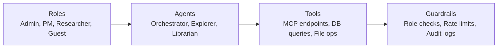

# The Pilot Artifact Pack: De-Risking the Jump from Prototype to Production

## Metadata
- **Post ID**: 2026-T-037
- **CTA**: book a working session at [lsadigital.com](https://lsadigital.com)

## Post

The gap between a "cool demo" and a pilot that stakeholders actually trust isn't more code—it's evidence. We bridge this gap using Vibe Engineering: combining vibe coding for rapid exploration with production-grade engineering for shipping. To move from Continuous Exploration (CE) to a live pilot, we deliver a specific artifact pack that proves the system is ready for the real world.

This isn't theoretical. Our recent builds involve managing 118 REST API endpoints and 33 database entities with 22 relationship types. When you scale to that level of complexity, "it worked once on my machine" is a liability.

**The Pilot Readiness Checklist:**
1. **Architecture Diagram:** A clear map of roles, agents, tools, data flows, and governance boundaries.
2. **Eval Plan:** Golden tasks with specific pass/fail thresholds and model-change baselines. We back this with 556 test functions and 29 Playwright E2E tests.
3. **Security Boundaries:** Documented identities, scopes, and tool permissions. No "god mode" agents.
4. **Runbook:** Explicit failure modes, recovery steps, and escalation contacts.
5. **Demo Script:** A transparent guide on what we show, what we claim, and what we explicitly do not claim.

This pack is what gets a stakeholder to say yes in 2-4 weeks. It transforms a fragile experiment into a predictable asset.

## Artifacts
- Remote:
  - https://www.lsadigital.com/insights/how-we-built-a-human-in-the-loop-ai-system-webinar-recap

## Post asset ideas
- [ ] Architecture diagram template (roles -> agents -> tools)
- [ ] Sample Eval Plan with golden task thresholds
- [ ] Security boundaries worksheet for agent permissions
- [ ] Runbook template for common agent failure modes
- [ ] Demo script outline: Claims vs. Non-Claims

### Diagram: Prototype-to-Pilot Architecture Template

### Table: Eval Plan Sample with Golden Task Thresholds

| Golden Task | Input | Expected Output | Pass Threshold | Tool Budget |
|---|---|---|---|---|
| Create product | name, description | Product in DB | Exact match | <=3 tool calls |
| Copy product | source_id, new_name | Deep copy with relations | All entities copied | <=5 tool calls |
| Search artifacts | query string | Ranked results | Top-3 relevance >0.7 | <=2 tool calls |

### Table: Security Boundaries Worksheet for Agent Permissions

| Boundary | Prototype (80/20) | Pilot (60/40) | Production (20/80) |
|---|---|---|---|
| Tool access | All tools | Role-scoped | Explicit allowlist |
| Data access | Full DB | Filtered views | Row-level security |
| Network | Open | Internal only | Egress blocked |
| Credentials | Shared dev key | Per-agent keys | Rotated, scoped |
