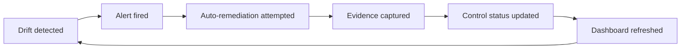

# Continuous Compliance: Moving Beyond the Quarterly Audit Scramble

## Metadata
- **Post ID**: 2026-T-040
- **Audience**: tech
- **Product**: LSARS, HSRA
- **Themes**: TECH_SECURITY, FUTUREAI_DEVOPS
- **Expert**: Mike, Keith
- **Depends On**: —
- **Dependency Name**: —
- **Relationship**: Automated compliance via continuous control monitoring (Drata); evidence stays current as systems change
- **Assets**: —
- **CTA**: book a working session at [lsadigital.com](https://lsadigital.com)

## Post

Compliance is often treated as a periodic tax on engineering speed, but in a Vibe Engineering culture, it is an operational system. We use vibe coding for rapid exploration, but we maintain production-grade engineering by automating our compliance controls. This ensures that speed doesn't survive at the expense of security or regulatory alignment.

We utilize Drata.com for continuous control monitoring, transforming compliance from a manual "PDF hunt" into an automated evidence stream. This approach allows us to detect drift in real-time—whether it's an unauthorized access change, a misconfigured tool, or a policy violation—long before it becomes an audit finding.

**The Pillars of Automated Compliance:**
- **Continuous Evidence Collection:** Evidence is automatically refreshed as the system evolves. We don't wait for an auditor to ask; the receipts are already generated and stored.
- **Accountable Control Ownership:** Every control in Drata has a designated owner and a clear technical path to satisfaction. There is no ambiguity about who is responsible for a specific security posture.
- **Drift Detection:** We monitor for changes in access, tooling, and configuration. If a system deviates from its compliant state, an alert is triggered immediately.
- **Integrated CI/CD:** Compliance checks are part of the deployment pipeline. If a change breaks a control, it doesn't ship.

By making compliance a byproduct of our engineering discipline, we keep our Continuous Integration (CI/CD) cycles fast and our stakeholders confident.

## Artifacts
- Remote:
  - https://lsadigital.com

## Post asset ideas
- [ ] Screenshot: Drata dashboard showing continuous control status
- [ ] Workflow diagram: Drift detection -> Alert -> Remediation -> Evidence update
- [ ] Checklist: Top 5 controls we automate for agentic systems

### Diagram: Continuous Compliance Workflow Cycle



### Checklist: Top 5 Controls Automated for Agentic Systems

- [ ] Access control: Role-based tool permissions verified every deploy
- [ ] Audit logging: Every agent action logged with request ID, user, timestamp
- [ ] Secret rotation: API keys rotated on schedule, old keys revoked
- [ ] Vulnerability scanning: Dependencies scanned on every PR
- [ ] Change management: All config changes require PR review + approval

### Code: Evidence Collection Pattern for Compliance Checks

```python
def run_control_check(control_id: str) -> None:
    check_result = evaluate_control(control_id)

    evidence = {
        "control_id": control_id,
        "timestamp": utcnow_iso(),
        "status": "pass" if check_result.passed else "fail",
        "details": check_result.details,
        "request_id": check_result.request_id,
    }

    evidence_id = drata_client.upload_evidence(
        control_id=control_id,
        payload=evidence,
    )

    drata_client.update_control_status(
        control_id=control_id,
        status=evidence["status"],
        evidence_id=evidence_id,
    )
```
