# Squawk Index

> **Auto-generated from Squawk MCP** — Do not edit manually. Rebuilt from scratch on each sync.
> 
> Last rebuilt: 2026-02-21

| Post ID | Title | Assets Preview | Review Status | Readiness | Readiness Notes | Audience | Product | Expert | Themes | Depends On | Dep. Name | Relationship | Repost By | Updated |
| --- | --- | --- | --- | --- | --- | --- | --- | --- | --- | --- | --- | --- | --- | --- |
| 2026-B-001 | Trust Through Auditable AI: Why "Show Your Work" Beats "Trust Me" | — | APPROVED | needs_work | The content is well-developed but needs additional assets and verification of cl... | business | LSARS | Nelson | AGENT_GUARDRAILS, COMMUNITY_TRANSPARENCY | — | — | — | Nelson, Thad, Mike | 2026-02-21 |
| 2026-B-002 | Permit dates aren't dates. They're probabilities. | 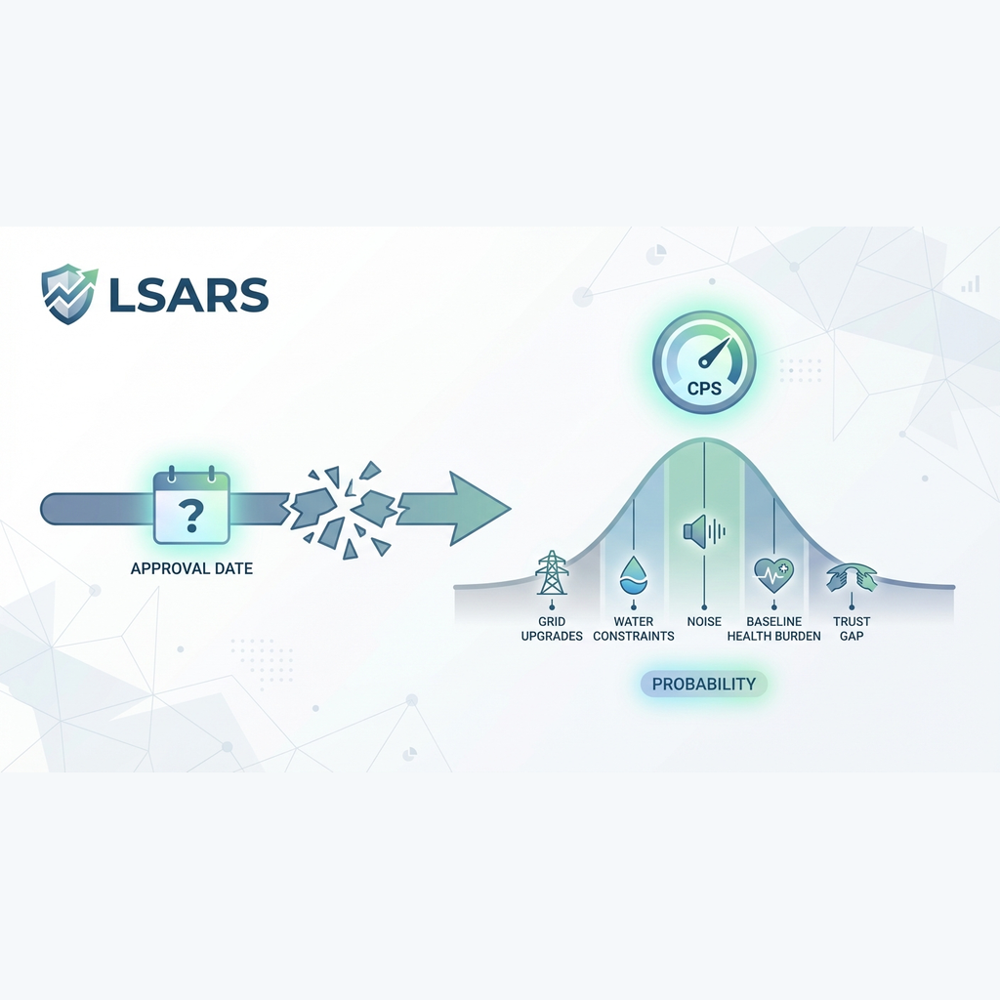 | APPROVED | ready | The content is ready for publishing on social media with minor enhancements. | business | LSARS | Nelson | LOCATION_INTELLIGENCE, SHARED_BENEFIT, COMMUNITY_TRANSPARENCY | — | — | — | Nelson, Julian, Mike | 2026-02-21 |
| 2026-B-003 | Data Center Permit Fights Aren't About Pollutants—They're About Trust | — | APPROVED | needs_work | The content is informative and well-structured but lacks visual elements and evi... | business | LSARS | Nelson | DASHBOARD_ACCOUNTABILITY, SHARED_BENEFIT, DATA_CENTER | — | — | — | Nelson, Mike, Julian | 2026-02-21 |
| 2026-B-004 | Regulatory Alignment Isn't One-Size-Fits-All—That's the Point | 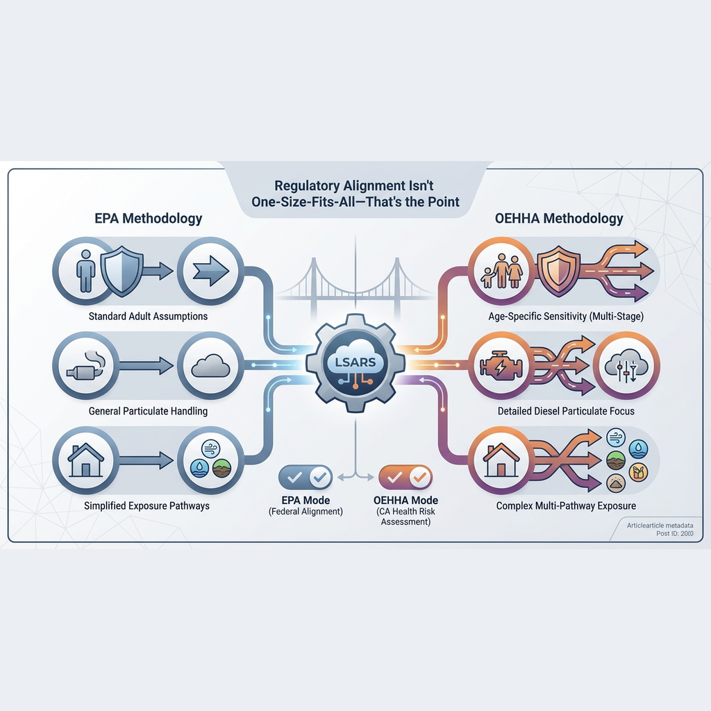 | APPROVED | needs_work | The content is overall well-developed, but the lack of the comparison diagram an... | business | LSARS | Mike | REGULATORY_ALIGNMENT, COMMUNITY_TRANSPARENCY | — | — | — | Mike, Keith | 2026-02-21 |
| 2026-B-005 | Flexible, faster permit options - over 100x the speed! | — | APPROVED | needs_work | The content is close to being ready for publication, needing substantiation for ... | business | LSARS | Nelson | SHARED_BENEFIT, COMMUNITY_TRANSPARENCY | — | — | — | Nelson, Mike | 2026-02-21 |
| 2026-B-006 | Governments can do more with less—without buying new software | — | PENDING_REVIEW | ready | The document is ready to be published with minor enhancements suggested. | business | LSARS | Nelson | SHARED_BENEFIT, GOVERNMENT | — | — | — | Nelson, Thad, Mike | 2026-02-20 |
| 2026-B-007 | Regulatory transparency that reviewers can verify | — | APPROVED | ready | The content is well-prepared for both CMS and social media publishing with minim... | business | LSARS | Nelson | COMMUNITY_TRANSPARENCY, REGULATORY_ALIGNMENT | — | — | — | Nelson, Julian, Thad, Mike | 2026-02-21 |
| 2026-B-008 | 797 Pollutants, 5 Significant Figures: Why HARP2 Parity Is the Only Standard That Matters | — | APPROVED | needs_work | The document is well-written but lacks certain elements that could enhance its e... | business | LSARS | Mike | REGULATORY_ALIGNMENT | — | — | — | Mike | 2026-02-21 |
| 2026-B-009 | Compliance Across Standards Isn't About Checking Boxes—It's About Showing Your Work | — | APPROVED | ready | The content is well-prepared for publication with minor improvements recommended... | business | LSARS | Mike | REGULATORY_ALIGNMENT, COMMUNITY_TRANSPARENCY | — | — | — | Mike | 2026-02-21 |
| 2026-B-010 | Healthier Communities Start with Better Data—Not Just Good Intentions | 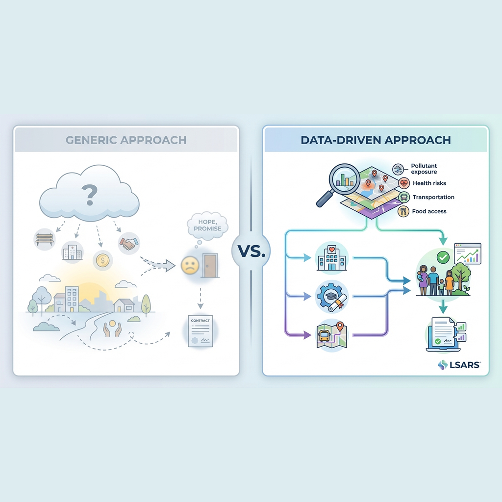 | APPROVED | needs_work | The post is structured and informative but requires a crucial visual asset for f... | business | LSARS | Nelson | RISK_INVESTMENTS, LOCATION_INTELLIGENCE, SHARED_BENEFIT | — | — | — | Nelson, Julian, Thad, Mike | 2026-02-21 |
| 2026-B-011 | Energy affordability commitments that communities can verify | — | APPROVED | ready | The content is ready for social media publishing after minor enhancements like g... | business | LSARS | Nelson | DASHBOARD_ACCOUNTABILITY, COMMUNITY_TRANSPARENCY, SHARED_BENEFIT | — | — | — | Nelson, Julian, Thad, Mike | 2026-02-21 |
| 2026-B-012 | Permit approvals shouldn't be surprises. Bound the date. | — | APPROVED | needs_work | The content is strong and engaging but could benefit from additional visual elem... | business | LSARS | Nelson | LOCATION_INTELLIGENCE, COMMUNITY_TRANSPARENCY, SHARED_BENEFIT | — | — | — | Nelson, Julian, Thad, Mike | 2026-02-21 |
| 2026-B-013 | Transportation is a health intervention—treat it like one | — | PENDING_REVIEW | needs_work | The content is largely ready but needs image generation and SEO metadata optimiz... | business | LSARS | Nelson | RISK_INVESTMENTS, SHARED_BENEFIT, SMART_MOBILITY | — | — | — | Nelson, Julian, Thad, Mike | 2026-02-20 |
| 2026-B-014 | CBAs fail when they stay in PDFs | — | PENDING_REVIEW | needs_work | The content itself is well-structured and compelling, but publication should be ... | business | LSARS | Nelson | DASHBOARD_ACCOUNTABILITY, COMMUNITY_TRANSPARENCY | — | — | — | Nelson, Julian, Mike, Keith | 2026-02-20 |
| 2026-B-015 | Apprenticeships don't work if people can't get to them | — | PENDING_REVIEW | ready | The post is clear and concise for a LinkedIn audience and is ready for publishin... | business | LSARS | Thad | RISK_INVESTMENTS, SHARED_BENEFIT, SMART_MOBILITY, JOBS | — | — | — | Thad, Nelson, Julian | 2026-02-20 |
| 2026-B-016 | How does LSARS make water use and drought triggers transparent (potable vs reclaimed)? | — | PENDING_REVIEW | needs_work | The post is well-structured but requires the addition of key visual elements and... | business | LSARS | Nelson | COMMUNITY_TRANSPARENCY, DASHBOARD_ACCOUNTABILITY, DATA_CENTER | — | — | — | Nelson, Julian, Mike | 2026-02-20 |
| 2026-B-017 | How does LSARS make noise commitments enforceable (decibel limits + continuous monitoring)? | — | PENDING_REVIEW | ready | The content is detailed, well-structured, contains a clear CTA, and is supported... | business | LSARS | Nelson | DASHBOARD_ACCOUNTABILITY, COMMUNITY_TRANSPARENCY, DATA_CENTER | — | — | — | Nelson, Julian | 2026-02-20 |
| 2026-B-018 | How does LSARS handle diesel backup generator credibility (construction + testing) with HSRA baseline risk? | — | PENDING_REVIEW | ready | The content is well-structured and informative, making it suitable for publicati... | business | LSARS | Nelson | RISK_INVESTMENTS, REGULATORY_ALIGNMENT, COMMUNITY_TRANSPARENCY, DATA_CENTER, business | — | — | — | Nelson, Julian, Mike | 2026-02-20 |
| 2026-B-019 | How does LSARS make rural-region workforce commitments believable (apprenticeships + supports + reporting)? | — | PENDING_REVIEW | ready | The content is well-prepared for social media publication. | business | LSARS | Nelson | DASHBOARD_ACCOUNTABILITY, SHARED_BENEFIT, JOBS | — | — | — | Nelson, Julian, Thad | 2026-02-20 |
| 2026-B-020 | How does LSARS help accelerate Data Center permitting? | 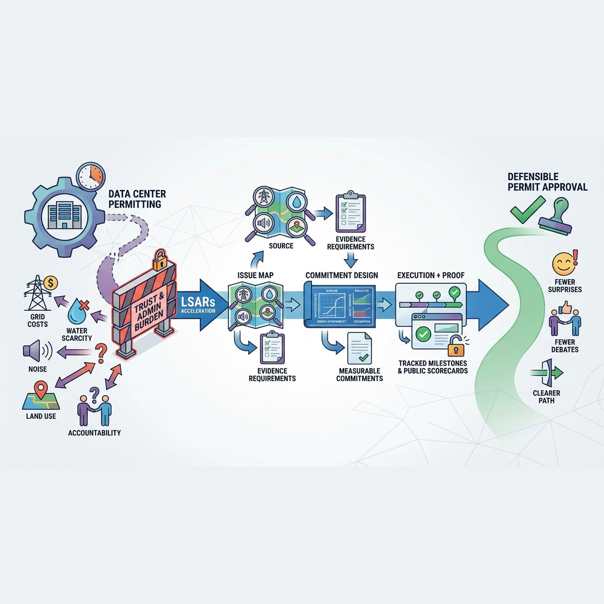 | APPROVED | needs_work | The content is nearly ready but requires the missing infographic and potentially... | business | LSARS | Nelson | DASHBOARD_ACCOUNTABILITY, LOCATION_INTELLIGENCE, DATA_CENTER, UTILITY | — | — | — | Nelson, Julian, Mike | 2026-02-21 |
| 2026-B-021 | How does LSARS help accelerate Utility permitting? | [📄 HMLP_EFSB_Petition_202...](posts/2026/02/2026-02-10_2026-B-021_accelerate-utility-permitting/assets/HMLP_EFSB_Petition_20241111-1.pdf) [📄 HMLP_ZE_Petition_FINAL...](posts/2026/02/2026-02-10_2026-B-021_accelerate-utility-permitting/assets/HMLP_ZE_Petition_FINAL.pdf) | PENDING_REVIEW | ready | Content is well-prepared and informative but can be enhanced with visual assets. | business | LSARS | Nelson | SHARED_BENEFIT, LOCATION_INTELLIGENCE, UTILITY | — | — | — | Nelson, Julian, Mike | 2026-02-20 |
| 2026-B-022 | How does LSARS help improve community economy? | — | APPROVED | ready | The content is well-structured and ready to be published, with minor improvement... | business | LSARS | Nelson | SHARED_BENEFIT, ECONOMY, DASHBOARD_ACCOUNTABILITY | — | — | — | Nelson, Julian, Mike, Thad | 2026-02-21 |
| 2026-B-023 | How does LSARS help improve transparency and accountability for promises made to the community? | — | APPROVED | ready | The content is well-prepared for publishing with a clear message, though it coul... | business | LSARS | Nelson | DASHBOARD_ACCOUNTABILITY, COMMUNITY_TRANSPARENCY | — | — | — | Nelson, Julian, Mike | 2026-02-21 |
| 2026-B-024 | How does LSARS help add more jobs for the local community? | — | APPROVED | needs_work | The content is nearly ready but could benefit from a feature image and possibly ... | business | LSARS | Nelson | SHARED_BENEFIT, JOBS, DASHBOARD_ACCOUNTABILITY | — | — | — | Nelson, Julian | 2026-02-21 |
| 2026-B-025 | How does LSARS + Smart Mobility turn SDOH into mobility investments communities will accept? | — | PENDING_REVIEW | needs_work | The content is strong in messaging but would benefit from visual assets to enhan... | business | LSARS | Thad | RISK_INVESTMENTS, DASHBOARD_ACCOUNTABILITY, SMART_MOBILITY | — | — | — | Thad, Mike, Nelson, Julian | 2026-02-20 |
| 2026-B-026 | How does Smart Mobility make construction traffic commitments measurable for faster permits? | — | APPROVED | ready | The content is well-structured and ready for publishing on both CMS and social m... | business | LSARS | Nelson | SMART_MOBILITY, DASHBOARD_ACCOUNTABILITY, SHARED_BENEFIT, TRANSPORTATION | — | — | — | Nelson, Julian, Mike | 2026-02-21 |
| 2026-B-027 | How does LSARS publish mobility KPIs as part of a CBA scorecard to ensure transparency and accountability for the community? | — | APPROVED | ready | The content is well-prepared and clear for social media posting, with minor addi... | business | LSARS | Keith | DASHBOARD_ACCOUNTABILITY, COMMUNITY_TRANSPARENCY, SMART_MOBILITY | — | — | — | Keith, Mike, Nelson, Julian | 2026-02-21 |
| 2026-B-028 | How does LSARS + Smart Mobility improve emergency access (cooling centers/clinics) in high-vulnerability tracts? | — | APPROVED | ready | The content is ready for publication, both as a blog post on the CMS and a post ... | business | LSARS | Thad | RISK_INVESTMENTS, LOCATION_INTELLIGENCE, SMART_MOBILITY | — | — | — | Thad, Mike, Nelson, Julian | 2026-02-21 |
| 2026-B-029 | How does LSARS give under-resourced governments one-click mobility visibility during permitting? | — | PENDING_REVIEW | needs_work | The content is strong, but could benefit from additional visual assets and evide... | business | LSARS | Nelson | LOCATION_INTELLIGENCE, SHARED_BENEFIT, SMART_MOBILITY, GOVERNMENT | — | — | — | Nelson, Mike, Julian | 2026-02-20 |
| 2026-B-030 | How does Smart Mobility reduce parking spillover and quality-of-life opposition near project sites? | — | PENDING_REVIEW | ready | Content is well-structured and detailed, with a small warning on development dep... | business | LSARS | Nelson | SMART_MOBILITY, DASHBOARD_ACCOUNTABILITY, SHARED_BENEFIT, TRANSPORTATION | — | — | — | Nelson, Julian | 2026-02-20 |
| 2026-B-031 | How do Low Emission Zone / access-control systems become a compliance proof point in permits? | — | PENDING_REVIEW | ready | Content is largely ready for publishing with a minor noted dependency for improv... | business | LSARS | Nelson | REGULATORY_ALIGNMENT, COMMUNITY_TRANSPARENCY, DASHBOARD_ACCOUNTABILITY, SMART_MOBILITY, TRANSPORTATION | — | — | — | Nelson, Julian, Mike | 2026-02-20 |
| 2026-B-032 | How does LSARS reduce administrative burden in Data Center permitting? | — | APPROVED | ready | The content is well-written and comprehensive. It aligns with its business audie... | business | LSARS | Nelson | DASHBOARD_ACCOUNTABILITY, COMMUNITY_TRANSPARENCY, DATA_CENTER, GOVERNMENT | — | — | — | Nelson, Julian, Mike | 2026-02-21 |
| 2026-B-033 | How does LSARS help data centers solve labor supply constraints (train vs recruit)? | — | APPROVED | ready | The content is well-structured and conveys the intended message clearly, with mi... | business | LSARS | Nelson | LOCATION_INTELLIGENCE, SHARED_BENEFIT, DATA_CENTER, JOBS | — | — | — | Nelson, Julian, Mike | 2026-02-21 |
| 2026-B-034 | How does LSARS prevent rework when utility plans change mid-permit? | [📄 HMLP_EFSB_Petition_202...](posts/2026/02/2026-02-13_2026-B-034_utility-permit-change-control/assets/HMLP_EFSB_Petition_20241111-1.pdf) [📄 HMLP_ZE_Petition_FINAL...](posts/2026/02/2026-02-13_2026-B-034_utility-permit-change-control/assets/HMLP_ZE_Petition_FINAL.pdf) | PENDING_REVIEW | needs_work | The content is almost ready but requires the addition of critical assets (PDF do... | business | LSARS | Nelson | COMMUNITY_TRANSPARENCY, UTILITY | — | — | — | Nelson, Julian, Mike | 2026-02-20 |
| 2026-B-035 | Your Work Zone Plan Isn't Real Until It's a Feed | — | PENDING_REVIEW | needs_work | Content is mostly ready but needs clarification on dependencies and enhancement ... | business | LSARS | Nelson | SMART_MOBILITY, DASHBOARD_ACCOUNTABILITY, SHARED_BENEFIT, TRANSPORTATION | — | — | — | Nelson, Julian, Mike | 2026-02-20 |
| 2026-B-036 | Curb Rules Are Permit Conditions. Make Them Enforceable. | — | PENDING_REVIEW | needs_work | The content is largely prepared but requires minor enhancements and metadata to ... | business | LSARS | Nelson | SMART_MOBILITY, DASHBOARD_ACCOUNTABILITY, SHARED_BENEFIT, TRANSPORTATION | — | — | — | Nelson, Julian, Mike | 2026-02-20 |
| 2026-B-037 | Product Research Dies in the Tab Where It Happened | — | PENDING_REVIEW | ready | The content is well-structured and effectively communicates its key message, sui... | business | EPMS | Mike | FUTUREAI_PRODDEV | — | — | — | Mike | 2026-02-20 |
| 2026-B-038 | Your Process Documents Are Dead the Day They're Written | — | PENDING_REVIEW | needs_work | The content is solid but would benefit from the inclusion of a CTA and visual as... | business | EPMS | Mike | FUTUREAI_PRODDEV | — | — | — | Mike | 2026-02-20 |
| 2026-T-001 | How We Built Auditable AI: Separating Advisors from Research Agents | 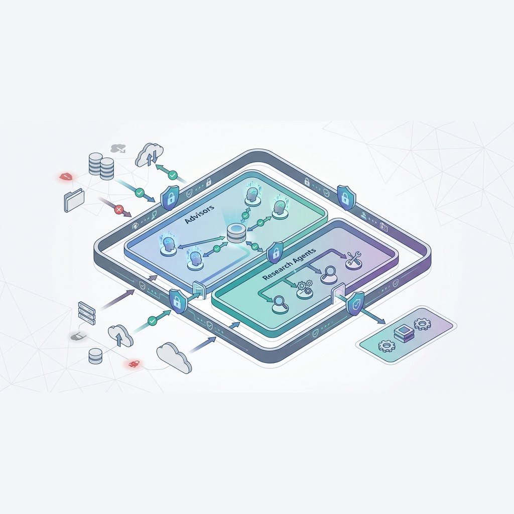 | APPROVED | needs_work | The content is close to ready but requires the missing diagram before it's fully... | tech | LSARS | Mike | AGENT_GUARDRAILS, COMMUNITY_TRANSPARENCY | 2026-B-001 | Trust Through Auditable AI | Advisor/research-agent split makes the audit trail inspectable | Mike, Keith | 2026-02-21 |
| 2026-T-002 | Stop shipping "confidence." Ship bounds + drivers. | — | APPROVED | ready | Content is well-structured and suited for immediate publication on social media ... | tech | LSARS | Mike | LOCATION_INTELLIGENCE, COMMUNITY_TRANSPARENCY, AGENT_GUARDRAILS | 2026-B-002 | Permit dates aren't dates. They're probabilities. | Adds bounds + drivers so a timeline score is explainable and defensible | Mike, Keith | 2026-02-21 |
| 2026-T-003 | Unit Tests Aren't Enough When Correctness Is the Whole Point | — | APPROVED | needs_work | Content is mostly ready but requires visual assets and dependency verification b... | tech | LSARS | Mike | REGULATORY_ALIGNMENT | 2026-B-004 | Regulatory Alignment Isn't One-Size-Fits-All | Gold-standard parity validation underpins credible EPA/OEHHA alignment | Mike, Keith | 2026-02-21 |
| 2026-T-004 | Reinforcement learning for mitigation strategy discovery—only if it's auditable. | 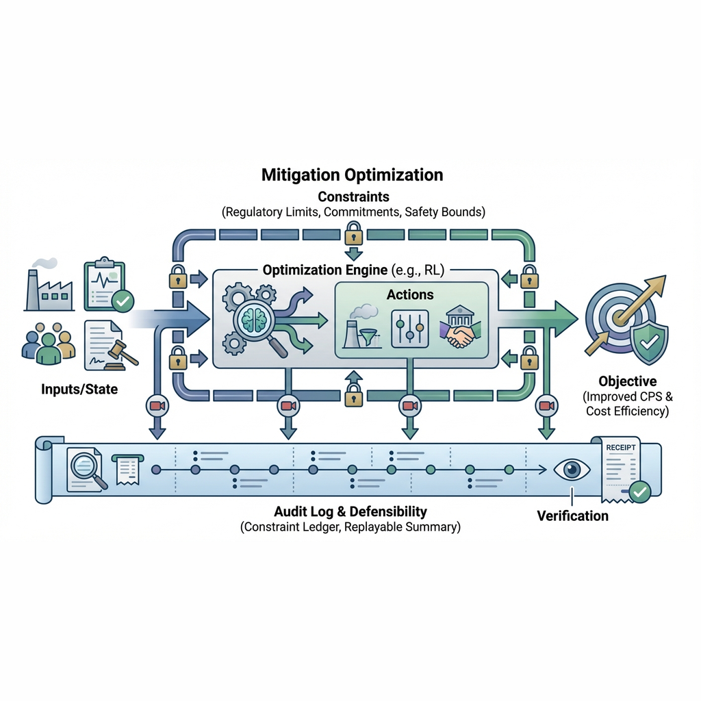 | APPROVED | needs_work | The content is strong, but missing assets and dependency confirmation should be ... | tech | LSARS | Mike | AGENT_GUARDRAILS, COMMUNITY_TRANSPARENCY | 2026-B-005 | Flexible, faster permit options - over 100x the speed! | Auditable optimization explores mitigation scenarios fast without losing receipt... | Mike | 2026-02-21 |
| 2026-T-005 | Route questions by data priority (highest-confidence first) | 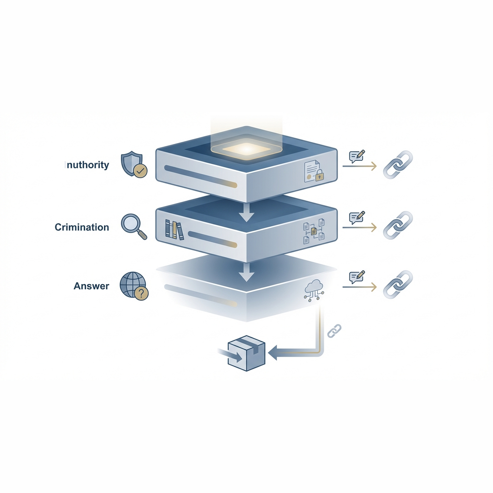 | APPROVED | needs_work | The content is strong in messaging but missing crucial assets that are pivotal t... | tech | LSARS | Mike | AGENT_GUARDRAILS, COMMUNITY_TRANSPARENCY | 2026-B-006 | Governments can do more with less—without buying new software | Priority routing reduces hallucinations and rework in constrained reviews | Mike, Keith | 2026-02-21 |
| 2026-T-006 | Data manifests beat implicit semantics | — | APPROVED | needs_work | Well-structured content, but requires missing dependencies to be addressed and p... | tech | LSARS | Mike | COMMUNITY_TRANSPARENCY, AGENT_GUARDRAILS | 2026-B-007 | Regulatory transparency that reviewers can verify | Explicit fields/units/provenance make report inputs verifiable by reviewers | Mike | 2026-02-21 |
| 2026-T-008 | The Best Security Configuration Is the One You Can't Misconfigure | 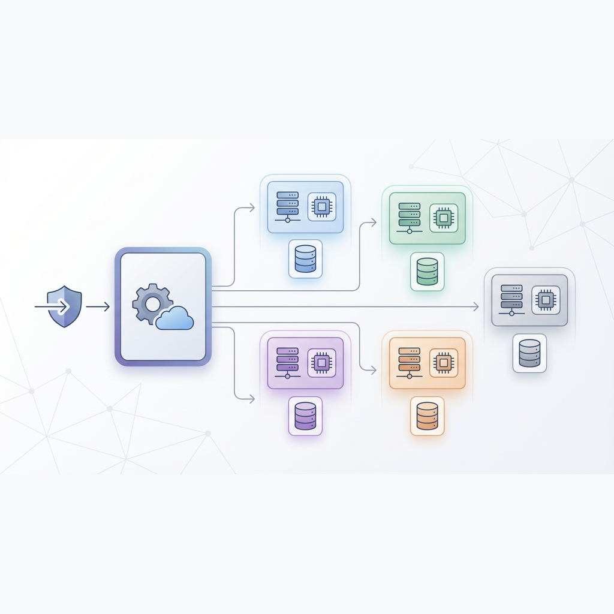 | APPROVED | needs_work | While the content is well-developed and relevant, the absence of the service-iso... | tech | LSARS | Mike | TECH_SECURITY, AGENT_GUARDRAILS | — | — | — | Mike, Keith | 2026-02-21 |
| 2026-T-009 | Agent Configuration Is the New Infrastructure. Treat It That Way. | — | APPROVED | needs_work | The content is well-written but requires clarification on dependencies and clear... | tech | LSARS | Mike | AGENT_GUARDRAILS, REGULATORY_ALIGNMENT | 2026-B-009 | Compliance Across Standards Isn't About Checking Boxes | Reviewable agent config makes compliance behavior traceable across standards | Mike, Keith | 2026-02-21 |
| 2026-T-010 | 3-Priority Data Routing: Answer from the Best Source First | — | APPROVED | needs_work | The content is almost ready but requires an accompanying visual and confirmation... | tech | LSARS | Mike | AGENT_GUARDRAILS, RISK_INVESTMENTS | 2026-B-010 | Healthier Communities Start with Better Data | Grounds investment answers in authoritative HSRA/SDOH evidence before LLMs | Mike | 2026-02-21 |
| 2026-T-011 | Layered microservices for regulatory-grade scalability | 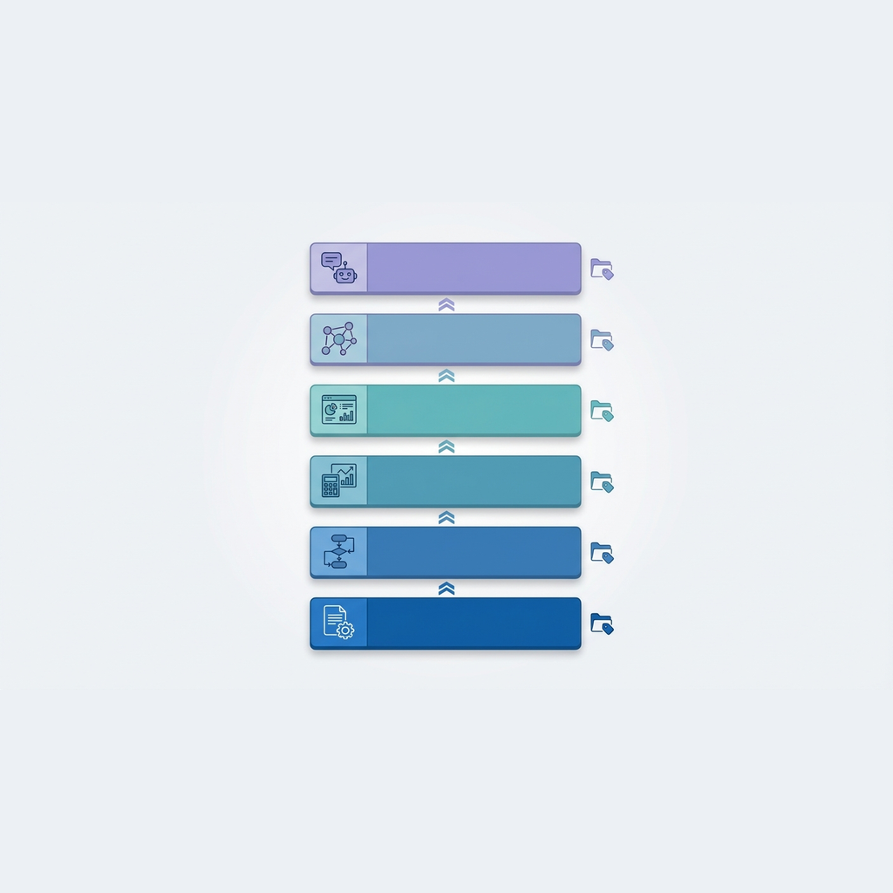 | APPROVED | needs_work | The content is valuable but missing a critical diagram and has an unresolved dep... | tech | LSARS | Mike | COMMUNITY_TRANSPARENCY, DASHBOARD_ACCOUNTABILITY | 2026-B-011 | Energy affordability commitments that communities can verify | Scales tract-level delivery reporting while keeping the commitment audit trail | Mike, Keith | 2026-02-21 |
| 2026-T-012 | Ensemble uncertainty quantification: bounds you can explain | — | APPROVED | needs_work | The content is close to ready for posting on LinkedIn but requires the addition ... | tech | LSARS | Mike | LOCATION_INTELLIGENCE, COMMUNITY_TRANSPARENCY | 2026-B-012 | Permit approvals shouldn’t be surprises. Bound the date. | Produces explainable date bounds plus uncertainty drivers for planning | Mike | 2026-02-21 |
| 2026-T-013 | Graph neural networks for community "network effects" | — | PENDING_REVIEW | ready | The content is well-structured and informative, suitable for publishing. Ensure ... | tech | LSARS | Mike | LOCATION_INTELLIGENCE, RISK_INVESTMENTS, SMART_MOBILITY | — | — | — | Mike, Keith | 2026-02-20 |
| 2026-T-014 | Fine-tuning for regulatory language—without giving up auditability | 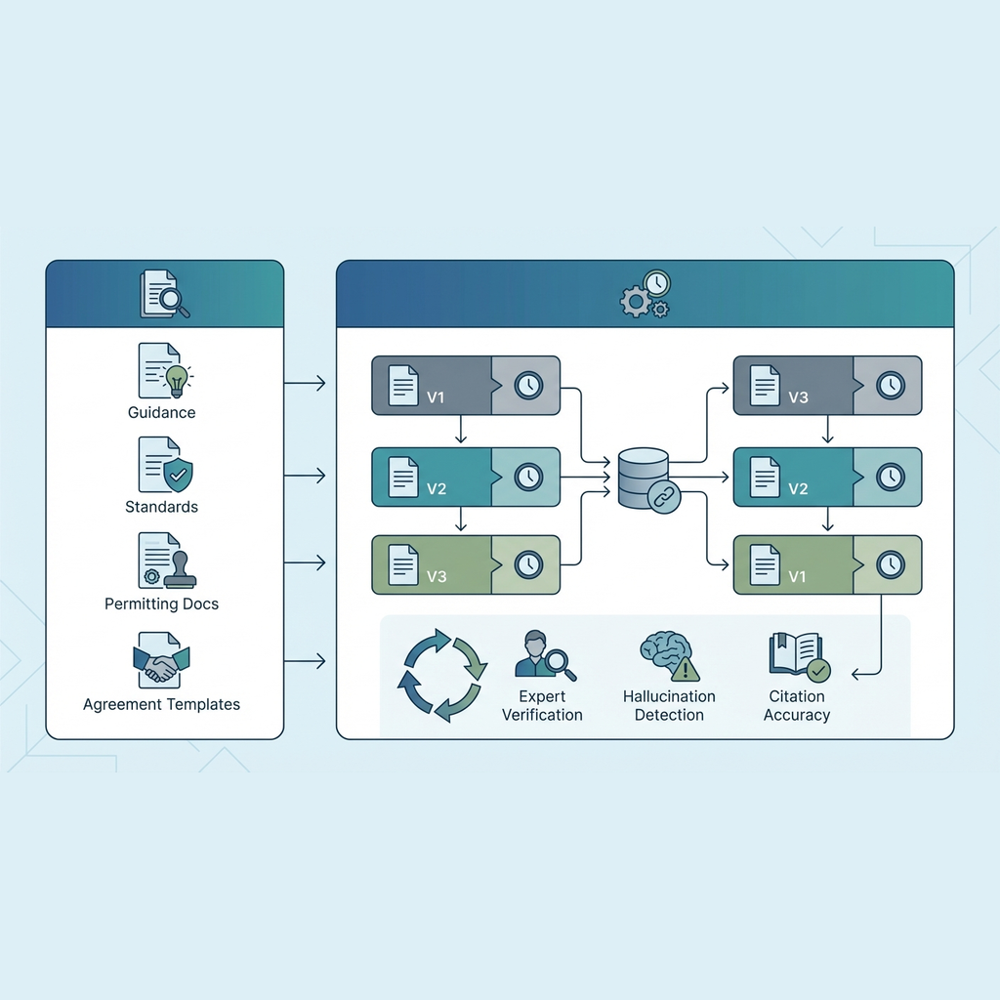  | APPROVED | ready | The content can be published on LinkedIn, but ensure assets are generated and up... | tech | LSARS | Keith | AGENT_GUARDRAILS, COMMUNITY_TRANSPARENCY, REGULATORY_ALIGNMENT | 2026-B-014 | CBAs fail when they stay in PDFs | Improves clause extraction + citations so CBAs become executable commitments | Keith, Mike | 2026-02-21 |
| 2026-T-015 | Agentic AI "just-in-time" UX: the information you need, when you need it | — | APPROVED | ready | The content is ready for publishing on LinkedIn with minor enhancements possible... | tech | LSARS | Keith | TECH_UX, AGENT_GUARDRAILS | — | — | — | Keith, Mike | 2026-02-21 |
| 2026-T-016 | Machine-Readable Mobility Commitments Beat PDFs | — | PENDING_REVIEW | needs_work | The content is well-structured but needs additional context for some claims and ... | tech | LSARS | Mike | COMMUNITY_TRANSPARENCY, DASHBOARD_ACCOUNTABILITY, SMART_MOBILITY, TRANSPORTATION | 2026-B-035 | Your Work Zone Plan Isn't Real Until It's a Feed | Shows how standard feeds + versioned rule schemas produce auditable mobility com... | Mike, Keith | 2026-02-20 |
| 2026-T-017 | 14 MCP Tools. 118 API Endpoints. 33 Entities. |  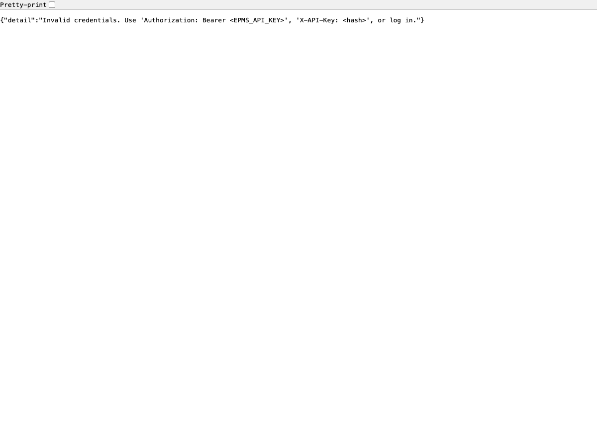 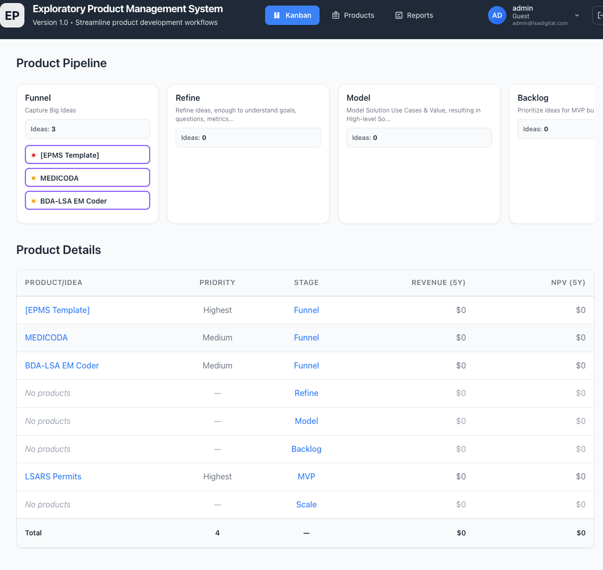 +1 | APPROVED | ready | The content is well-developed and provides valuable technical insights suitable ... | tech | EPMS | Mike | FUTUREAI_PRODDEV, AGENTICAI_DEVOPS, TECH_UX | — | — | — | Mike | 2026-02-21 |
| 2026-T-018 | HUX and AUX Are Not Buzzwords. They Are System Design Constraints. |   | PENDING_REVIEW | ready | The document is well-written and clear, with no critical assets missing, and it ... | tech | EPMS | Mike | TECH_UX, AGENTICAI_DEVOPS, FUTUREAI_PRODDEV | — | — | — | Mike | 2026-02-20 |
| 2026-T-019 | Scaling Trust Across Epic and eClinicalWorks with JWT RS384 |  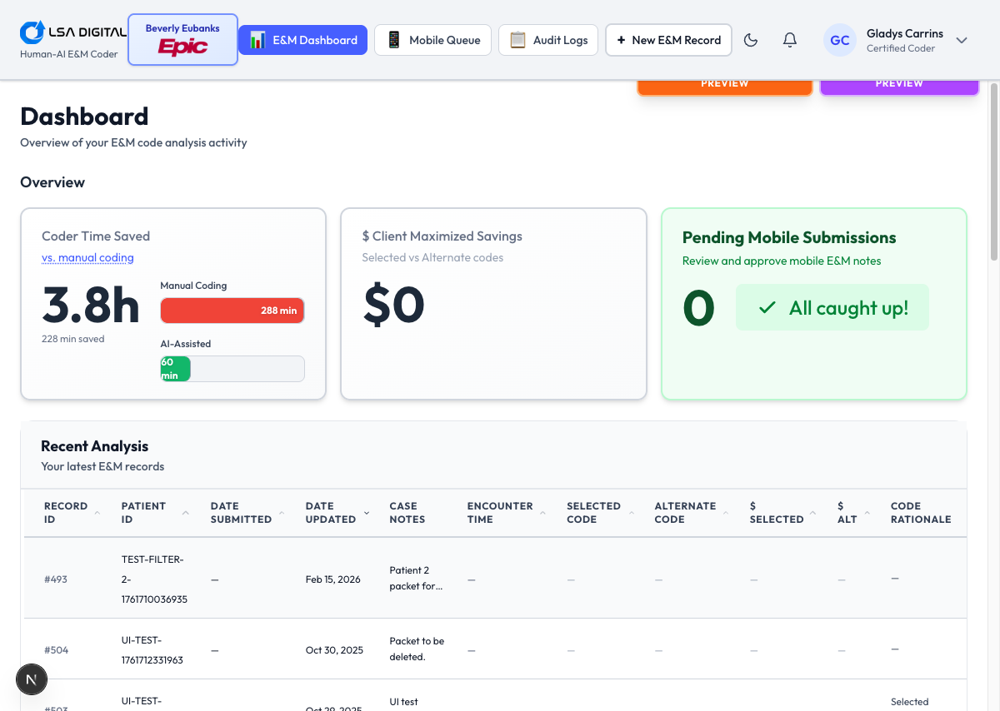 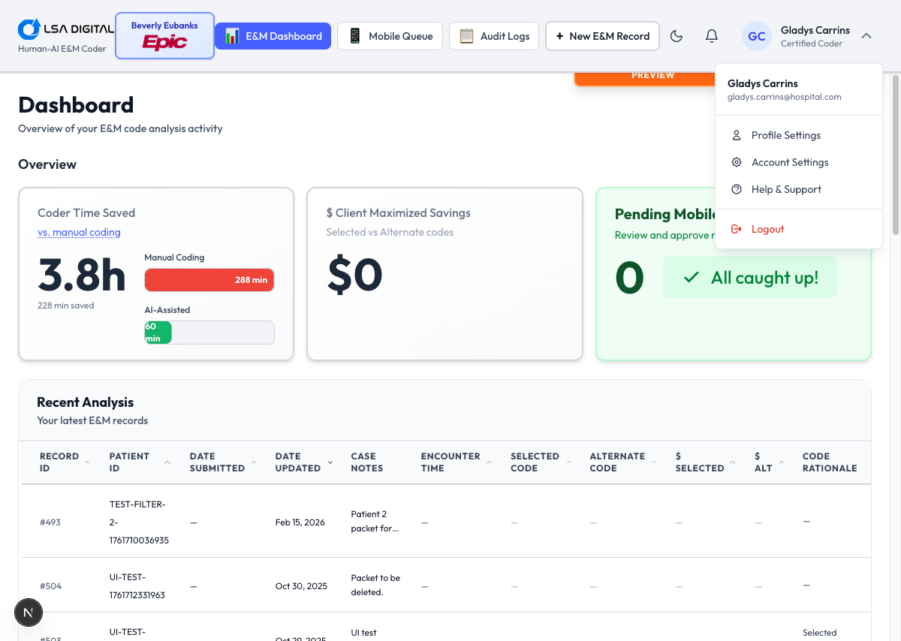 | PENDING_REVIEW | ready | The content is well-prepared for publishing with minor improvements recommended. | tech | MEDICODAX | Mike | AGENTICAI_DEVOPS, TECH_SECURITY | — | — | — | Mike | 2026-02-20 |
| 2026-T-020 | Adapting to the Ground Truth: The MEDICODAX Workflow Story |    | PENDING_REVIEW | ready | The content is largely complete and well-prepared for publication with minor imp... | tech | MEDICODAX | Mike | AGENTICAI_FIRST, TECH_UX | — | — | — | Mike | 2026-02-20 |
| 2026-T-021 | Stop Doing Product Archaeology. Start Building Living Systems. |   | PENDING_REVIEW | needs_work | The post is nearly ready for publishing but needs the missing assets uploaded. | tech | EPMS | Mike | FUTUREAI_PRODDEV, TECH_UX | — | — | — | Mike | 2026-02-20 |
| 2026-T-022 | The Vibe Engineering Dial: Why Most AI Ideas Should Be Killed |   | PENDING_REVIEW | ready | The content is ready for publishing with all assets and key data included. It of... | tech | EPMS | Mike | FUTUREAI_PRODDEV, AGENTICAI_DEVOPS | — | — | — | Mike | 2026-02-20 |
| 2026-T-023 | The Traceability Checklist: Shipping Without Institutional Memory Loss | — | PENDING_REVIEW | needs_work | The content is nearly publish-ready but requires inclusion of referenced Playwri... | tech | EPMS | Mike | FUTUREAI_PRODDEV, AGENTICAI_DEVOPS | — | — | — | Mike, Keith | 2026-02-20 |
| 2026-T-024 | The Vibe Dial: When to Stop Coding and Start Documenting | 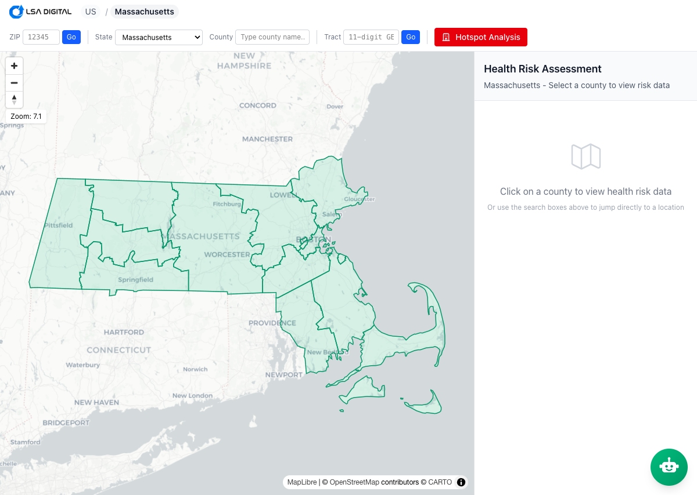 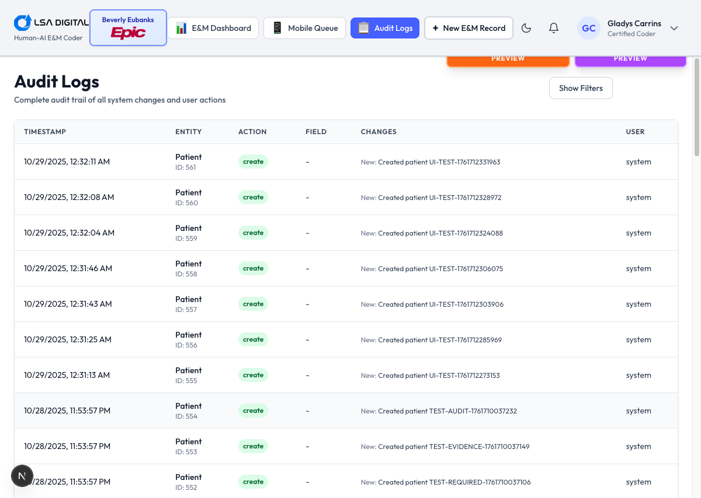 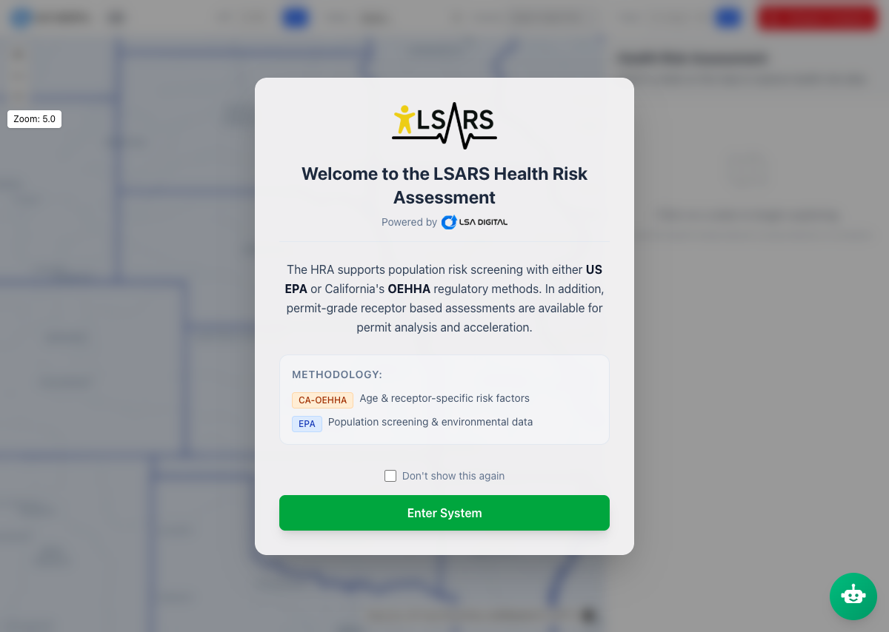 | PENDING_REVIEW | ready | The content is well-organized and accompanied by visual assets, making it suitab... | tech | LSARS | Mike | AGENTICAI_DEVOPS | — | — | — | Mike, Keith | 2026-02-20 |
| 2026-T-025 | Stop Prompting, Start Rehydrating: The MCP Proxy Pattern | — | PENDING_REVIEW | ready | The content is well-written and ready for publishing on LinkedIn. It effectively... | tech | LSARS | Mike | AGENTICAI_DEVOPS, AGENTICAI_FIRST | — | — | — | Mike, Keith | 2026-02-20 |
| 2026-T-026 | The Agent Portfolio: Picking the Right Tool for the Dial | — | PENDING_REVIEW | needs_work | The content is well-written and informative but would benefit from additional vi... | tech | LSARS | Mike | AGENTICAI_DEVOPS, AGENTICAI_FIRST | — | — | — | Mike | 2026-02-20 |
| 2026-T-027 | The Day Our Agent Stopped Guessing: Building Codebase Memory |   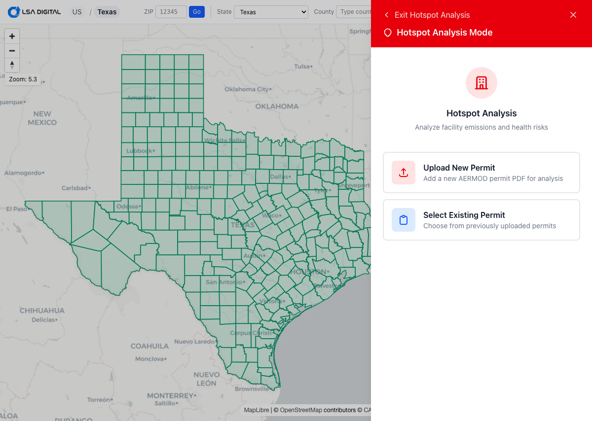 | PENDING_REVIEW | — | — | tech | LSARS | Mike | FUTUREAI_DEVOPS, AGENTICAI_DEVOPS | — | — | — | Mike, Keith | 2026-02-20 |
| 2026-T-028 | The Agentic Sandbox: Rules for Safe Continuous Exploration | — | PENDING_REVIEW | ready | The content is well-prepared for publication on LinkedIn, with clear, expert-lev... | tech | LSARS | Mike | FUTUREAI_PRODDEV, TECH_SECURITY | — | — | — | Mike, Keith | 2026-02-20 |
| 2026-T-029 | Squeezing Code into 4MB: The New Art of Context Management | 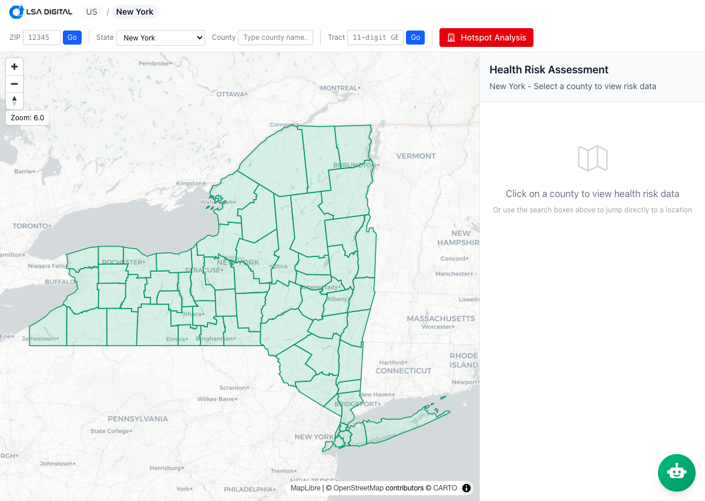  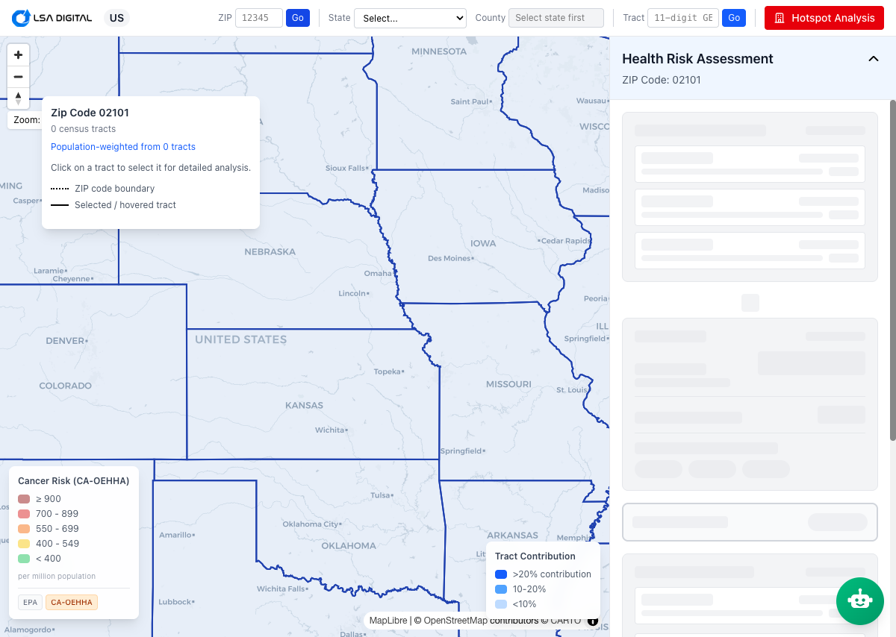 | PENDING_REVIEW | ready | The content is ready for publishing, with no critical concerns or missing elemen... | tech | LSARS | Mike | FUTUREAI_PRODDEV | — | — | — | Mike, Keith | 2026-02-20 |
| 2026-T-030 | Zero Trust is an Architecture, Not a Checklist | — | APPROVED | needs_work | The content is strong but lacks visual assets to support understanding. Dependen... | tech | LSARS | Mike | TECH_SECURITY | 2026-T-008 | The Best Security Configuration Is the One You Can't Misconfigure | Zero trust principles; reverse proxy/IAP as one example; acknowledge PEP pattern... | Mike, Keith | 2026-02-21 |
| 2026-T-031 | Stop Letting Models Guess: The Context7 Mandate | — | PENDING_REVIEW | ready | The content is ready for publishing on LinkedIn with minor adjustments suggested... | tech | LSARS | Mike | AGENTICAI_FIRST | — | — | — | Mike, Keith | 2026-02-20 |
| 2026-T-032 | 797 Pollutants, 5 Significant Figures: The Reality of Agent Evals | 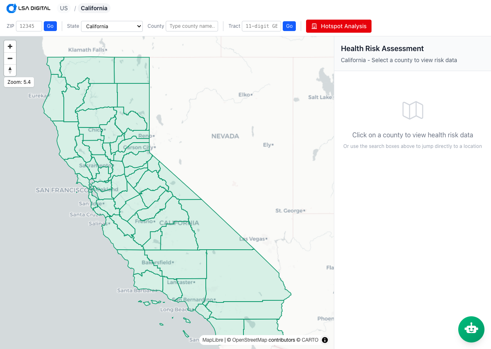  | PENDING_REVIEW | needs_work | The content is well-structured but needs additional metadata and SEO optimizatio... | tech | LSARS | Mike | AGENTICAI_DEVOPS, FUTUREAI_PRODDEV | — | — | — | Mike, Keith | 2026-02-20 |
| 2026-T-033 | Beyond Logs: Tracing Agent Intent Through 13 API Routers | 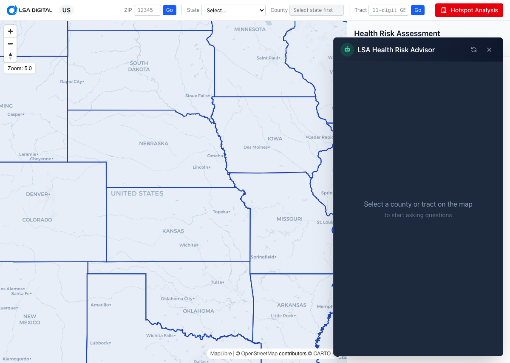 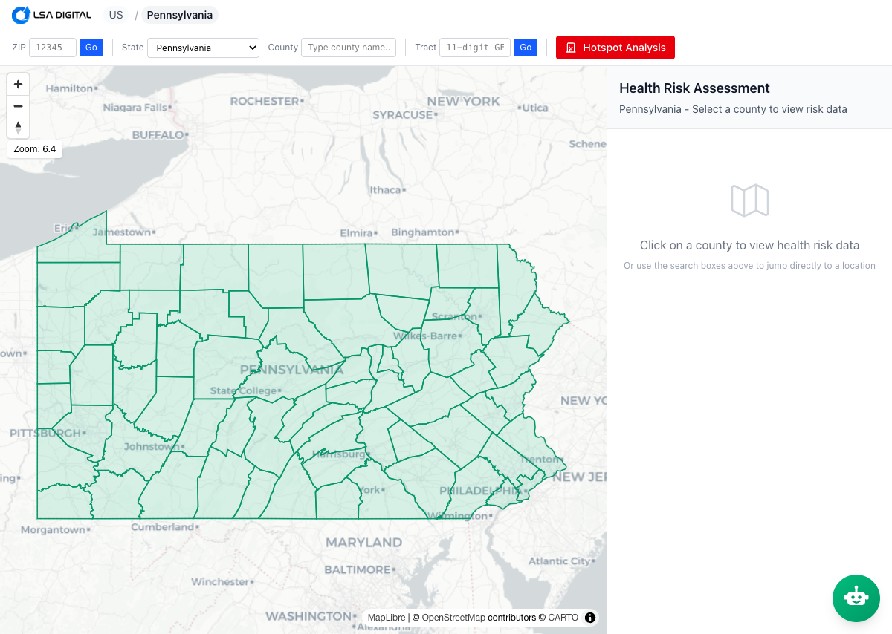 | PENDING_REVIEW | needs_work | The document is nearly ready but needs some content adjustments and asset verifi... | tech | LSARS | Mike | AGENTICAI_DEVOPS, FUTUREAI_PRODDEV | — | — | — | Mike, Keith | 2026-02-20 |
| 2026-T-034 | Attack Trees, Not Just Checklists: Reframing Agent Security | — | PENDING_REVIEW | needs_work | While the content is strong, it requires additional validation and expert commen... | tech | LSARS | Mike | AGENTICAI_DEVOPS, TECH_SECURITY | — | — | — | Mike, Keith | 2026-02-20 |
| 2026-T-035 | Designing the Review Queue: A Narrative of Human-in-the-Loop UX |    | PENDING_REVIEW | ready | The content is strong and complete, with no missing assets and clear articulatio... | tech | LSARS | Mike | TECH_UX, AGENTICAI_FIRST | — | — | — | Mike, Keith | 2026-02-20 |
| 2026-T-036 | Config is Infrastructure: Rolling Out Agent Behavior | — | PENDING_REVIEW | needs_work | The content is mostly well-prepared but requires addition of a visual asset and ... | tech | LSARS | Mike | AGENTICAI_DEVOPS | 2026-T-009 | Agent Configuration Is the New Infrastructure. Treat It That Way. | Extends agent config as infrastructure with rollout/canary/rollback mechanics | Mike, Keith | 2026-02-20 |
| 2026-T-037 | The Pilot Artifact Pack: De-Risking the Jump from Prototype to Production | — | PENDING_REVIEW | needs_work | The content is well-developed but requires critical visual assets for completion... | tech | EPMS | Mike | FUTUREAI_PRODDEV, AGENTICAI_DEVOPS | — | — | — | Mike, Keith | 2026-02-20 |
| 2026-T-038 | Designing for Agent-UX (AUX): Beyond Human-Readable APIs | 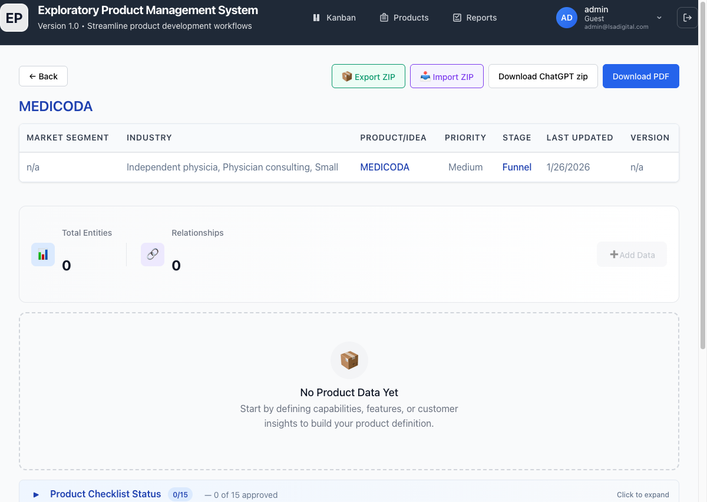 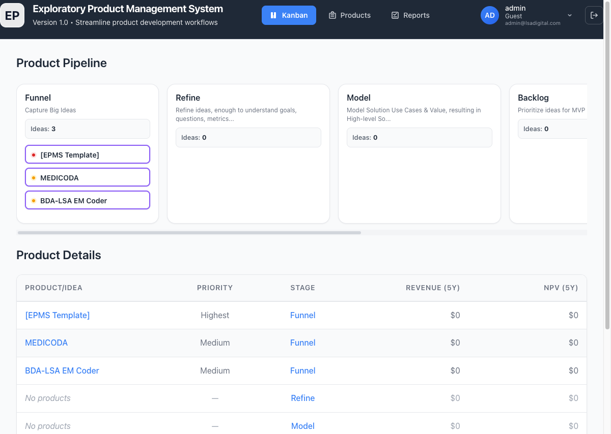 | PENDING_REVIEW | needs_work | The document is almost ready for publication but would benefit from additional s... | tech | EPMS | Mike | TECH_UX, AGENTICAI_DEVOPS | — | — | — | Mike, Keith | 2026-02-20 |
| 2026-T-039 | Production Runtime Sandboxing: Hardening the Agent Boundary | 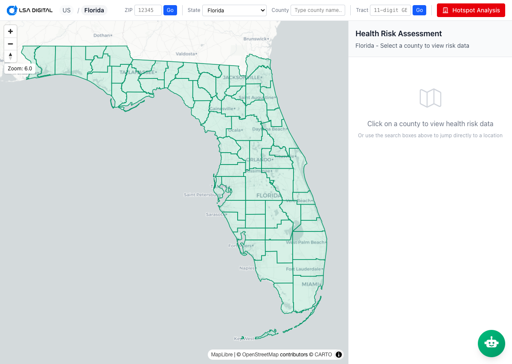  | PENDING_REVIEW | ready | The content is well-structured and comprehensive, suitable for both CMS and soci... | tech | LSARS | Mike | TECH_SECURITY, AGENTICAI_DEVOPS | — | — | — | Mike, Keith | 2026-02-20 |
| 2026-T-040 | Continuous Compliance: Moving Beyond the Quarterly Audit Scramble | — | PENDING_REVIEW | needs_work | The content has a solid framework but lacks clarity on some terms and is missing... | tech | LSARS | Mike | TECH_SECURITY, FUTUREAI_DEVOPS | — | — | — | Mike, Keith | 2026-02-20 |
| 2026-T-041 | The Golden Rule of Security: No Evidence, No Fix | — | PENDING_REVIEW | needs_work | The content is well-structured and informative but is missing critical verificat... | tech | LSARS | Mike | TECH_SECURITY, AGENTICAI_DEVOPS | — | — | — | Mike, Keith | 2026-02-20 |
| 2026-T-042 | Your Agent Greps for Keywords. That's Why It Misses the Function It Needs. | — | PENDING_REVIEW | needs_work | The content is almost ready but requires minor enhancements like adding a hero i... | tech | LSARS | Mike | AGENTICAI_DEVOPS | — | — | — | Mike, Keith | 2026-02-20 |
| 2026-T-043 | If You Can't Trace the Call Chain, You Can't Find the Vulnerability | — | PENDING_REVIEW | ready | The content is well-prepared for both social and CMS publication, with minor enh... | tech | LSARS | Mike | AGENTICAI_DEVOPS, TECH_SECURITY | — | — | — | Mike, Keith | 2026-02-20 |
| 2026-T-044 | We Built a ChatGPT Widget. The Hard Part Wasn't the UI. | — | PENDING_REVIEW | needs_work | The content is technically strong but requires confirmation of dependencies and ... | tech | EPMS | Mike | FUTUREAI_PRODDEV, AGENTICAI_DEVOPS, TECH_UX | 2026-B-037 | Product Research Dies in the Tab Where It Happened | MCP App architecture: Node.js proxy, 4-channel comms, HUX+AUX design, 102 integr... | Mike, Keith | 2026-02-20 |
| 2026-T-045 | From Chat to Diagram: The Architecture of Live Process Building | — | PENDING_REVIEW | needs_work | The content is mostly ready but needs additional assets and metadata to be fully... | tech | EPMS | Mike | FUTUREAI_PRODDEV, AGENTICAI_DEVOPS | 2026-B-038 | Your Process Documents Are Dead the Day They're Written | ProcessNodesUpdate architecture, streaming preview with ontoolinputpartial, sand... | Mike, Keith | 2026-02-20 |
